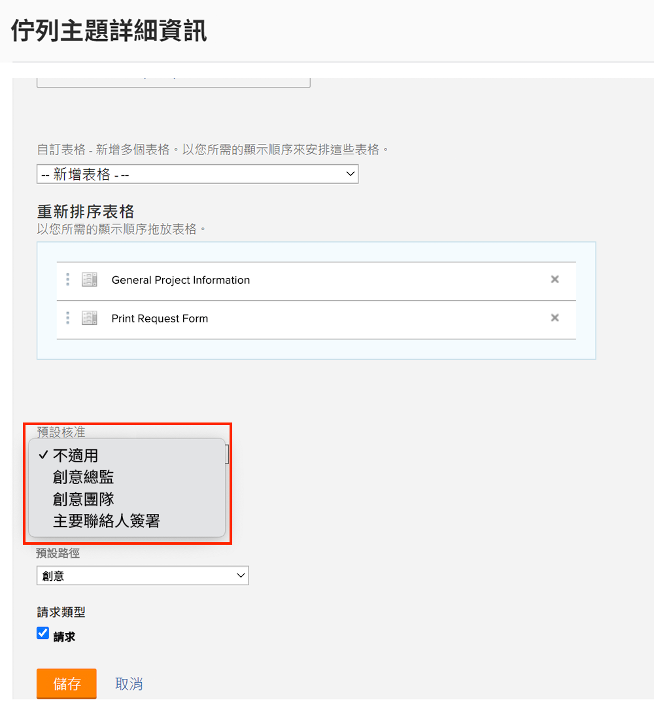
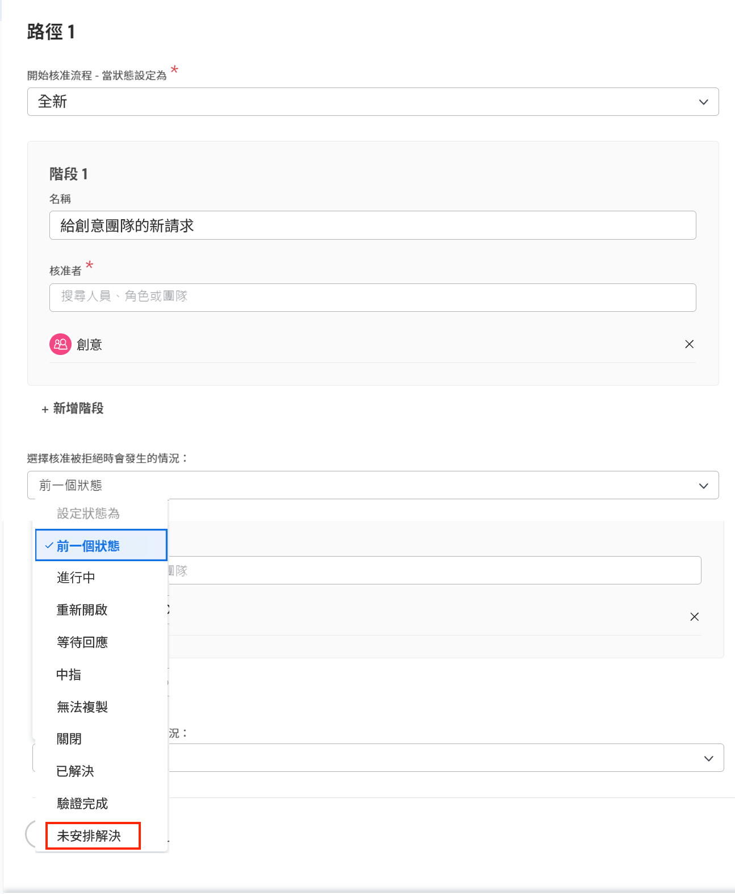

# 建立全域和單次使用的核准流程

專案、任務和問題的核准流程使專案經理人能夠在繼續下一步之前，獲得專家確認工作已完成。專案經理人可以針對每種情況建立一個核准流程 (稱為單次核准流程)，或從先前為滿足常見需求而建立、數量可能較多的核准流程清單中選擇 (這些稱為全域或現有核准流程)。

在任一情況下，當物件狀態變更為核准流程中指定的狀態時，核准者都會以各種方式收到通知，以便檢閱工作並予以核准或拒絕。由於整個專案可能會因為等待核准而暫停，核准者應提前意識到可能輪到他們負責核准。如果核准者因任何原因不在辦公室，他們可以將核准工作委派給符合資格的替補人員。如需詳細資訊請參閱「[委派任務、問題和核准](/help/manage-work/approval-processes-and-milestone-paths/delegate-approvals.md)」。

在這部影片中，您將了解如何針對專案、任務或問題建立全域核准流程和單次核准流程。

>[!VIDEO](https://video.tv.adobe.com/v/335225/?quality=12&learn=on&enablevpops)

>[!TIP]
>
>您可以將專案或任務的單次核准流程新增至專案範本。

>[!NOTE]
>
>您可以按照影片中針對任務所述的相同方式設定專案和問題的單次核准流程。

## 如何在請求佇列中套用自動問題核准

如果您想要在請求佇列中設定問題自動核准，則只能使用全域問題核准流程並套用於「[!UICONTROL 佇列主題]」來完成操作。

建立或編輯「[!UICONTROL 佇列主題]」時，請在「**[!UICONTROL 預設核准]**」欄位中選取全域核准流程。

您可能需要編輯問題核准流程，以確保「**[!UICONTROL 前一個狀態]**」不是核准遭拒絕時問題所設定的狀態。這是因為前一個狀態是「**[!UICONTROL 新]**」，而且這也是觸發核准流程的狀態，所以這是審核通過時系統將設定的狀態。為了避免問題核准遭拒絕時出現混亂，建議您將狀態設為「**[!UICONTROL 不會解決]**」等狀態，或針對此目的建立的自訂狀態。

## 有關此主題的推薦教學課程

* [委派任務、問題與核准](/help/manage-work/approval-processes-and-milestone-paths/delegate-approvals.md)
* [瞭解特定群組的核准流程](/help/administration-and-setup/approval-processes-and-milestone-paths/group-specific-approval-processes.md)
* [建立請求流程](/help/manage-work/request-queues/create-a-request-flow.md)

