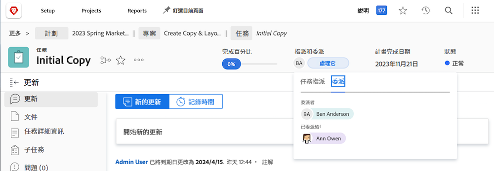

# 委派任務、問題和核准

了解如何將專案、工作、問題和工時記錄卡的核准委派給其他Workfront使用者。 也了解如何委派任務和問題分配。

## 代理人核准

了解如何將專案、工作、問題和工時記錄卡的核准委派給其他使用者。

在此影片中，您將學習如何：

* 將核准指派給其他人
* 結束委派期
* 查找委託批准

>[!VIDEO](https://video.tv.adobe.com/v/336094/?quality=12)

<!---
learn more URLS
Delegate approval request
--->

## 委派任務和問題分配

當您計畫外出時，您可以將指派給您的任務和問題委派給其他使用者。

### 如何啟用任務和問題分配委派

任務和問題委派必須由組或系統管理員啟用，才能使用。 這是在 [!UICONTROL 設定>專案偏好設定>工作與問題>委派]. 啟用此功能，將可讓所有擁有檢閱或更高授權的使用者委派其指派的工作和問題。

![螢幕截圖顯示 [!UICONTROL 設定] 委派偏好設定](assets/delegation-1.png)

### 如何委派任務和問題分配

導覽至 [!UICONTROL 首頁] 按一下 [!UICONTROL 委派]，然後指定您要將所有指派的工作委派給的使用者和日期範圍。 您可以指定具有「審核」或更高許可的任何用戶。

![螢幕擷圖顯示 [!UICONTROL 首頁]](assets/delegation-2.png)

### 如何判斷是否已委派任務或問題

您可以在 [!UICONTROL 首頁] 或在任務或問題視圖中。

![螢幕截圖顯示 [!UICONTROL 首頁]](assets/delegation-4.png)

### 套用至委派工作的電子郵件通知

您的組或系統管理員可以啟用電子郵件通知，這些通知將在您委派任務和問題以及將某人的任務和問題委派給您時通知您。

![螢幕截圖顯示 [!UICONTROL 設定] 委派電子郵件通知選項](assets/delegation-5.png)

