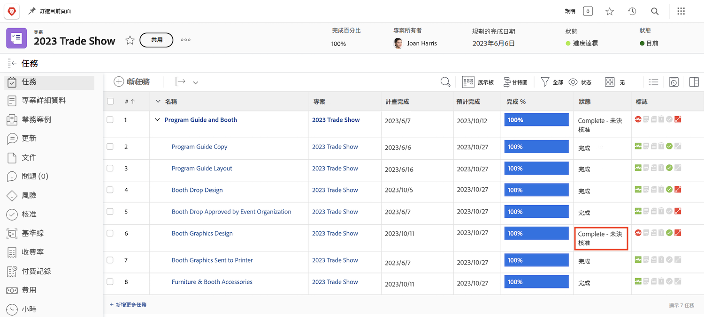
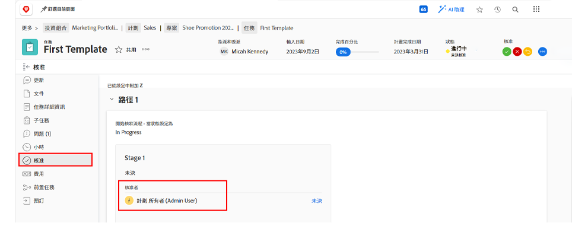

# 完成核准

許多工作流程均包含任務和問題核准。但未解決的核准將使您無法把專案狀態設定為「完成」。

在專案的「[!UICONTROL 任務]」區段，選取包含「[!UICONTROL 狀態]」欄的「[!UICONTROL 視圖]」。快速瀏覽那一欄，如果任務有未完成的核准，則狀態名稱之後會顯示「[!UICONTROL - 待核准]」。

您可以選擇以下幾種動作：

* **完成核准** — 可能要提醒其他人有核准未完成。您可以開啟任務並按一下「核准」標籤來查看哪些人被指派為核准者。
* **刪除核准** — 如果不需要核准，直接刪除可能是比較簡單的做法。執行這項操作的能力取決於您的 [!DNL Workfront] 權限。
* **改變狀態 —** 如果不需要核准，您可以選擇不附加核准的狀態。只要確認狀態等於「完成」即可。

若貴組織在專案執行期間使用問題來追蹤各種狀況、變更順序或其他事件，請按照專案的「[!UICONTROL 問題]」區段的相同步驟進行。
