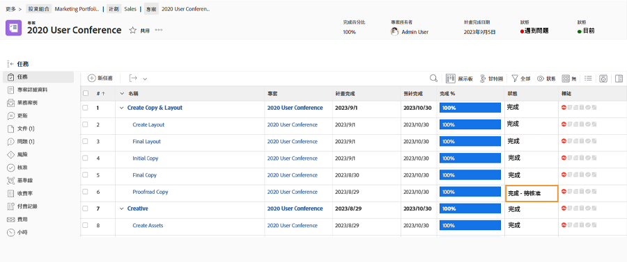

# 完成核准

任務和問題核准是許多工作流程的一部分。 但未解析的核准可能會阻止您將專案狀態設定為「完成」。

於 [!UICONTROL 任務] 區段，選取 [!UICONTROL 檢視] 這包括 [!UICONTROL 狀態] 欄。 快速瀏覽該欄將顯示是否有具有「」的任務未完成核准[!UICONTROL  — 核准待處理]」在狀態名稱之後。

您可以選擇要執行的動作：

* **完成核准 —** 這可能意味著提醒其他人尚未完成的核准。 透過以下方式更新以執行此操作 [!DNL Workfront]. 視您的 [!DNL Workfront] 許可權，您或許可以自行完成核准。
* **移除核准 —** 如果不需要核准，直接刪除可能會更容易。 您執行此動作的能力取決於您的 [!DNL Workfront] 許可權。
* **變更狀態 —** 選取沒有附加核准的狀態。 只需確定狀態等於「完成」。

如果您的組織在專案期間使用問題來追蹤問題、變更單或其他事件，請遵循上的相同步驟 [!UICONTROL 問題] 區段。
