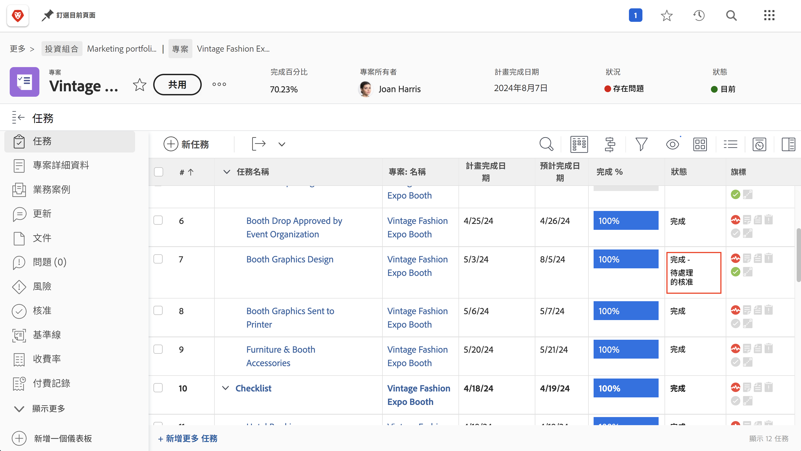
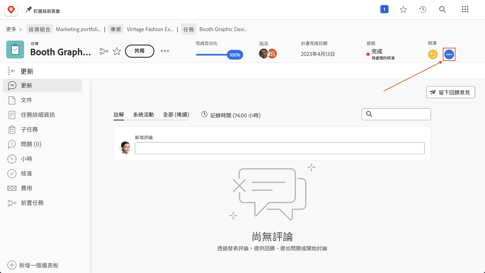
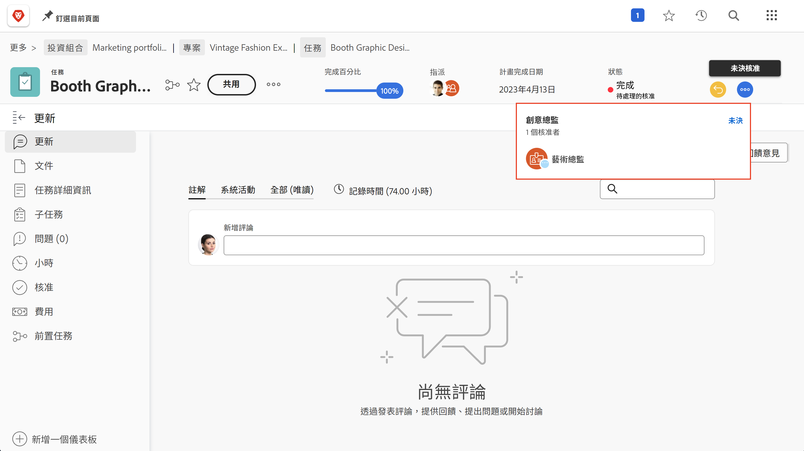
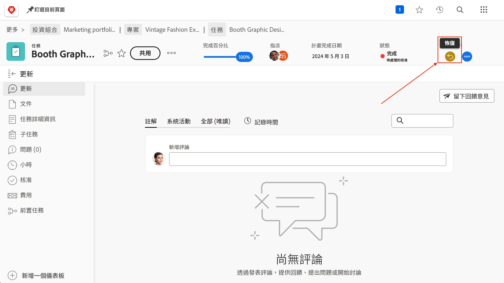
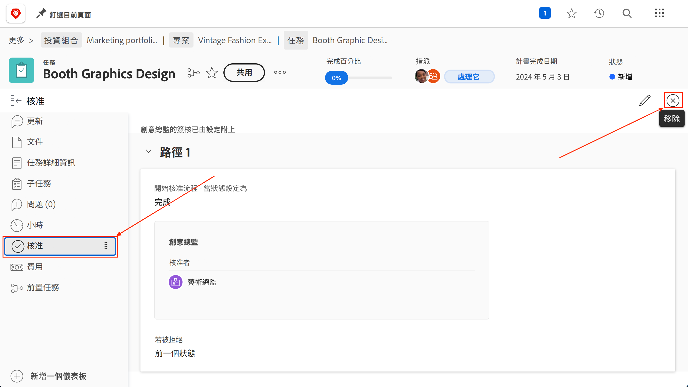

# 完成核准

任務和問題核准是許多專案的一部分。 但未解決的核准將使您無法把專案狀態設定為「完成」。

以下說明如何找到並處理這些異動。

在您的專案的[!UICONTROL 任務]區段中，選取包含[!UICONTROL 狀態]資料行的[!UICONTROL 檢視]，例如[!UICONTROL 狀態]檢視。 如果狀態名稱后面有單字&quot;[!UICONTROL  — 未決核准]&quot;的任務未完成核准，則會快速瀏覽該欄。

當您發現仍在等待核准的任務時，您有兩個選項可以選擇：

## 完成核准

這可能表示提醒指派人員未完成核准。 您可以透過開啟任務並按一下核准區域中的三個點選單，檢視誰被指派為核准者。

隨即出現一個方塊，顯示指派的核准者。

## 移除核准

如果不需要核准，您可能想要將其移除。 您可以先撤銷核准來執行此操作。 按一下核准區域中的[!UICONTROL 撤銷]按鈕。 這會將狀態變回其先前的狀態，並允許您移除核准流程。

現在按一下左側的[!UICONTROL 核准]索引標籤，然後按一下右上方的[!UICONTROL 移除]按鈕。

## 處理問題核准

若貴組織在專案執行期間使用問題來追蹤各種狀況、變更順序或其他事件，請按照專案的「[!UICONTROL 問題]」區段的相同步驟進行。
