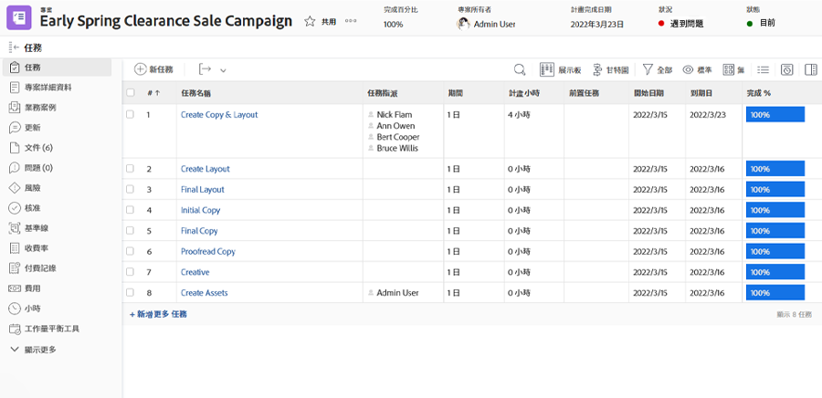

# 記錄和審核時間

如果記錄實際工作時數是組織工作流程的一部分，您可以在 [!UICONTROL 小時] 區段（從左側面板功能表選取）。 這會顯示個別工作和專案本身的所有記錄時間。 您也可以從此頁面記錄小時。

>[!NOTE]
>
>貴組織可能會要求您核准 [!DNL Workfront] 時間表。 向內部 [!DNL Workfront] 團隊，了解您應使用的程式。

<!---
learn more url
Log time
--->
