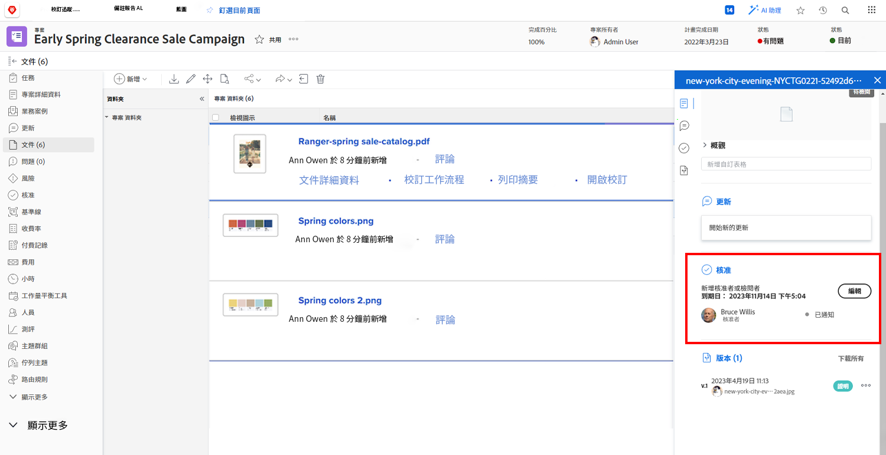

# 上傳資產

在關閉之前 [!DNL Workfront] 專案，請確定所有相關檔案都附加在 [!UICONTROL 檔案] 區段。 根據貴組織的方針決定，將這些檔案上傳為檔案或校樣。

您可能需要以現有檔案的版本上傳檔案或校訂。

如果您的組織使用校訂核准，請透過快速瀏覽進度圖示確保所有核准都完成。

如果您的組織使用檔案核准，請選取清單中的每個專案，並檢查檔案詳細資訊以檢視核准是否已完成。

<!---
learn more urls
Create proofs
Add new documents to Workfront
--->
