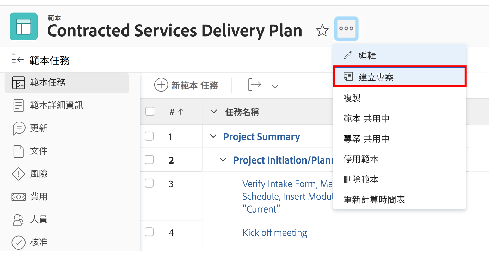
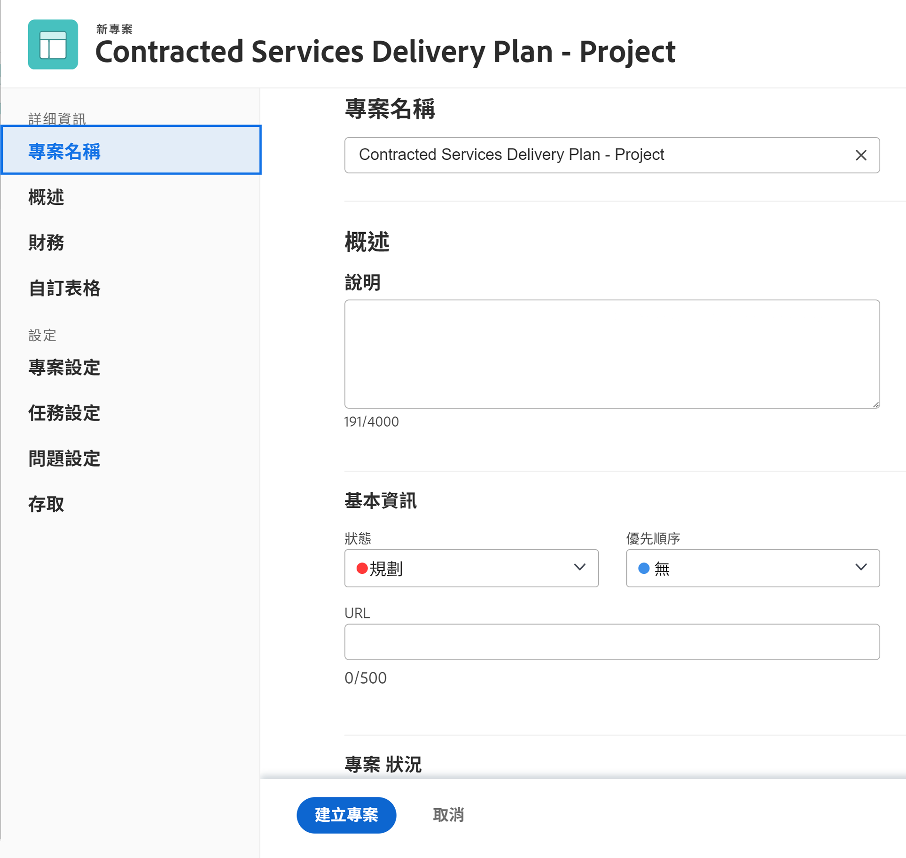
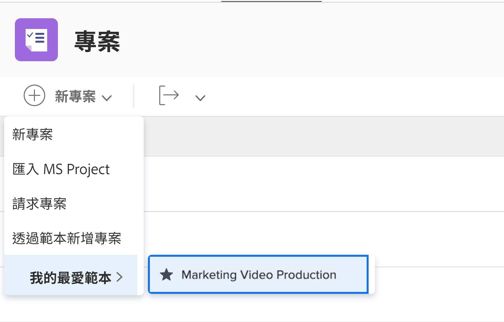

# 直接從範本建立專案

如果您剛好在使用範本，而且需要使用該範本建立專案，請按一下範本名稱旁邊的3點選單。 然後選取「建立專案」。

詳細資訊視窗可讓您變更新專案的設定。

>[!NOTE]
>
>若要使用此方法建立專案，您需要存取Workfront的「範本」區域。 如果您無法存取範本，您仍然可以從專案區域或在轉換問題/任務時使用範本建立專案。

>[!TIP]
>
>如果您經常使用範本，請將其加入我的最愛！ 除了顯示在導覽列中的「我的最愛」功能表下外，您還會在「新增專案」功能表中看到範本列出。

