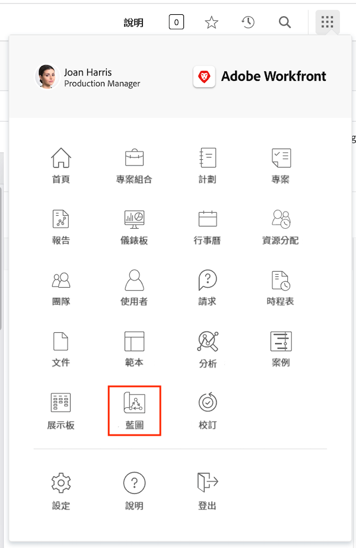
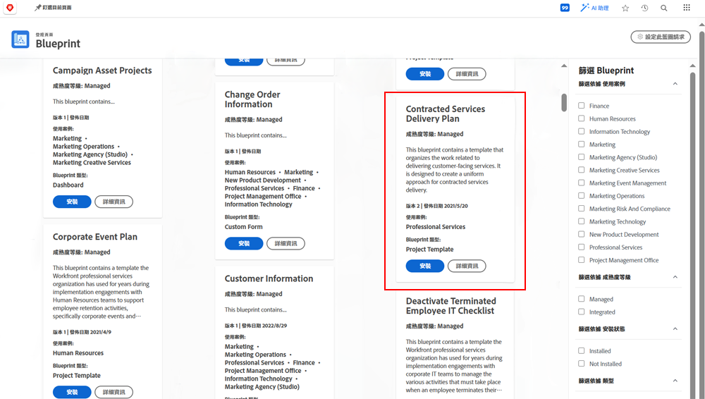
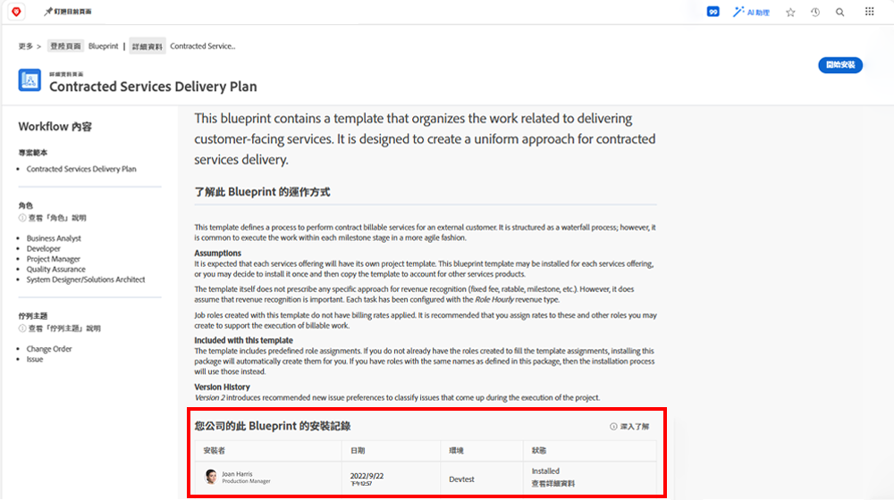
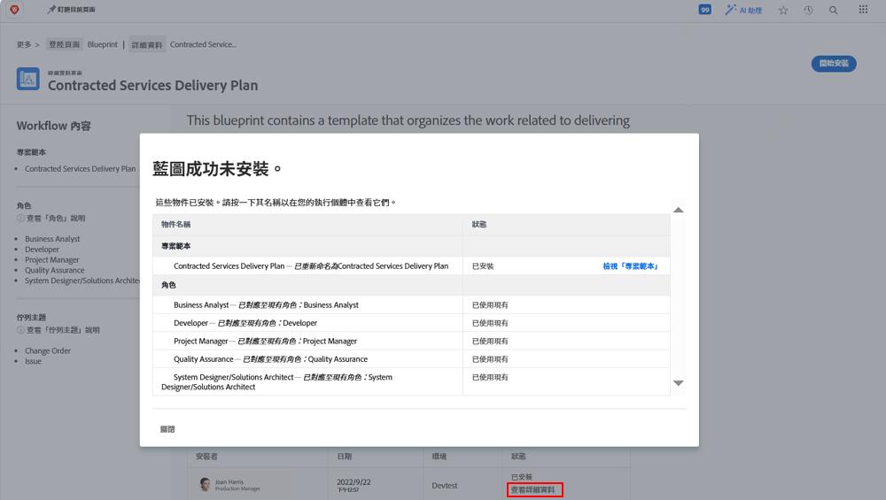

# 建立專案範本並探索藍圖

學習從頭開始和從現有專案建立專案範本，並瞭解如何透過[!UICONTROL 藍圖]存取由 Workfront 專家建立的許多實用專案範本。

## 建立專案範本

* 影片提供建立和使用行銷影片製作範本的逐步指南。首先說明如何從頭開始建立新範本、命名並儲存。此程式&#x200B;包含三個主要步驟：建立任務、使用持續期間及前置任務設定時間表，以及指派工作角色而非個別使用者。影片&#x200B;會強調使用父子關係來組織工作，以獲得更好的摘要和效率。&#x200B;URL
* 建立範本後，即可用於產生新專案。影片示範如何從範本建立新專案、進行必要調整，以及視需要新增任務或修改持續時間。它也&#x200B;會說明如何使用資源排程和計畫功能將工作角色指派給作業。&#x200B;URL
* 影片說明如何將現有專案儲存為新範本，以允許在工作流程中進行更新和改進。它突顯&#x200B;了管理範本以避免混淆並確保簡化專案執行的重要性。&#x200B;URL

>[!VIDEO](https://video.tv.adobe.com/v/335210/?quality=12&learn=on&enablevpops=0)

## 關鍵重點

* **建立範本：**&#x200B;瞭解如何從頭開始建立新範本，方法為命名範本、設定工作、時間表及指派工作角色。&#x200B;URL
* **任務組織：**&#x200B;使用父子任務關係來有效地組織任務，為專案提供清晰的摘要和結構。&#x200B;URL
* **時間表設定：**&#x200B;使用持續時間和前置任務來設定任務時間表，以準確估計時間範圍和任務順序。&#x200B;URL
* **以角色為基礎的指派：**&#x200B;將任務指派給工作角色，而不是個別使用者，以有效利用資源排程和規劃功能。&#x200B;URL
* **範本管理：**&#x200B;將現有專案儲存為新範本，以進行改善並管理範本，進而避免混淆並確保高效的專案執行。

## 使用[!UICONTROL 藍圖]建立範本

Workfront 使用者可以使用[!UICONTROL 藍圖]來協助建立專案範本。 這項功能位在主選單，讓您可以存取預先建立、隨時可用的範本，是專為特定部門和特定成熟度等級提供的範本。 這些範本讓使用者在重複建立專案時起步更快，並保持範圍以內各個專案之間的一致性。

任何已授權的使用者都可以瀏覽 Workfront 中可用的藍圖清單。 建立新專案時 (例如將任務或請求轉換為專案)，您無法直接套用藍圖。 藍圖和專案範本之間有一項重要差異，我們使用藍圖來建立範本，而使用專案範本來建立專案。 **系統管理員必須安裝藍圖才能建立對應的範本。**

如果您發現看起來有趣的藍圖，可以按一下「**[!UICONTROL 詳細資訊]**」瞭解更多。

「[!UICONTROL 詳細資訊]」畫面說明有關藍圖的更多資訊，包括安裝歷史記錄 (若已安裝藍圖)。

如果藍圖已安裝，您可以按一下「**[!UICONTROL 查看詳細資訊]**」取得所建立範本以及為支援該範本而建立的任何其他物件之連結。

如果尚未安裝藍圖，您可以向系統管理員要求安裝。

## 有關此主題的推薦教學課程

* [直接使用範本建立專案](/help/manage-work/create-and-manage-project-templates/create-a-project-directly-from-a-template.md)
* [有效共用專案範本](/help/manage-work/create-and-manage-project-templates/share-a-project-template.md)
* [有效率地複製現有專案](/help/manage-work/manage-projects/copy-an-existing-project.md)
* [停用專案範本](/help/manage-work/create-and-manage-project-templates/deactivate-a-project-template.md)
* [在範本中編輯專案團隊](/help/manage-work/create-and-manage-project-templates/edit-the-project-team-in-a-project-template.md)
