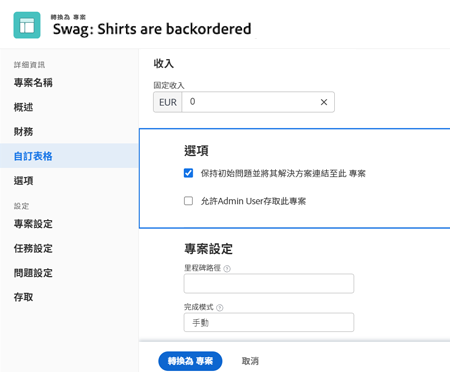
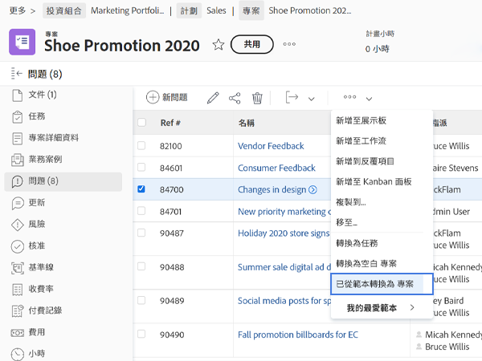

# 將問題轉換為其他工作項

## 將問題轉換為任務

一個問題可能足夠重要，需要在項目時間表中說明解決這個問題的時間和努力，並分配適當的資源。 在這種情況下，問題可以轉換為任務。

![的影像 [!UICONTROL 轉換為任務] 中的問題 [!UICONTROL Workfront].](assets/15-convert-issue-to-task-menu-option.png)

1. 導覽至 [!UICONTROL 問題] 已登錄問題的項目或任務的部分。 或在您有權存取的報表中尋找問題。
1. 按一下問題名稱以開啟它。
1. 從問題名稱右側的3點功能表中，選取 **[!UICONTROL 轉換為任務]**.
1. 填寫 [!UICONTROL 轉換為任務] 表單。 首先，為新任務命名和描述。
1. 如果新任務應屬於不同項目，請輸入項目名稱。
1. 在 [!UICONTROL 選項] 部分，選中複選框以保留原始問題、允許訪問新任務並維護完成日期。 進行這些選取時，請遵循您組織的工作流程。 如果要將自訂表單資料從問題傳輸到任務，請附加自訂表單。 （問題表單和任務表單中存在的所有欄位將自動轉移到任務表單。）
1. 填寫自訂表單（如果已附加）。
1. 按一下 **[!UICONTROL 轉換為任務]** 完成。

![的影像 [!UICONTROL 轉換為任務] 問題形式 [!UICONTROL Workfront].](assets/16-convert-to-task-options.png)

視貴組織的 [!DNL Workfront] 系統設定時，轉換任務時，您可能無法更改「選項」部分中的設定。 這些選項會同時影響原始問題和新任務。

* **「保留原始問題，並將其解決與這項任務掛鈎」** 保留原始問題和相關資訊（小時數、文檔等）。 選擇此選項後，當任務完成時，問題將標籤為已解決。 如果未選擇此選項，則任務完成時將刪除原始問題。 這可能會影響您的組織追蹤問題和回報的方式。
* 此 **&quot;允許（用戶名）有權訪問此任務&quot;** 選項會允許建立問題的人員存取此新任務。
* 此 **「保留問題的計畫完成日期」** 選項可讓您保留已在問題上設定的計畫完成日期。 這會將任務約束設定為 [!UICONTROL 完成時間不晚於]. 如果取消核取該框，則任務的日期將被設定為在項目中建立新任務。

新任務將放置在項目上的任務清單的底部。 將任務移至所需位置、為工作分配用戶或團隊、添加計畫小時數和持續時間等。

>[!NOTE]
>
>您無法將問題添加到項目時間軸，因為它們代表「計畫外工作」。 項目時間表用於「計畫工作」，即任務。

## 將問題轉換為專案

有時，無法通過解決問題本身或將問題轉換為任務來解決問題，因為解決問題的過程需要更加協調。 在此情況下，您可以將問題轉換為專案。

1. 導覽至專案的「問題」區段，或登入問題的任務。 或在您有權存取的報表中尋找問題。
1. 按一下問題名稱以開啟它。
1. 按一下問題名稱右側的3點功能表，以顯示「更多」功能表。
1. 然後，選擇是否要建立完全空白的新項目或使用項目模板，該模板將預填任務和時間軸資訊。
1. 從項目名稱開始，在「轉換為項目」窗口中填寫資訊。
1. 根據您的團隊或組織的要求，填寫其他專案詳細資訊。
1. 在「選項」區段中，核取方塊以保留原始問題並允許存取新專案。 進行這些選取時，請遵循您組織的工作流程。
1. 填寫自訂表單（如果已附加）。 如果您想要將自訂表單資料從問題傳輸至專案，請附加自訂表單。 （問題表單和項目表單中存在的所有欄位都會自動轉移到項目表單。）
1. 按一下 **轉換為專案** 完成。

「轉換為專案」視窗中顯示的專案詳細資訊欄位，取決於您用來建立專案的方法。 如果您使用「從範本轉換為專案」選項，左側功能表會顯示更多資訊。

>[!NOTE]
>
>視您組織的Workfront系統設定而定，某些區段（例如「選項」區段）雖然可見，但可能無法存取。

* 按一下「**保留原始問題，並將其解決方案與本專案連結**」。 此選項會保留原始問題和相關資訊（小時數、檔案等）。 新專案完成後，問題會標示為已解決。 如果未選擇此選項，則項目完成時將刪除原始問題。 這可能會影響您的組織追蹤問題和回報的方式。
* 「**允許（使用者名稱）擁有此專案的存取權**「 」選項可讓建立問題的人員存取要建立的專案。

## 在轉換過程中維護資訊

<!-- Need link to wf one doc article below 

To learn about what information transfers when you convert an issue to a task or project, we recommend you read through the conversion considerations in the article, Convert issues. This lists what information is kept when converting issues and what isn’t. Workfront recommends you become familiar with these considerations so you don’t lose important information when converting issues to tasks or projects.

-->

傳輸自訂表單資料需要下列任一項：

* 同一自訂表單的多份復本 — 一份用於問題，另一份用於任務或專案。 這些自訂表單上的欄位應完全相符，因此資訊可從一個自訂表單傳輸至另一個自訂表單。

* 或是選取問題、任務和/或專案物件的單一自訂表單。 使用此方法，您只需在單一自訂表單中建立和維護自訂欄位。 這是最近的增強功能，比起有多個相同表單的復本來要容易得多，但兩種方法都能運作。

<!-- Need link to wf one doc article below

Learn more in the article, Transfer custom form data to a larger work item.

-->

<!-- Pro tips graphic -->

如果您在專案範本中加入自訂表單，當您在轉換程式中選取範本時，系統會自動指派自訂表單。

<!-- Learn more graphic and documentation article links 

* Convert issues
* Transfer custom form data to a larger work item
* Overview of resolving and resolvable objects
* Understanding resolving and resolvable objects
* Unlink issues from their resolvable objects

-->

## 將問題從任何問題清單轉換為任務或項目

若要提高工作效率，並更輕鬆地在快節奏的環境中轉換問題，您可以將問題從專案、報表或控制面板中的任何問題清單轉換為任務或專案。 只要選取問題，然後按一下顯示的3點功能表即可。

