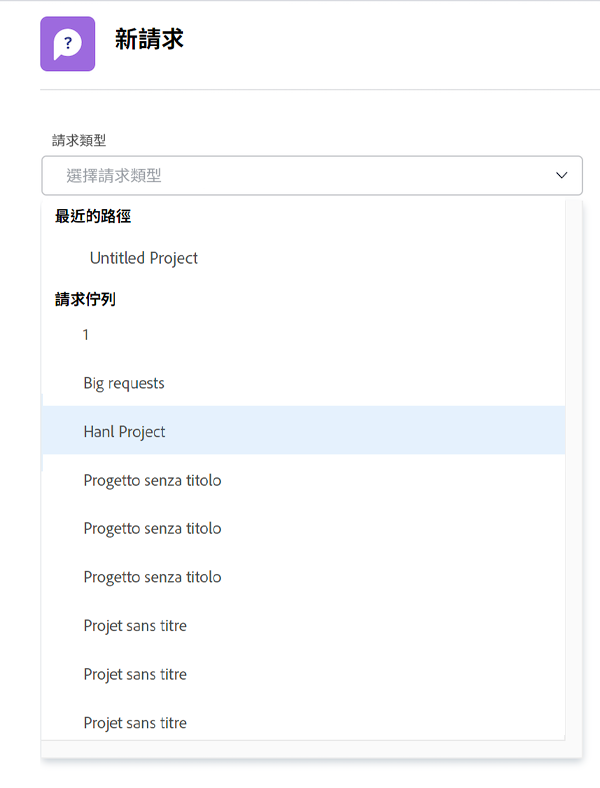
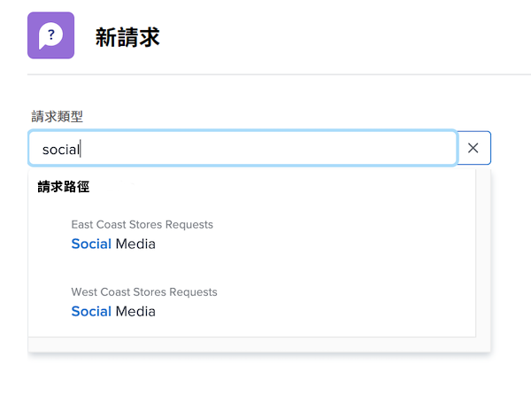
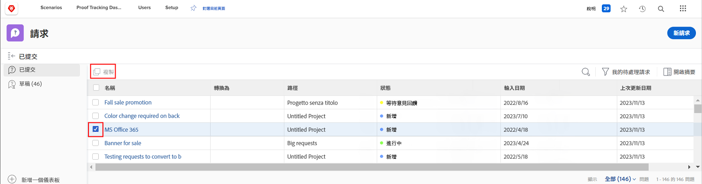
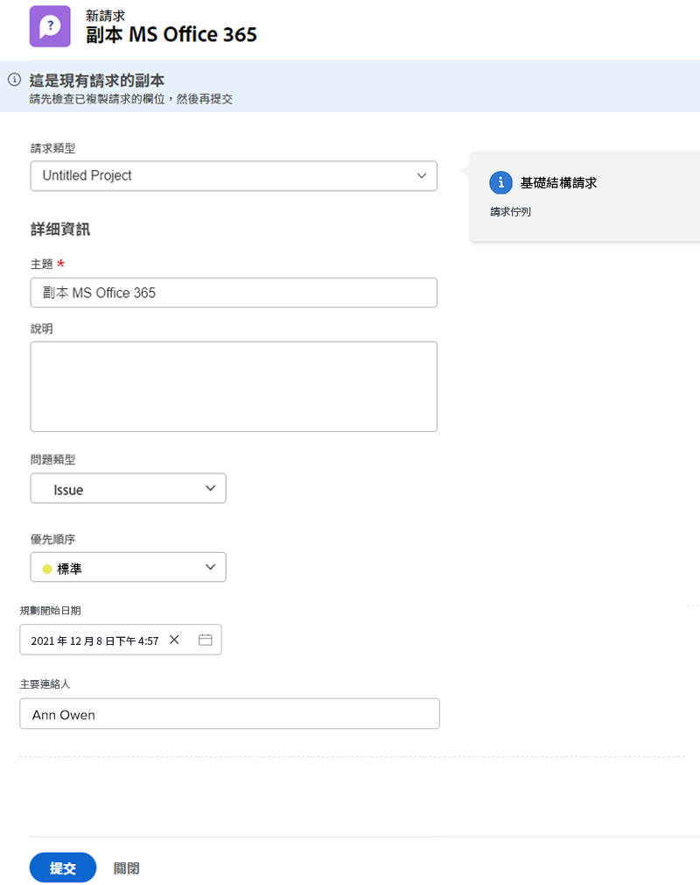

# 提出請求

在許多組織中，啟動新項目、開發新產品或建立交付項的第一步是在 [!DNL Workfront]. 您可以追蹤要求的進度，並視需要提供其他資訊。

在此影片中，您將學習如何：

* 導覽至請求區域
* 提出請求
* 查看提交的請求
* 查找請求草稿

>[!VIDEO](https://video.tv.adobe.com/v/336092/?quality=12&learn=on)

## 快速輕鬆地存取請求佇列路徑

當您按一下 [!UICONTROL 請求類型] 欄位中，最近提交以自動顯示在清單頂端的最近三個請求路徑。 選取選項，將另一個請求檔案至該佇列。

清單底部是您有權存取的所有請求佇列。 如果您不確定要用於請求的佇列，請使用關鍵字搜尋來快速輕鬆找到您需要的佇列。

當您輸入關鍵字時， [!DNL Workfront] 帶出相符項目，方便您找到符合需求的請求佇列路徑。 例如，若要請求社交媒體貼文，請開始在 [!UICONTROL 請求類型] 欄位和清單會動態更新，以顯示任何相符項目。

選擇您想要的選項、填寫申請表，然後提交申請。

## 複製已提交的請求以提出新請求

當您經常提交相同類型的請求時，建立每個新請求並一次又一次填寫相同的資訊會非常耗時。 複製現有請求、只變更需要更新的資訊，並以新請求的形式提交，借此加快處理速度。

1. 按一下主功能表中的「請求」 。
1. 勾選左側面板功能表，確定您位於「已提交」區段。
1. 尋找並選取您要複製的請求。 一次只能複製一個請求。
1. 按一下請求清單左上角的「複製並提交為新」圖示。
1. 隨即開啟「新建請求」窗口，並突出顯示「主題」欄位，以便您為新請求命名。
1. 視需要更新請求中的其他資訊。
1. 按一下提交以完成。
1. 複製的請求會以新請求的形式提交，並顯示在您的已提交清單中。

您可以複製先前提交的請求，但無法複製請求草稿。 只要您擁有請求的「檢視」存取權，您就可以複製其他人提交的請求。

<!---
Learn more
Requests area overview
Create and submit Workfront requests
Guides
Make a work request
--->
