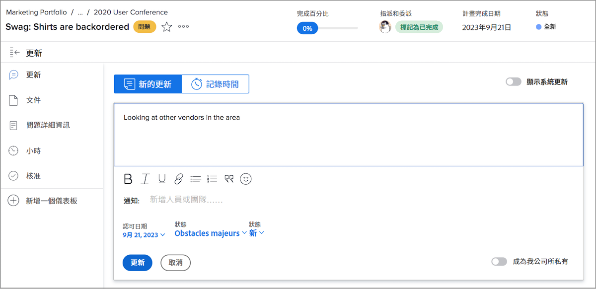
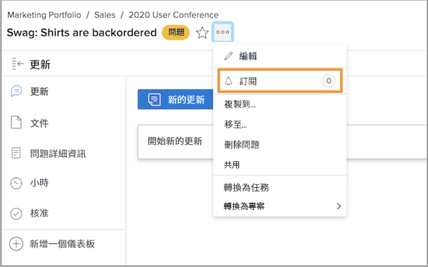
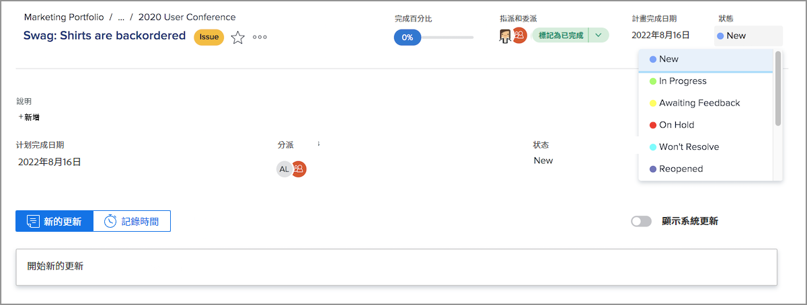
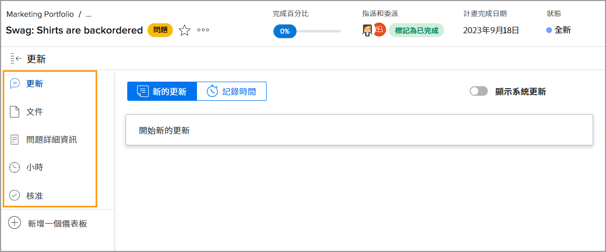

# 管理問題分配

## 指派問題

將問題記錄在 [!DNL Workfront] 是解決出現問題的第一步。 下一步是將問題指派給個別使用者、多名使用者或團隊，以便完成任何相關的工作並解決問題。

指派問題就像指派任務一樣，請填入 [!UICONTROL 分配] 欄位。 問題會顯示在受託人的 [!UICONTROL 工作清單] in [!DNL Workfront] [!UICONTROL 首頁]. 如果指派給團隊，則會顯示在 [!UICONTROL 團隊請求] 區段 [!UICONTROL 團隊] 頁面。

所有登錄任務和項目本身的問題都可從 [!UICONTROL 問題] 區段。 這允許項目經理、規劃人員和其他人快速分配與項目相關的問題。

有數種方式可在 [!DNL Workfront].

* 前往 [!UICONTROL 問題] 區段。 按一下 [!UICONTROL 分配] 欄位以啟用行內編輯，然後輸入應完成工作的用戶、用戶或團隊的名稱。
您也可以在檢視 [!DNL Workfront] 報表。

* 按一下問題名稱，可在報表或 **[!UICONTROL 問題]** 項目或任務的部分。 然後按一下 **[!UICONTROL 分配]** 區段（位於視窗右上角）。 別忘了按一下 **[!UICONTROL 儲存]** 按鈕。

![按一下 [!UICONTROL 分配] 問題欄位](assets/04-issue-assign-issue-list-assignments-field.png)

<!--
Learn more graphic and documentation article links
Assign issues
Edit user assignments for multiple issues
-->

## 接收問題分配

您會在 [!UICONTROL 工作清單] in [!UICONTROL 首頁].

![中問題指派的影像 [!UICONTROL 工作清單] in [!UICONTROL 首頁]](assets/05-workfront-home-work-list.png)

使用 [!UICONTROL 篩選] 功能表來縮小清單，以便您只檢視問題（如果需要）。

![的影像 [!UICONTROL 篩選] 功能表 [!UICONTROL 工作清單] in [!UICONTROL 首頁]](assets/06-workfront-home-issue-filter.png)

將問題指派給團隊時，問題會顯示在 [!UICONTROL 團隊請求] 區段 [!UICONTROL 團隊] 頁面。 團隊成員可以按一下 [!UICONTROL 努力] 按鈕以接受分配，或團隊主管可以按一下 [!UICONTROL 重新分配] 圖示將請求提供給特定人員。

![的影像 [!UICONTROL 團隊請求] 區段 [!UICONTROL 團隊] 頁面](assets/07-team-page-work-on-it.png)

指派給團隊的問題也會出現在 [!UICONTROL 排程] 區段。 這允許團隊領導和其他人在指派工作之前，先查看正在處理的團隊成員。 將問題列從 [!UICONTROL 未指派] 區域來指定團隊成員的日曆。

![中的團隊指派影像 [!UICONTROL 排程] 區段。](assets/08-issue-assignment-team-schedule.png)

視貴組織 [!DNL Workfront] 設定後，您可能會在屬於控制面板一部分的報表中看到指派給您或您的團隊的問題。

<!-- Learn more graphic and documentation article links

* Display items in the [!UICONTROL Work List] in the [!UICONTROL Home] area
* Manage work and team requests in the [!UICONTROL Home] area

-->

## 更新問題進展

您和您的團隊成員可以發佈更新並登錄問題的數小時，以便了解正在完成的工作，並讓所有參與的人了解工作的進度。

因為有多種方式可在 [!DNL Workfront]，請依照您團隊的特定指示，了解搭配您的系統設定和工作流程使用的建議方式。

更新和小時可從 [!UICONTROL 首頁]. 按一下 **[!UICONTROL 新更新]** 來張貼留言。

![發佈更新的影像，來自 [!UICONTROL 首頁].](assets/09-workfront-home-update.png)

當您對問題發表意見時，可以使用@name功能將訊息導向其他使用者或團隊，就像在社交媒體上一樣。

按一下 **[!UICONTROL 記錄時間]** 按鈕，記錄您處理此問題的時間。

![記錄問題時數的影像，來自 [!UICONTROL 首頁].](assets/10-workfront-home-log-hours.png)

或者，您可以開啟問題（按一下名稱）並在該處記錄您的資訊。

## 訂閱問題

任何有權檢視問題的人都能 [!UICONTROL 訂閱] 會在每次對問題進行更新/留言時傳送通知給他們。 記錄小時數、狀態變更或進行其他編輯時，您不會收到通知。

訂閱是其他團隊成員或項目經理跟蹤他們感興趣的工作（但未分配給或主動工作）的絕佳方式。

<!-- Learn more graphic and link to documentation article

* Update or edit a work item in the Home area

-->

## 更新問題狀態

除了張貼留言或記錄時間外，別忘了變更問題狀態以指出您正在處理此問題。 然後再次更改它以指示工作已完成。

將標題中的狀態從 [!UICONTROL 首頁] 或開啟「問題」頁面時。

### 未解決的問題

狀態未更新為完成或相等狀態時，系統會將問題視為「未解決」。

未解決的問題會阻止將與其關聯的任務標籤為已完成，並阻止將項目狀態設定為完成。

<!-- Learn more graphic and documentation article link

* Mark a work item as done in the Home area

-->

## 問題的其他功能

「問題」(Issue)頁面提供了對團隊成員和項目經理可能需要的其他資訊和功能的訪問，這些資訊和功能可以正確記錄和管理問題以解決問題。

除 [!UICONTROL 更新] 和 [!UICONTROL 小時]，開啟問題後，可從左側面板功能表存取其他資訊。

* **[!UICONTROL 檔案]** — 上傳和審閱與問題相關的文檔。
* **[!UICONTROL 問題詳細資訊]** — 更改問題資訊，如說明、優先順序、嚴重性和計畫完成日期。
* **[!UICONTROL 核准]** — 為發放設定一次性審批流程或應用全局審批流程。 您也可以在本區段中追蹤核准的進度。

在問題名稱右側的3點功能表下，尋找可複製、刪除或共用問題的選項。

<!-- Learn more graphic and documentation article links

* Edit issues
* Copy issues
* Share an issue
* Move issues
* Grant access to an issue

-->
