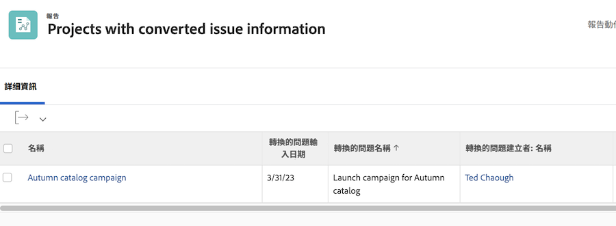

# 問題報告

## 透過建立報表來集中問題

許多流量和專案經理會建立 [!UICONTROL Workfront] 自訂報表，集中處理所有傳入的問題。 這可讓您輕鬆追蹤新增功能，且需要引起注意。

然後，可將報表新增至控制面板，將您完成工作所需的一切整合在一起 [!UICONTROL Workfront] 窗口。

![的影像 [!UICONTROL 解析對象] 欄。](assets/18-resolving-object-report.png)

要顯示問題轉換為的任務或項目的名稱，請包括「[!UICONTROL 解析對象]」欄。 A &quot;[!UICONTROL 解析對象]「 」是轉換問題時建立的任務或專案。 如果問題尚未轉換，則 [!UICONTROL 解析對象] 欄位將空白。 此報表可快速讓您查看已轉換的問題，以免最後出現重複項目。 只需按一下解析對象名以開啟它，以便跟蹤正在完成的工作的進度。

## 在報表中顯示原始問題資訊

有時，問題會轉換為任務或專案，以便根據組織的工作流程來追蹤和監控解決問題所需的工作。

項目或任務報告可以顯示有關原始問題的有用資訊。 這些欄可新增至具有文字模式報表的自訂檢視：

* [!UICONTROL 原始發行錄入日期]
* [!UICONTROL 原始問題名稱]
* [!UICONTROL 原始問題發起者名稱]

<!-- Need wf one documentation article link below

For the text mode used to create this report, see the article titled View: Display original issue information on task and project list.

-->

<!--  Learn more graphic and documentation article links

* Create and customize views
* Overview of resolving and resolvable objects
* Understanding resolving and resolvable objects

-->
