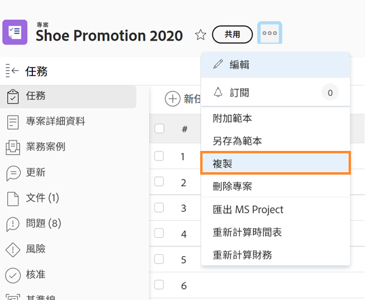

# 複製現有專案

有時候，您只需要複製專案以供其他一次性使用，而不是使用範本來建立專案。 要執行此操作，您必須擁有具有項目編輯和建立訪問權限的計畫許可證。

導覽至您要複製的專案，然後按一下專案名稱旁的3點功能表。 然後選擇「複製」。

通過「複製項目」窗口，您可以更改標題和狀態，並清除與項目關聯的各種資料，如分配、文檔和自定義資料。

選擇「清除分配」和/或將狀態設定為「計畫」，將阻止複製的項目在複製後立即發送任務分配通知。
