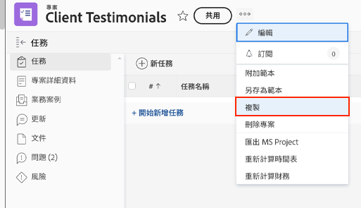

# 複製現有專案

有時候，反而不需要使用範本來建立專案，您只需要複製一個專案供另一次使用。若要這麼做，您必須擁有標準授權，且具備專案的編輯及建立存取權。

導覽到您要複製的專案並按一下專案名稱旁邊的三圓點選單。然後選取「複製」。

您可以使用「複製專案」視窗來變更標題和狀態，以及清除與專案相關的各種資料，例如指派、文件和自訂資料等選項。

選取「清除指派」或將狀態設定為「規劃」，避免所複製的專案在複製之後馬上傳送任務指派通知。

## 有關此主題的推薦教學課程

* [直接使用範本建立專案](/help/manage-work/create-and-manage-project-templates/create-a-project-directly-from-a-template.md)
* [處理任務](/help/manage-work/tasks/work-with-tasks.md)
* [指派專案計劃的任務](/help/manage-work/tasks/assign-tasks-from-the-project-plan.md)
