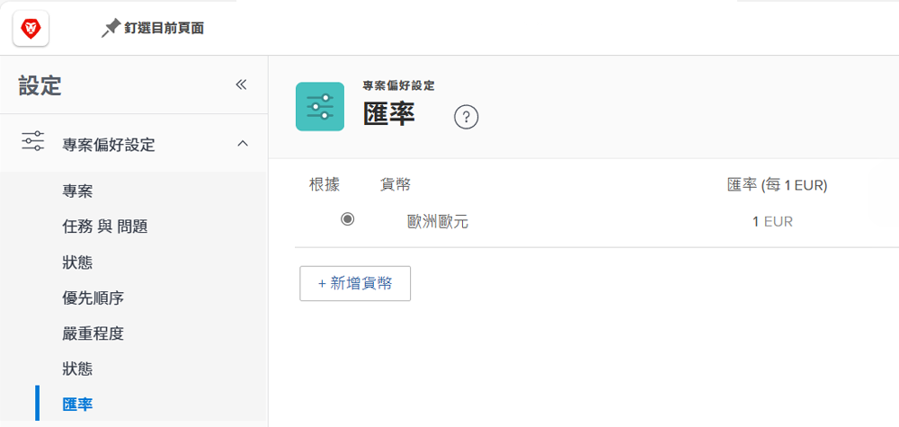
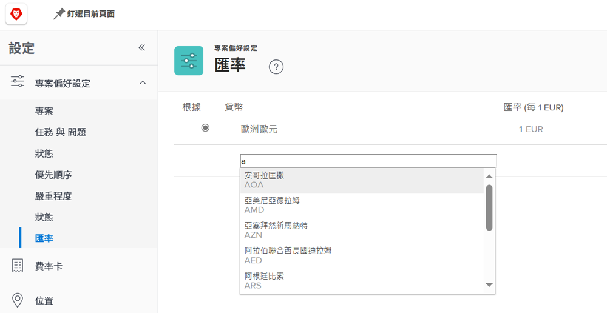

# 設定匯率

[!DNL Workfront] 支援屬於跨國公司的客戶組織使用不同貨幣。您可以在專案和報告中使用匯率，以世界各地的不同貨幣來反映財務資訊。

匯率由系統管理員管理。您的組織可以根據需求設定其他貨幣。

Workfront 預設的基礎貨幣是美元。這是計算財務資訊預設使用的貨幣。您可以在全域設定以及個別專案中變更這個預設值。

## 設定貨幣和匯率

**在主選單中選取「[!UICONTROL 設定]」。**

1. 展開左側選單面板的「**[!UICONTROL 專案偏好設定]**」。
1. 按一下「**[!UICONTROL 匯率]**」。
1. 按一下「**[!UICONTROL 新增貨幣]**」按鈕。
1. 從下拉式選單選取國家貨幣。
1. 輸入所需貨幣匯率。
1. 如果要使用美元以外的其他貨幣作為 [!DNL Workfront] 系統的基礎 (預設) 貨幣，請按一下貨幣名稱旁邊的按鈕。
1. 新增所有貨幣之後按一下「**[!UICONTROL 儲存]**」。

>[!NOTE]
>
>Workfront 不會更新或追蹤匯率目前的市場價值。如有必要，必須手動進行更新。
