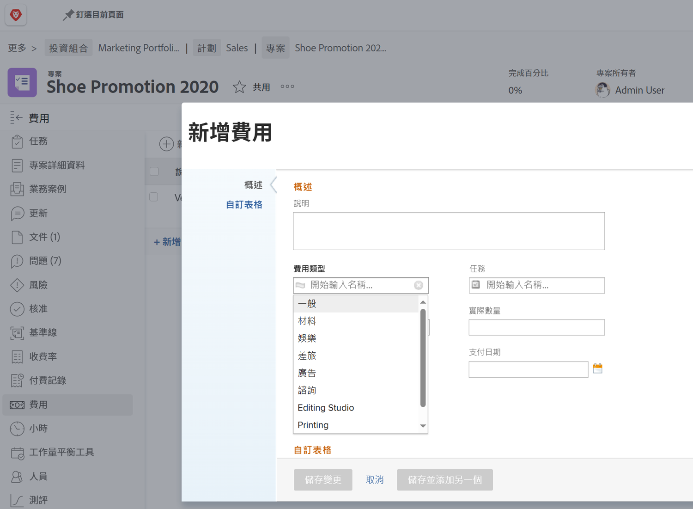

# 設定費用型別

中的費用 [!DNL Workfront] 代表與專案和其他工作相關的非人力成本。 例如，費用可能是造訪客戶時的差旅費用，或是完成拍照所需的耗材。 這些費用應記錄於專案中，以便針對任何專案計算並報告計畫成本與實際成本。

[!DNL Workfront] 有預先建立的費用型別，可在輸入費用時使用。 無法刪除或修改預設值，但可以新增預設值。

* 廣告
* 諮詢
* 娛樂
* 一般
* 材料
* 列印
* 送貨
* 差旅

系統管理員可以新增其組織所需的費用型別。 您可以修改、隱藏或刪除這些額外的費用型別，以支援組織所需的財務報告。

專案經理、高階主管和其他人員可以產生費用報表 — 如有需要，可以依型別將個別費用分組 — 用於內的任務、專案、計畫或投資組合 [!DNL Workfront]. 使用費用型別，專案財務管理變得更容易管理。

## 建立費用型別

**選取 [!UICONTROL 設定] 從主功能表**

1. 按一下 **[!UICONTROL 費用型別]** 在左側面板選單中。
1. 按一下 **[!UICONTROL 新費用型別]** 按鈕。
1. 為費用型別命名。
1. 視需要新增說明。
1. 按一下 **[!UICONTROL 儲存]** 按鈕。

![建立新專案的影像 [!UICONTROL 費用型別]](assets/setting-up-finances-6.png)

## 使用費用型別

費用選項會顯示在 **[!UICONTROL 費用型別]** 當使用者在專案或任務中建立費用時下拉式清單 [!DNL Workfront].

