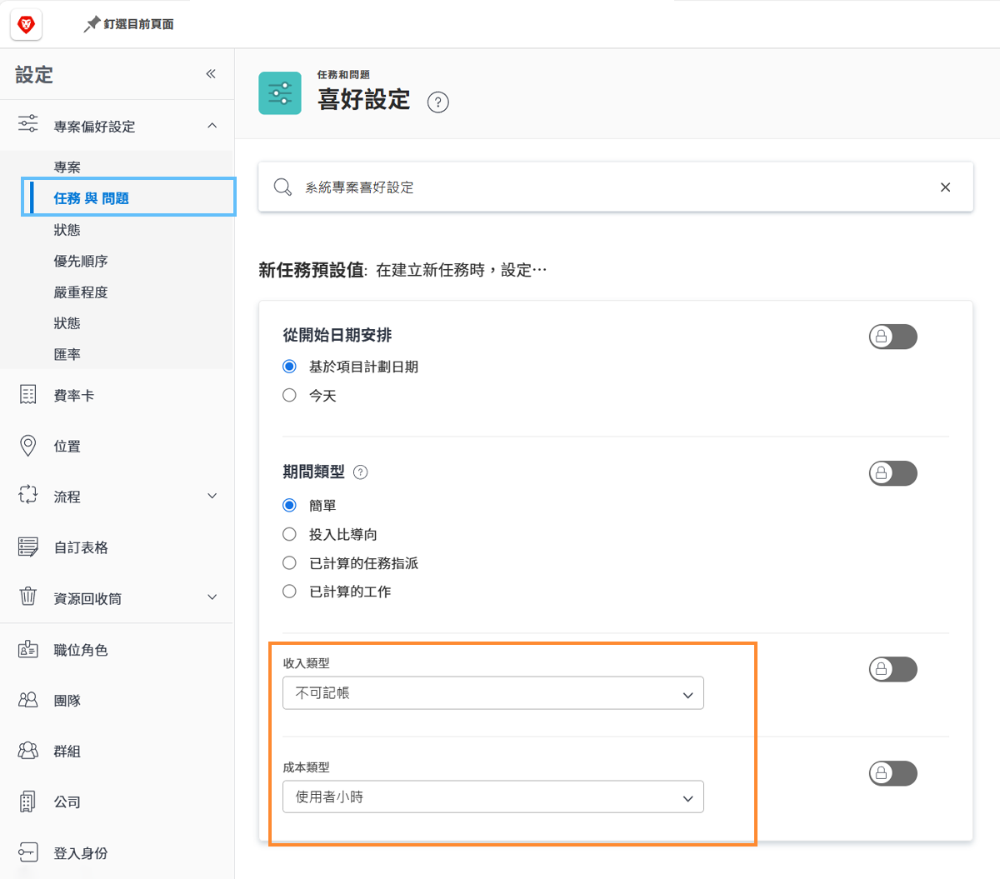

# 設定任務的預設收入與成本

使用收入類型和成本類型來計算任務的規劃財務資訊和實際財務資訊。每一項預設資訊皆可設為全系統適用，以便套用到每一個新建立的任務。您可以在個別專案上變更相關資訊，或是把資訊設定在專案範本上。

**有五種可用的預設收入類型：**

* 不可計費
* 使用者每小時
* 角色每小時
* 固定每小時
* 固定收入

**有四種可用的預設成本類型：**

* 無成本
* 固定每小時
* 使用者每小時
* 角色每小時

>[!NOTE]
>
>當收入或成本類型設為「不可計費」或「無成本」時，任務不會產生收入和成本的估算值。因此，該任務的工作對於專案層級的收入或成本沒有貢獻。

## 設定收入和成本預設值

在主選單中選取「**[!UICONTROL 設定]**」。

1. 按一下左側面板選單的「**[!UICONTROL 專案偏好設定]**」。
1. 然後按一下「**[!UICONTROL 任務和問題]**」。
1. 在「[!UICONTROL 新增任務預設值]」區段，選取所需的「[!UICONTROL 收入類型]」和「[!UICONTROL 成本類型]」。
1. 完成時，按一下「儲存」。

