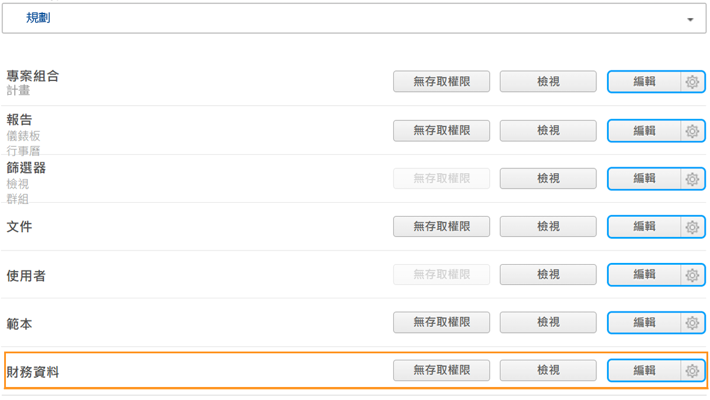
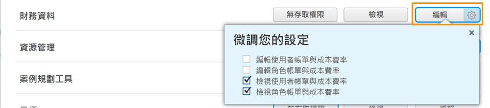

# 瞭解財務資訊存取

如果您的組織從 [!DNL Workfront] 擷取任何財務資料，作為系統管理員，您有責任保護及管理擁有權限檢視和編輯該資訊的人員。

使用者要檢視或編輯財務資訊，需要具備兩個條件：

1. 必須啟用[!UICONTROL 存取層級]的存取權。
2. 使用這些存取權的權限必須按照物件逐一授予。

例如，使用者可能在存取層級獲得檢視財務資料的權限，但是他們只能檢視某個任務與他們共用的財務資料，而且該任務的共用設定啟用財務資料檢視功能。

因此，在[!UICONTROL 存取層級]擁有檢視財務資料權限的使用者，可能可以檢視其中某些物件的財務資料，根據那些物件個別的共用選項而定。但是，任何使用者均無法檢視任何物件上的財務資料，除非他們在[!UICONTROL 存取層級]獲授予相關權限。

## [!UICONTROL 存取層級]設定

首先根據 [!DNL Workfront] 授權類型授予財務資料的整體存取權。

**[!UICONTROL 計劃]授權擁有以下權限：**

* 管理計費記錄
* 管理和檢視角色計費與成本費率
* 管理和檢視使用者帳單與成本費率
* 管理費用
* 檢視和編輯財務資料

**[!UICONTROL 工作]授權擁有以下權限：**

* 管理費用
* 檢視財務資料

**[!UICONTROL 檢閱]授權擁有以下權限：**

* 檢視財務資料

**可以依據[!UICONTROL 存取層級]修改權限。財務資料存取的三個選項包括：**

* [!UICONTROL 無存取權] — 使用者無法查看財務資訊。
* [!UICONTROL 檢視] — 使用者可以檢閱和共用資訊。
* [!UICONTROL 編輯] — 使用者可以建立、編輯、刪除和共用資訊。(僅適用於「計劃」授權。)

請注意，對於[!UICONTROL 計劃]授權，[!UICONTROL 檢視]和[!UICONTROL 編輯]選項有額外的設定。按一下「[!UICONTROL 檢視]」按鈕上的齒輪來查看這些選項：

**[!UICONTROL 檢視]**

* 檢視角色帳單與成本費率
* 檢視使用者帳單與成本費率

**[!UICONTROL 編輯]**

「[!UICONTROL 編輯]」選項亦提供上述兩個選項，再加上以下選項：

* 編輯角色帳單與成本費率
* 編輯使用者帳單與成本費率

>[!NOTE]
>
>具有新增費用權限的使用者也可以檢視自己新增的費用以及其直屬部下新增的費用。
