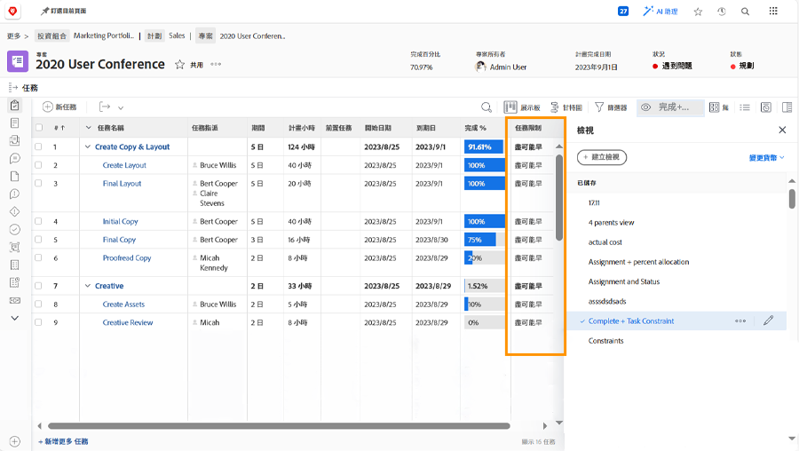

# 從專案時間表追蹤進度

請確定任務進度如預期般符合專案截止日期。 當您掃描時 [!UICONTROL 任務] 清單，中有數個功能 [!DNL  Workfront] 協助您監視工作的進度和狀態。

## 完成百分比

每個工作任務的完成百分比有時用於衡量工作的進度。 請務必注意……此欄位必須手動調整，因為這是被指定者對進度預估值。

>[!TIP]
>
>雖然需要手動更新工作任務的完成百分比，但Workfront會根據完成百分比以及每個子任務的期間或計畫時數，計算父任務的完成百分比。 這表示如果您將大型任務分成較小的子任務，將獲得更好的完成百分比準確性。

![專案任務清單顯示 [!UICONTROL 完成百分比] 欄](assets/planner-fund-task-percent-complete.png)

完成百分比自動變更時有三次：

* 當任務 [!UICONTROL 狀態] 設為「完成」，完成百分比會變更為100。
* 如果任務 [!UICONTROL 狀態] 回覆為新值，完成百分比會重設為0。
* 在父系任務中，當子系任務的完成百分比變更時。

## 狀態

包含 [!UICONTROL 狀態] 欄位 [!UICONTROL 檢視] 以快速檢視哪些工作已開始、正在進行中，以及已完成中。 您甚至可以在「 」中設定條件式格式 [!UICONTROL 檢視] 為每個狀態著色，讓資訊更容易解密。

## 任務指派

當您稽核專案時，請稽核任務指派。 可能因為沒有指派任何人員處理工作而造成工作落後。 或可能受指派人沒有完成工作的適當技能組。 新增更多人員至任務或重新指派任務以確保完成工作。

## 任務限制

有時任務限制會變更，而您並未實現。 限制會影響您的時間表行為，因此您應確保已設定好您希望使用的限制。

建立自訂檢視，其中包含 [!UICONTROL 任務限制] 欄，以在您的工作清單上檢視此資訊。 如果您從開始日期開始規劃專案，希望任務具有 [!UICONTROL 儘快] ([!UICONTROL ASAP])條件約束。

如需有關任務限制的詳細資訊，請參閱 [瞭解並管理期間型別和任務限制](https://experienceleague.adobe.com/docs/workfront-learn/tutorials-workfront/manage-work/intermediate-projects/understand-and-manage-duration-types-and-task-constraints.html).
