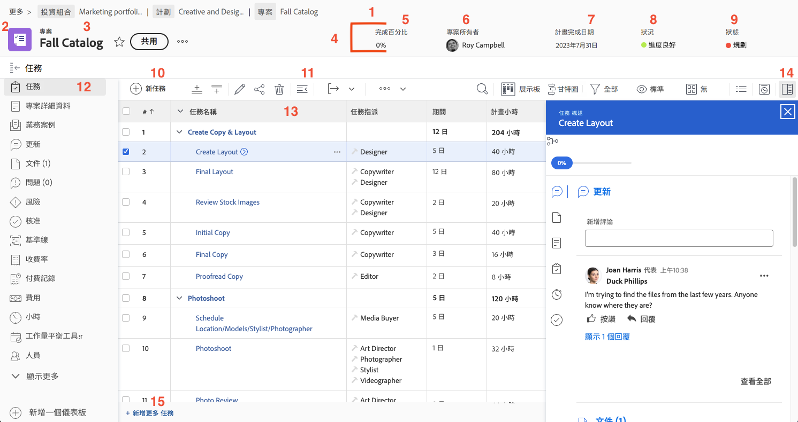

# 導覽專案頁面

本影片提供在Workfront中導覽及管理專案頁面的概觀。&#x200B;URL 重要功能包含：

* **專案標題：**&#x200B;顯示基本資訊，例如完成百分比、專案經理、計畫完成日期、專案狀態及狀態。&#x200B;URL 狀態有助於追蹤專案的階段並觸發通知。&#x200B;URL
* **階層連結導覽：**&#x200B;顯示專案在組織方案和投資組合中的位置，並提供可點按的連結以方便導覽。&#x200B;URL
* **我的最愛和功能表：**&#x200B;我的最愛會將該專案加入書籤以供快速存取，而功能表則提供編輯詳細資訊、複製專案和重新計算時間表等選項。&#x200B;URL
* **工作清單：**&#x200B;代表專案計畫中的步驟。&#x200B;URL 使用快速篩選來找出任務、內聯編輯以進行快速變更，以及任務摘要面板以取得詳細資訊。&#x200B;URL 按一下任務名稱會開啟其專用頁面。&#x200B;URL
* **左側面板：**&#x200B;提供各種專案區段的存取權，例如詳細資訊、更新及檔案。&#x200B;URL 該面板可由系統管理員自訂。&#x200B;URL
* **更新區段：**&#x200B;集中有關專案的通訊，允許標籤使用者、回複評論，以及檢視任務、問題和檔案的彙總更新。&#x200B;URL
* **檔案區段：**&#x200B;啟用上傳和管理專案相關的檔案和校樣。&#x200B;URL 附加到任務的檔案會彙總到專案層級，以便輕鬆存取。&#x200B;URL

>[!VIDEO](https://video.tv.adobe.com/v/3449737/?quality=12&learn=on&enablevpops=1&captions=chi_hant)

## 關鍵重點

* **專案標題概述：**&#x200B;快速存取關鍵專案詳細資料，例如完成百分比、專案經理、到期日、狀態和狀況。&#x200B;URL 狀態也會控制通知和工作流程階段。&#x200B;URL
* **任務管理：**&#x200B;使用任務清單來追蹤專案步驟、套用快速篩選以尋找任務並進行內嵌編輯。&#x200B;URL 透過摘要面板或任務頁面存取詳細的任務資訊。&#x200B;URL
* **階層連結導覽：**&#x200B;使用階層連結追蹤中的可點按連結，導覽組織內的專案階層。&#x200B;URL
* **集中式更新：**&#x200B;任務、問題和檔案的所有更新會彙總到專案更新區段，簡化通訊和追蹤。&#x200B;URL
* **檔案組織：**&#x200B;在檔案區段中上傳和管理專案相關的檔案和校樣，確保相關檔案已附加至任務，以簡化共同作業。&#x200B;URL

## 專案頁面的主要部分

[按一下這裡](/help/assets/key-parts-of-the-project-page.pdf)以下載此頁面的 PDF 版本。

專案頁面提供協助您管理工作的許多功能。如果您需要的選項並未出現在您的 [!DNL Workfront] 執行個體上，請與您的系統管理員合作解決。以下是值得注意的數個專案頁面主要功能。

1. **階層連結路徑：**&#x200B;導覽專案背後的方案及專案組合階層
2. **物件類型：**&#x200B;在登陸頁面上顯示物件類型協助您識別自己正在查看 [!DNL Workfront] 哪些部分。「專案」一詞可由您的 [!DNL Workfront] 系統管理員自訂。
3. **專案名稱：**&#x200B;您正在檢視的專案名稱。按一下名稱來編輯。
4. **專案標題：**&#x200B;所有專案頁面上可用的標準資訊。
5. **[!UICONTROL 完成百分比]：**&#x200B;這會根據專案中任務完成的情況自動更新。
6. **[!UICONTROL 專案所有者]：**&#x200B;在大多數組織中，這是指專案經理人。此人員負責管理 [!DNL Workfront] 中的專案並確保專案完成。
7. **[!UICONTROL 規劃完成日期]：**&#x200B;專案的規劃完成日期由專案經理人經由專案時間表設定。
8. **[!UICONTROL 情況]：**「[!UICONTROL 情況]」是用視覺化方式呈現的專案進展情況。[!DNL Workfront] 可以根據專案中任務的進度狀態自動設定「[!UICONTROL 狀況]」。或者透過專案詳細資料手動設定「[!UICONTROL 狀況]」。
9. **[!UICONTROL 狀態]：**「[!UICONTROL 狀態]」表示專案目前處於流程中哪個位置：專案是否仍在規劃中、專案是否進行中，或專案是否已完成。
10. **[!UICONTROL 新增任務]：**&#x200B;按一下在專案中建立任務。在清單底部產生任務。
11. **[!UICONTROL 匯出]：**&#x200B;將任務清單或選取的任務匯出為 PDF、試算表或以定位點分隔的檔案。
12. **左側面板選單：**&#x200B;使用左側面板導覽至關於專案的不同資訊。若您的螢幕需要更多空間，按一下頂端的「工作」圖示來摺疊面板。拖放圖示，使其位置順序有助於提升工作效率。您看到的選項由您的 [!DNL Workfront] 系統管理員設定。
13. **任務清單：**&#x200B;任務清單顯示組成專案計劃的所有任務。每個任務可見的資訊由所選的視圖決定。
14. **摘要面板：**&#x200B;透過摘要面板可快速檢視所選任務的資訊。按一下摘要面板圖示可開啟或關閉。
15. **新增更多任務**：按一下此處可使用內聯編輯將另一個任務新增至任務清單的底部。

## 有關此主題的推薦教學課程

* [瞭解建立專案的基本操作](/help/manage-work/projects/understand-basic-project-creation.md)
* [瞭解建立專案的四種方法](/help/manage-work/projects/understand-other-ways-to-create-projects.md)
* [填寫專案詳細資料](/help/manage-work/projects/fill-in-the-project-details.md)

