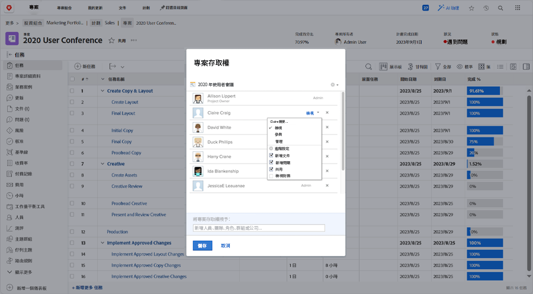

# 共用專案

讓利益相關方和協作者了解項目是管理項目的重要部分。

共用專案，確保每個人都能查看所需資訊。 在Workfront中，這是使用 [!UICONTROL 共用] 選項。 您可以從個別專案，從 [!UICONTROL 更多] 的雙曲正切值。

或者，您可以從上的專案清單中一次共用多個專案 [!UICONTROL 專案] 頁面，方法是選取專案並按一下 [!UICONTROL 共用] 按鈕。

共用專案可讓所有參與者在需要時查看專案資訊。

<!---
Learn More Icon
Share permissions on objects
Share a project
--->
