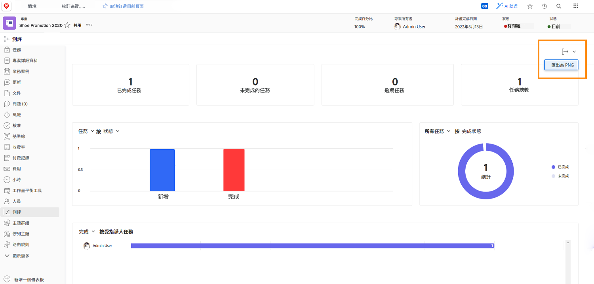

# 使用專案量度追蹤工作進度

在本影片中，您將瞭解如何：

* 存取專案度量圖表
* 自訂圖表中的資訊

>[!VIDEO](https://video.tv.adobe.com/v/336667/?quality=12&learn=on)

您可將整個專案量度控制面板匯出為.png檔案，並使用 [!UICONTROL 匯出] 按鈕。 這可讓您透過電子郵件或簡報，輕鬆與他人共用資料。

<!---
Overview of project metrics
--->
