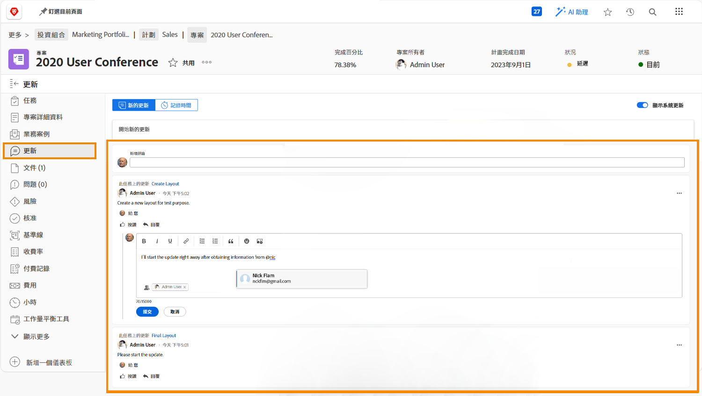

# 了解專案通訊

正如俗話所說，管理項目的90%是溝通。 與專案團隊、您的經理和專案利害關係人進行溝通。

但當專案團隊使用電子郵件、即時訊息、會議和便箋來進行專案通訊時，資訊會被分散……甚至更糟，被遺忘。 保持與項目本身的項目工作的溝通 [!DNL Workfront] 使用更新。

當項目團隊成員正在處理分配時，他們可以從 [!DNL Workfront] [!UICONTROL 首頁] 在分配給它們的任務上。

從任務、問題和文檔到項目級別的更新 [!UICONTROL 更新] 頁簽，使資訊快速且易於查看。

接著，您只需按一下按鈕，即可回覆更新。 這可讓所有對話集中在一個位置，讓您稍後可以回復。

<!---
learn more urls
Communicate about work in Home
Subscribe to items in Workfront
Update work
--->
