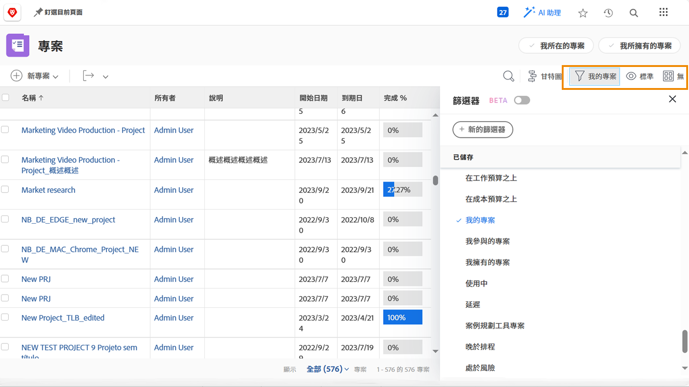
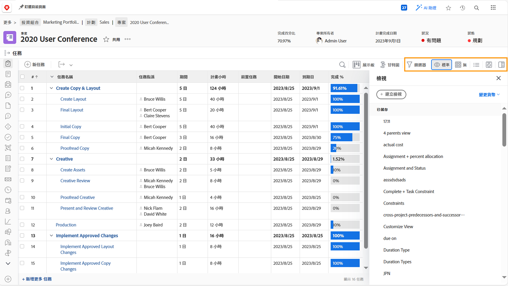

# 查看項目資訊

不管你是在看 [!UICONTROL 專案] 頁面或個別專案，微調清單以查看您需要的資訊 [!UICONTROL 篩選器], [!UICONTROL 檢視]，和 [!UICONTROL 分組].

您可以在 [!UICONTROL 專案] 頁面。

使用 [!UICONTROL 篩選器] 以根據特定條件縮小清單。 然後選取 [!UICONTROL 檢視] 顯示與項目相關的資訊列。 最後，選取 [!UICONTROL 分組] 以對你有意義的方式組織項目。

當你在 [!UICONTROL 工作] 項目部分，使用 [!UICONTROL 篩選器], [!UICONTROL 檢視]，和 [!UICONTROL 分組] 再次幫助您監視正在完成的工作。 因為您看的是任務而不是項目，所以您有一整套不同的選擇。

許多 [!DNL Workfront] 客戶建立自訂檢視，公開自訂表單資訊和與正在完成的工作相關的其他欄位。
