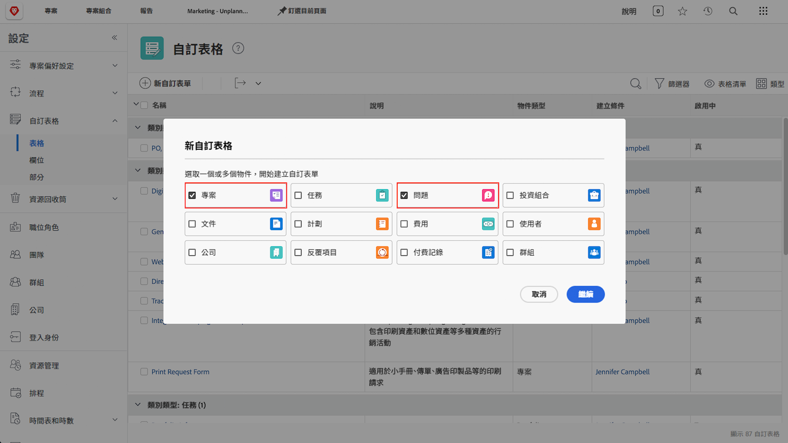
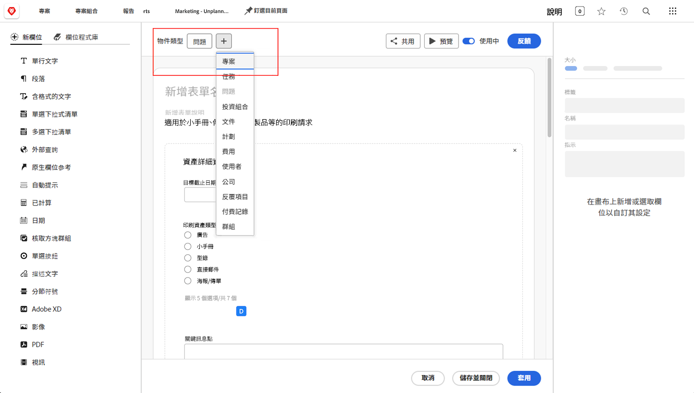

# 請求佇列常見問題的解答

**為什麼我可以看到請求佇列，但我的使用者看不到？**

在您的請求佇列/專案的「[!UICONTROL 佇列詳細資料]」標籤中，確認您的使用者符合「誰可以對此佇列新增請求」欄位的條件。

如需詳細資訊，請觀看這部影片：

>[!VIDEO](https://video.tv.adobe.com/v/3434156/?quality=12&learn=on&enablevpops=1)

**我授予使用者存取佇列的權限，但現在他們也可以看見請求佇列專案。為什麼？**

在「誰可以新增要求至此佇列？」清單中，如果您選擇「對此專案有檢視存取權的人員」，凡是您就為了使用請求佇列而授予檢視存取權的任何對象，也將能查看專案清單中的請求佇列。為了避免這種情況，請使用「此專案公司中的人員」或「此專案群組中的人員」選項。

**我可以將請求轉換成專案嗎？**

是。您可以根據需要將問題轉換成任務或專案。

這些教學課程將說明如何進行下列操作：

* [將問題/請求轉換為專案](/help/manage-work/issues-requests/create-a-project-from-a-request.md)

* [將問題/請求轉換為任務](/help/manage-work/issues-requests/convert-issues-to-other-work-items.md)

**在哪裡可以找到進行編輯的請求佇列？**

您可以使用導覽列的「[!UICONTROL 搜尋]」欄位或是瀏覽「[!UICONTROL 專案]」區域的清單。

如果您從請求佇列中開啟一項請求，您可以按一下階層連結區域中的專案名稱。

**我可以把請求自訂表單中的資訊轉移到專案自訂表單嗎？**

是。在您建立自訂表單時，請同時選取「[!UICONTROL 專案]」和「[!UICONTROL 問題]」作為物件類型。您也可以編輯專案自訂表單以納入問題物件類型，反之亦然。

將自訂表單附加到請求上。當您將請求轉換成專案時，自訂表單會自動附加到新的專案上，而任何欄位所包含的值將會同時出現在請求和專案自訂表單上。

**我正在查看專案或任務報告。我如何找出這個物件來自哪項請求？**

您可以存取「**[!UICONTROL 已轉換的問題]**」和「**[!UICONTROL 已轉換問題的建立者]**」欄位來源中的欄位，把該資訊新增到專案和任務報告中。

如需詳細資訊，請觀看這部影片：

>[!VIDEO](https://video.tv.adobe.com/v/3434176/?quality=12&learn=on&enablevpops=1)

**在報告中篩選請求佇列的最佳方法是什麼？**

若您的專案篩選器包含「**佇列 >> 是公開的 >> 等於 >> 無**」，則您的報告只會顯示「**不是**」請求佇列的專案。

若您的專案篩選器包含「**佇列 >> 是公開的 >> 不等於 >> 無**」，則您的報告只會顯示「**是**」請求佇列的專案。

如需詳細資訊，請觀看這部影片：

>[!VIDEO](https://video.tv.adobe.com/v/3434329/?quality=12&learn=on&enablevpops=1)

**建立請求佇列的自訂狀態是適當作法嗎？**

某些客戶會建立與「目前」等同的請求佇列自訂狀態。然後，他們可以執行報告來顯示所有請求佇列，或輕鬆地從報告中排除請求佇列。雖然這項作法比使用「**佇列 >> 是公開的 >> 不等於 >> 無**」更容易操作，但缺點是使用者建立請求佇列時可能會忘記這項作法，因為「目前」狀態也同樣可有效運作，並且是他們在大多數訓練教材中所看到的作法。因此，許多客戶選擇不使用請求佇列的自訂狀態。

但是，如果您已經在組織中使用請求佇列狀態，而且您只想要透過一種方法來確保正確使用請求佇列狀態 (或在未正確使用的情況下進行修正)，則可以建立上面影片所述的「**使用中的請求佇列**」報告，並將「**專案 >> 狀態等同於 >> 等於 >> 目前**」篩選器變更為「**專案 >> 狀態 >> 等於 >> 目前**」。這樣一來，系統就會向您顯示所有狀態為「目前」的使用中請求佇列 (而不是您希望其使用的請求佇列狀態)。選取顯示的所有專案，並進行大量編輯來更改請求佇列狀態。

## 有關此主題的推薦教學課程

* [瞭解請求佇列](/help/manage-work/request-queues/understand-request-queues.md)
* [建立請求佇列](/help/manage-work/request-queues/create-a-request-queue.md)
* [了解請求流程設定](/help/manage-work/request-queues/understand-settings-for-a-flow-request.md)
* [建立請求流程](/help/manage-work/request-queues/create-a-request-flow.md)
* [建立系統管理員意見回饋請求佇列](/help/manage-work/request-queues/create-a-system-admin-feedback-request-queue.md)
