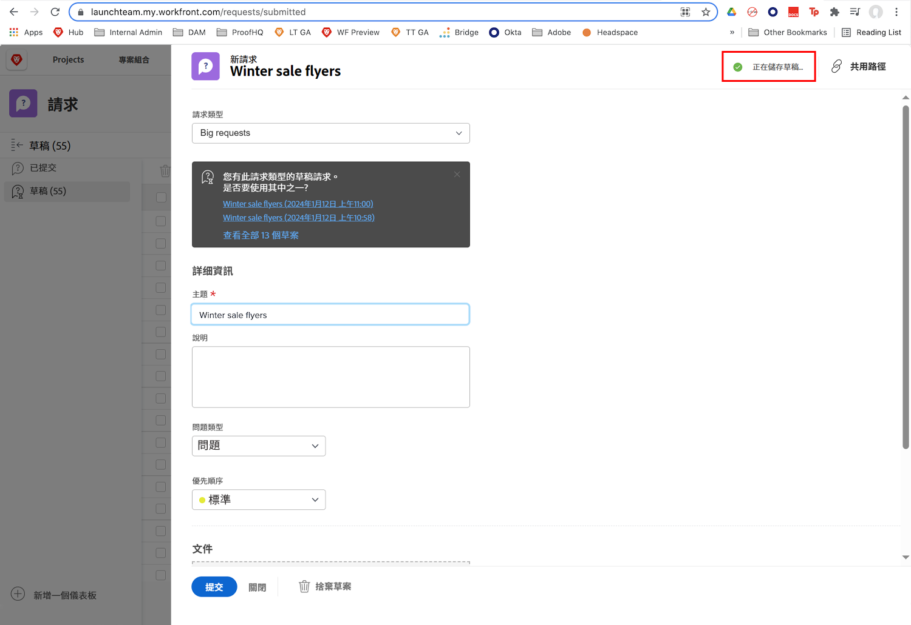
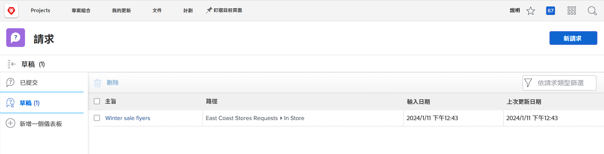

# 瞭解請求佇列

觀看這段影片，您將會瞭解：

* 如何透過提交請求 [!DNL  Workfront] 請求佇列
* 請求佇列的結構

>[!VIDEO](https://video.tv.adobe.com/v/335220/?quality=12&learn=on)

## 請求草稿自動儲存

當您開始填寫請求表單時，在填寫「[!UICONTROL 主旨]」欄位之後 [!DNL Workfront] 會自動儲存草稿。這表示如果您需要導覽以離開 [!UICONTROL 請求] 區域做其他事情，或者如果您需要在請求中途暫停以收集更多資訊。

您會在視窗頂端看到草稿已儲存的指示。 [!DNL Workfront] 將會儲存請求的草稿，即使尚未填寫必填欄位亦然。

當您準備好提交請求時，請在 [!UICONTROL 草稿] 標籤。 按一下名稱來開啟並完成表單填寫。然後按一下 [!UICONTROL 提交請求] 完成時。

## 換您來操作

讓我們花一點時間回顧剛才提供給您的資訊。

**問題：**&#x200B;如何在 Workfront 中提出請求？按順序列出步驟。

* 選擇您需要提出的請求類型
* 按一下「提交請求」
* 填寫表單上的資訊
* 按一下「新增請求」
* 導覽至請求區域

**回答：**&#x200B;導覽至請求區域 > 按一下「新增請求」> 選擇您需要提出的請求類型 > 填寫表單上的資訊 > 按一下「提交請求」

**問題：**&#x200B;請求實際上是...

**回答：**&#x200B;問題

<!---
You can also access request drafts from the [!UICONTROL Select a Request Type] menu at the top of the window. Select an option from the [!UICONTROL Recent Drafts] section, or start a new request by picking a queue from the [!UICONTROL New Requests] section. Fill everything out like normal, then submit the request.

<!---
image
--->

<!---
Let's take a minute to review the information you were just presented.

How do you make a request in Workfront? List the steps in order.
Choose the request type you need to make
Click Submit request
Fill out the information on the form
Click "New Request"
Navigate to the request area

Answer: Navigate to the request area>Click New Request>Choose the request type you need to make>Fill out the information on the form>Click Submit request

A request is really an......

Answer: Issue
--->
