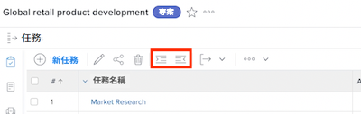
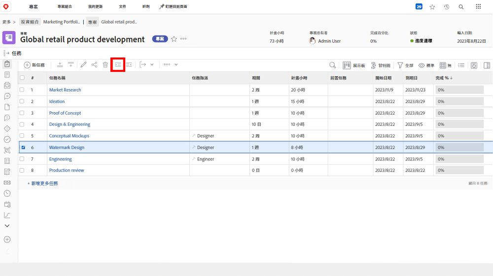
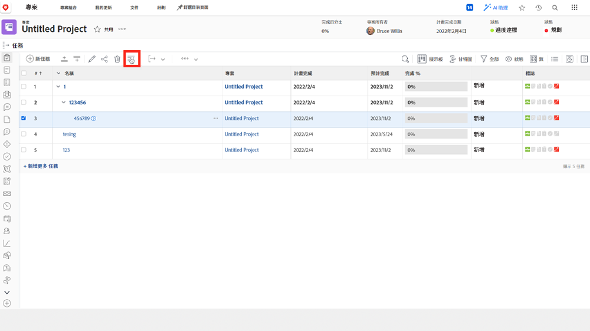

# 瞭解父子任務

在本影片中，您將瞭解：

* 任務在中如何建構 [!DNL Workfront] 專案

>[!VIDEO](https://video.tv.adobe.com/v/335087/?quality=12&learn=on)

## 將任務變更為子任務，然後再變更一次

此 **縮排** 和 **凸排** 按鈕可用來將任務變更為子任務，或從子任務變更為非子任務。

選取「[!UICONTROL 浮水印設計]」並按一下 **縮排** 按鈕。 &quot;[!UICONTROL 浮水印設計]「 」將成為「 」下的子任務[!UICONTROL 概念模型]「」，這會成為父系任務。

選取「[!UICONTROL 浮水印設計]&quot;當它是子任務並按一下 **凸排** 按鈕。 &quot;[!UICONTROL 浮水印設計]「 」將變為與「 」相同層級的常規任務[!UICONTROL 概念模型]「。

