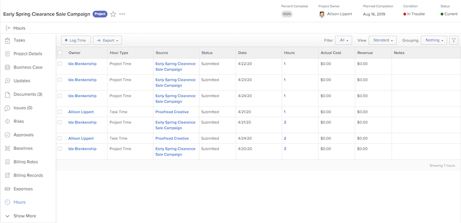

# 記錄和檢閱時數

若貴組織的工作流程中包含記錄工作的實際時數，您可以在專案的「[!UICONTROL 時數]」區段檢閱這些時數 (從左側面板選單選取)。這裡顯示個別任務和專案本身所記錄的全部時數。您也可以在這個頁面記錄時數。

>[!NOTE]
>
>貴組織可能會要求您使用 [!DNL Workfront] 時程表來核准時數。與您的內部 [!DNL Workfront] 團隊確認應該使用哪一個流程。

<!---
learn more url
Log time
--->
