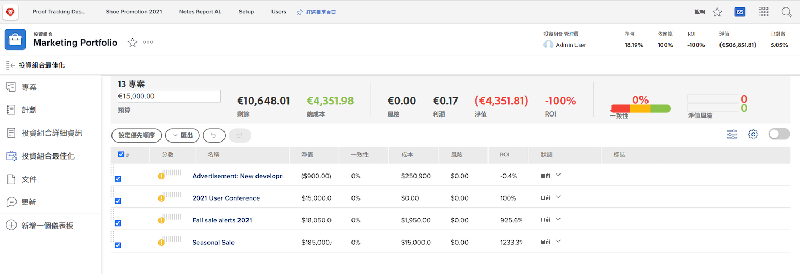

# 產品組合概觀

經理們往往有一項棘手的工作：找出哪些項目最能幫助公司實現目標。 這意味著根據對這些目標重要的標準來判斷當前項目或潛在項目。 此標準可包括所需資源數量、項目成本與項目帶來的成本、和/或相關風險數量等。 有了這些資訊，經理可以決定哪些項目應首先完成，哪些項目可以擱置。

考慮和規劃項目並不是一項過於困難的任務 — 大多數經理都習慣了這一過程。 真正的鬥爭是將項目相互比較。 篩選一長串詳細的項目清單非常耗時。 這就是投資組合 [!DNL  Workfront] 可以幫忙。

## 什麼是產品組合？

產品組合是針對相同資源、預算、排程和優先順序完成的專案集合。 例如，行銷機構可能會使用產品組合來為特定客戶將所有專案分組。

導覽至 **[!UICONTROL Portfolio]** 區段 [!UICONTROL 主菜單]，然後按一下產品組合名稱以開啟它。

您可以使用 **[!UICONTROL 新增專案]** 按鈕，輕鬆將現有專案新增至產品組合。 或者，您可以直接在產品組合中建立新專案。

![的下拉式功能表影像 [!UICONTROL 新增專案] 按鈕](assets/01-portfolio-management3.png)

將專案新增至產品組合後，您就可以使用頁面標題中的摘要資訊，以高階檢視專案收集對整體目標的貢獻，無論是正面或負面。

您也可以使用產品組合最佳化工具來排定支援整體策略目標的專案優先順序。

## 存取產品組合

若要使用產品組合，您必須在 [!DNL Workfront] 並指派存取層級，提供您處理產品組合的權限。

建立產品組合時，只有產品組合建立者或經理才能存取該產品組合。 您可以共用作品集來授予其存取權。 這也可讓您存取產品組合內建立的方案和專案。

開啟產品組合，按一下三點功能表，然後選取 **[!UICONTROL 共用]**. 新增應具有存取權的個人、團隊、工作角色、群組或公司。 然後確定每個應具有的訪問類型 — 管理或查看。

![的影像 [!UICONTROL 共用] 選項 [!DNL Workfront] 作品集](assets/04-portfolio-management11.png)

<!--
Pro-tips graphic
If a user can’t access a specific portfolio, make sure it’s shared with them. The Workfront access level determines that a user can access portfolios in general, but sharing makes sure they can see specific portfolios. 
-->

<!--
Learn more graphic and links to documentation articles
* Portfolio overview   
* Create a portfolio 
* Create and manage portfolios 
* Navigate within a portfolio 
* Share a portfolio   
-->
