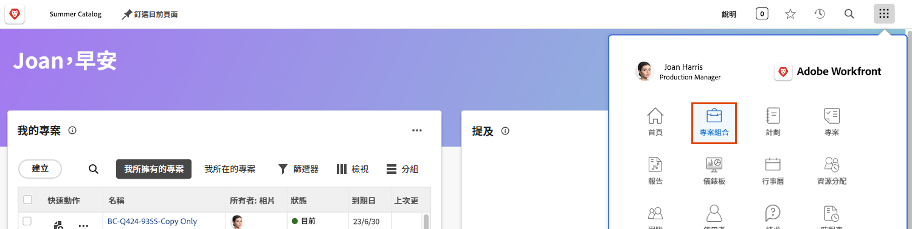
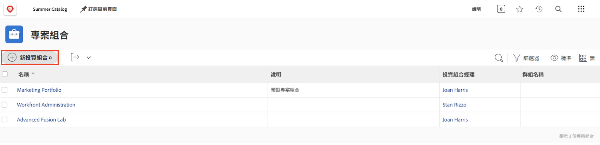
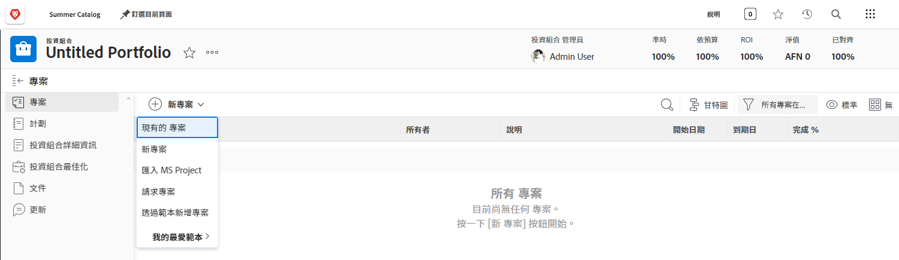
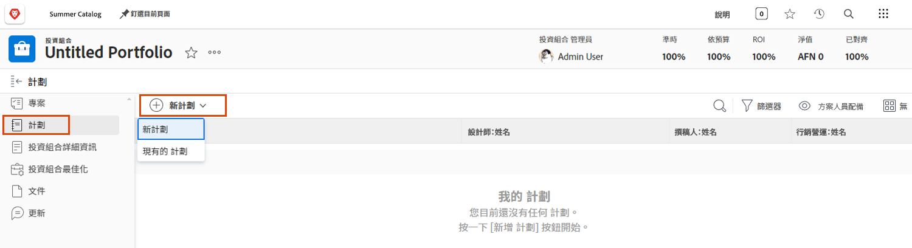

# 了解專案組合

管理員通常都要處理一項棘手的工作，即確定哪些專案對於實現公司的長期和短期目標最有幫助。這意味著要根據對目標具有重要性的條件來評估目前或可能的專案。這些條件可能包括所需的資源數量、專案需花費多少成本與專案所帶來的成效相比，以及瞭解相關的風險。藉由這些資訊，經理人可以決定應該完成哪些專案以及何時完成。

思考和規劃專案並不是太困難的任務；這是大多數經理人慣常經歷的過程。真正的困難在於專案的相互比較。仔細檢查一長串詳細的專案清單非常耗時。而這是 Workfront 的專案組合能發揮作用的地方。

## 什麼是專案組合？

專案組合是多個專案的集合，這些專案必須爭用相同的資源、預算、排程和優先順序。例如，行銷機構可能使用專案組合把特定客戶的所有專案組合起來。

導覽到[!UICONTROL 主選單]的「**[!UICONTROL 專案組合]**」區段，然後按一下專案組合名稱來開啟。

您可以使用「**[!UICONTROL 新增專案]**」按鈕輕鬆把現有專案新增到專案組合中。或者您可以直接在專案組合中建立新專案。

![影像顯示「[!UICONTROL 新增專案]」按鈕的下拉式選單](assets/01-portfolio-management3.png)

將專案新增到專案組合之後，您便可以使用頁面標題的摘要資訊，從高層次的角度檢視此專案集合對於整體目標的貢獻，無論是正面或負面。

您可以使用[!UICONTROL 產品組合最佳化工具]，根據淨值、一致性、成本、風險和投資報酬率來確認專案的優先順序。

## 存取專案組合

要使用專案組合，您在 Workfront 中必須獲得指派「計劃」授權，而且擁有可以使用專案組合的存取層級權限。

建立專案組合時，唯有專案組合的建立者或管理員才擁有其存取權。您可以透過共用權限讓其他人存取專案組合。對方也會因此擁有存取專案組合內所有方案和專案的存取權。

開啟專案組合並按一下三圓點選單，然後選取「**[!UICONTROL 共用]**」。新增應該擁有存取權的個人、團隊、職務角色、群組或公司。然後決定其分別應該擁有哪一類型的存取權：管理或檢視。

![影像顯示[!UICONTROL 共用]選項，位於 [!DNL Workfront] 專案組合](assets/04-portfolio-management11.png)

## 建立專案組合

若要建立專案組合，按一下主選單中的&#x200B;**[!UICONTROL 專案組合]**。

在「專案組合」區域中，按一下&#x200B;**[!UICONTROL 新專案組合]**。

為專案組合命名，然後按一下&#x200B;**[!UICONTROL 新專案]**&#x200B;將專案新增至專案組合。您可以透過多種方式建立新專案，就像在&#x200B;**[!UICONTROL 專案]**&#x200B;區域中建立新專案一樣。您從此處建立的任何新專案都將屬於此專案組合。您也可以按一下&#x200B;**[!UICONTROL 現有專案]**&#x200B;從清單中選取現有專案。

## 在專案組合中建立方案

選取&#x200B;**[!UICONTROL 方案]**&#x200B;標籤，然後按一下&#x200B;**[!UICONTROL 新方案]**，在此專案組合中建立新方案，或按一下&#x200B;**[!UICONTROL 現有方案]**，從其他專案組合中取走現有方案。

<!--
Pro-tips graphic
If a user can't access a specific portfolio, make sure it's shared with them. The Workfront access level determines that a user can access portfolios in general, but sharing makes sure they can see specific portfolios. 
-->

<!--
Learn more graphic and links to documentation articles
* Portfolio overview   
* Create a portfolio 
* Create and manage portfolios 
* Navigate within a portfolio 
* Share a portfolio   
-->

