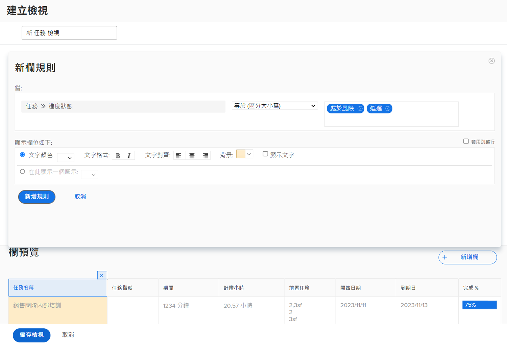

# 對視圖新增基本條件式格式設定

建立欄規則便可以進行條件式格式設定。欄規則允許您根據自己設定的條件，用特定方式將欄格式化。

觀看這段影片，您將會瞭解：

* 視圖中有哪些條件式格式設定
* 如何建立和修改條件式格式設定

>[!VIDEO](https://video.tv.adobe.com/v/335149/?quality=12&amp;learn=on&amp;enablevpops=0

## 條件式格式概要

若要建立條件式格式設定：

1. 選擇您想要顯示格式的列
1. 決定您想要格式設定變更哪些狀況
1. 決定哪一種格式設定變更效果最好

   * 背景顏色
   * 文字顏色
   * 替代文字
   * 顯示圖示

## 「對視圖新增基本條件式格式設定」活動

### 活動 1：對視圖新增條件式格式設定

使用現有的「標準」視圖，然後在「[!UICONTROL 名稱]」欄新增這項條件式格式設定，建立名為「標準 +進度」的任務視圖。

1. 新增一項欄規則，當任務的進度狀態為「延遲」時，將欄位背景變成紅色。
1. 新增一項欄規則，當進度狀態為「落後」或「有風險」時，將欄位背景變成黃色。

這類規則可以協助您在視圖不包含進度狀態欄的情況下發現有問題的任務。

### 解答 1

1. 在任務清單報告中，前往「**[!UICONTROL 視圖]**」下拉式選單並選取「**[!UICONTROL 新增視圖]**」。
1. 將您的視圖命名為「標準 + 進度」。
1. 使用所提供的預設欄。
1. 選取「[!UICONTROL 任務名稱]」欄。這就是您想要套用條件式格式設定的欄，以便在任務的進度狀態不是「準時」的時候顯示紅色或黃色。
1. 按一下 Report Builder 視窗右上角的「**[!UICONTROL 進階選項]**」。
1. 按一下「**[!UICONTROL 為此欄新增一項規則]**」。
1. 把視窗上方的「[!UICONTROL 任務]」>「[!UICONTROL 名稱]」變更為「[!UICONTROL 任務]」>「[!UICONTROL 進度狀態]」，啟動欄規則。按一下「[!UICONTROL 任務]」>「[!UICONTROL 名稱]」旁邊的 **[!UICONTROL X]** 圖示，把規則從欄位中刪除。
1. 在欄位中輸入「進度」，然後在「[!UICONTROL 任務]」欄位來源之下選取「[!UICONTROL 進度狀態]」。
1. 在「[!UICONTROL 等於]」限定詞右邊的欄位中選取「**[!UICONTROL 延遲]**」。
1. 在「[!UICONTROL 文字顏色]」列選擇紅色的背景。
1. 按一下「**[!UICONTROL 新增規則]**」來儲存欄規則。
1. 現在再次按一下「**[!UICONTROL 新增欄規則]**」，新增另一條規則。
1. 和之前一樣，從條件欄位中刪除「[!UICONTROL 任務]」>「[!UICONTROL 名稱]」。使用「[!UICONTROL 任務]」欄位來源之下的「[!UICONTROL 進度狀態]」來取代。
1. 在「等於」限定詞右邊的欄位中選取「[!UICONTROL 有風險]」及「[!UICONTROL 落後]」。
1. 在「[!UICONTROL 文字顏色]」列選擇黃色的背景。
1. 按一下「**[!UICONTROL 新增規則]**」來儲存欄規則。
1. 按一下「**[!UICONTROL 儲存視圖]**」來儲存視圖。
