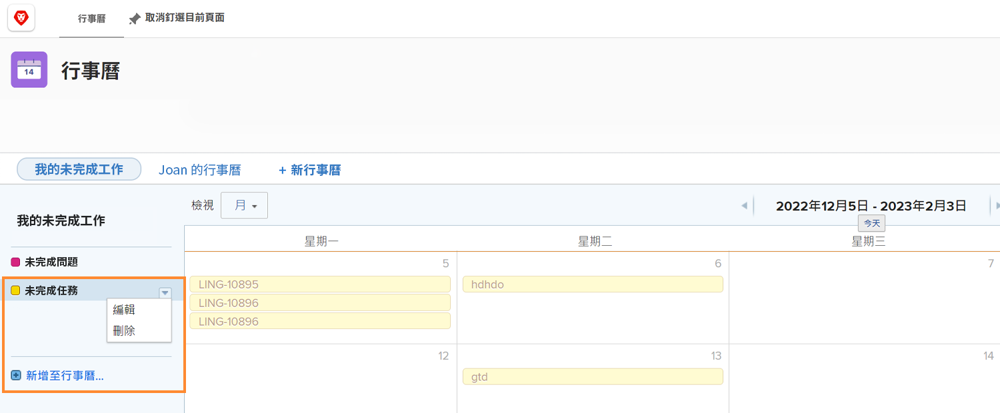

# 了解其他日曆選項

在本節中，您將學習如何：

* 編輯日曆分組
* 刪除日曆分組
* 共用日曆

## 編輯日曆分組

若要編輯群組，請將滑鼠移至日曆上的名稱上。 按一下右側顯示的向下箭頭，然後選取 **[!UICONTROL 編輯]**.

## 刪除日曆分組

若要刪除群組，請將滑鼠移至日曆上的名稱上。 按一下右側顯示的向下箭頭，然後選取 **[!UICONTROL 刪除]**.

## 共用日曆

作為項目經理，您可以建立要與其他人共用的日曆，如項目經理、團隊成員等。

1. 從 **[!UICONTROL 主菜單]**，選取 **[!UICONTROL 日曆]** 的上界。
1. 選擇要共用的日曆。
1. 選擇 **[!UICONTROL 共用]** 從 **[!UICONTROL 日曆動作]** 下拉式功能表。
1. 輸入要共用日曆的用戶、角色、團隊、組或公司的名稱。
1. 選取使用者是否獲得 [!UICONTROL 檢視] 或 [!UICONTROL 管理] 存取日曆報表。
1. 按一下 **[!UICONTROL 儲存]**.

在共用日曆時，請注意以下幾點：

* 按一下 **[!UICONTROL 齒輪表徵圖]** 在「共用」窗口的右上角，使日曆在系統範圍內可見，或將日曆公開給外部用戶。
* [!UICONTROL 檢視] 存取可讓使用者查看日曆，但不會變更控制群組的篩選器。
* [!UICONTROL 管理] 存取可讓使用者查看日曆，並變更可控制群組的篩選器。

## 可分享的連結

您可以與其他人共用日曆 [!DNL Workfront] 透過私人連結的使用者。 這會直接將它們帶至 [!DNL Workfront].

您可以透過 **[!UICONTROL 日曆動作]** 菜單，通過選擇 **[!UICONTROL 取得分享連結]**. 從那裡，按一下 **[!UICONTROL 複製連結]** 按鈕，然後將URL貼到電子郵件或即時消息中。

![影像 [!UICONTROL 取得分享連結] 螢幕](assets/calendar-3-1.png)
