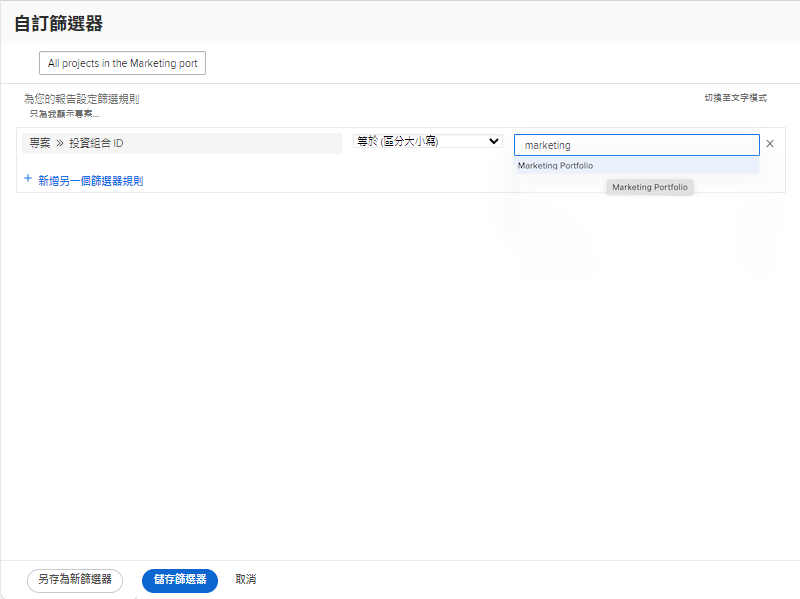
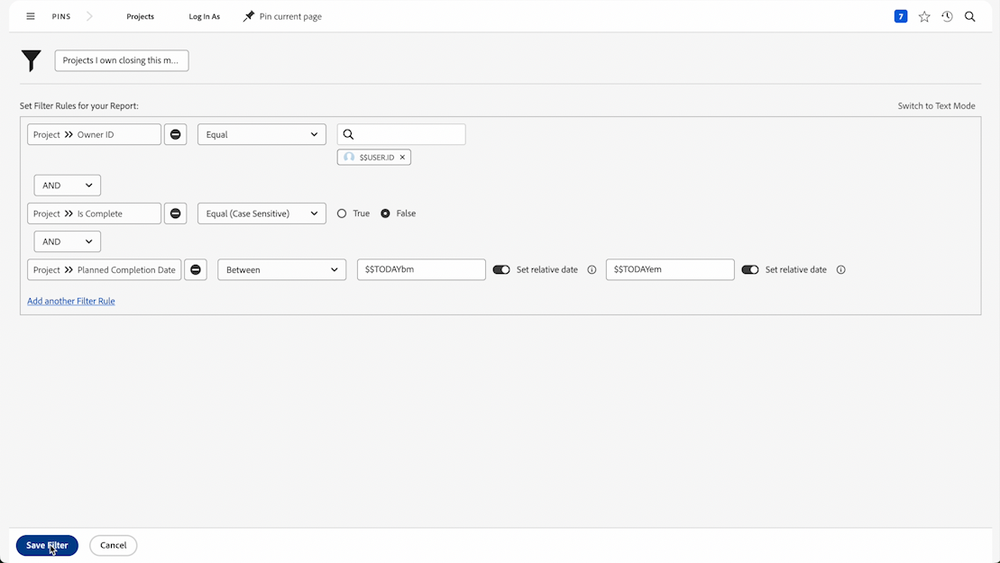

# 建立基本篩選器活動

## 活動 1 - 行銷專案組合中所有專案

在此活動中，您將在[!UICONTROL 舊的篩選器]體驗中建立一個名為「行銷專案組合中所有專案」的專案篩選器。這將會向您顯示名為「行銷專案組合」的專案組合中所有專案，無論其狀態如何。

以下包含逐步操作指示。

## 活動 1 答案

1. 從[!UICONTROL 主選單]導覽至「[!UICONTROL 專案]」區域。接著會顯示專案清單。
1. 按一下&#x200B;**[!UICONTROL 篩選器]**&#x200B;功能表，選取[!UICONTROL 舊版篩選器] （如果尚未選取）。
1. 選取「**[!UICONTROL 新增篩選器]**」。
1. 將您的篩選器命名為「行銷專案組合中所有專案」。
1. 按一下「**[!UICONTROL 新增篩選規則]**」。
1. 按一下&#x200B;**選取欄位**&#x200B;並開始輸入單字「[!UICONTROL 投資組合名稱]」。 然後，在「[!UICONTROL 專案組合]」欄位來源下面選取「[!UICONTROL 名稱]」。
1. 「[!UICONTROL 等於]」運算子維持原本設定。
1. 在搜尋欄位中輸入&quot;[!UICONTROL 行銷]&quot;。
1. 選取「[!UICONTROL 行銷專案組合]」(假設您有一個要篩選名稱的專案組合)。如果沒有，只需使用預先輸入功能，即可找到您想要的專案組合。
1. 按一下「**[!UICONTROL 儲存篩選器]**」。

## 活動 2 - 我擁有本月將結束的的專案

在這段影片中，您將會在[!UICONTROL 舊的篩選器]體驗中建立一個名為「我擁有本月將結束的的專案」的專案篩選器。若您要監視大量專案，這個篩選器可協助您專注於預計即將結束的專案。

以下包含逐步操作指示。

>[!VIDEO](https://video.tv.adobe.com/v/3443390/?quality=12&learn=on&enablevpops&captions=chi_hant)

## 活動 2 答案

1. 從[!UICONTROL 主選單]導覽至「[!UICONTROL 專案]」區域。接著會顯示專案清單。
1. 按一下&#x200B;**[!UICONTROL 篩選器]**&#x200B;功能表，選取[!UICONTROL 舊版篩選器] （如果尚未選取）。
1. 選取「**[!UICONTROL 新增篩選器]**」。
1. 將您的篩選器命名為「我擁有本月將結束的的專案」。
1. 按一下「**[!UICONTROL 新增篩選規則]**」。
1. 按一下&#x200B;**選取欄位**&#x200B;並開始輸入「所有者」這個字。 現在請按一下[!UICONTROL 專案]欄位來源底下的「擁有者識別碼」。
1. 「[!UICONTROL 等於]」運算子維持原本設定。
1. 在搜尋欄位中輸入「$$」。
1. 選取「[!UICONTROL $$USER.ID]」這是已登入使用者的萬用字元。
1. 按一下新增其他篩選器規則。
1. 按一下&#x200B;**選取欄位**&#x200B;並開始輸入「已完成」這個字。 現在按一下[!UICONTROL 專案]欄位來源下的[已完成]。
1. 「[!UICONTROL 等於]」運算子維持原本設定。
1. 選取「False」。
1. 再按一下新增另一個篩選器規則。
1. 按一下&#x200B;**選取欄位**&#x200B;並開始輸入「計畫」這個字。 現在按一下[!UICONTROL 專案]欄位來源下的「規劃完成日期」。
1. 將「[!UICONTROL 等於]」運算子變更為「[!UICONTROL 本月]」。
1. 按一下「**[!UICONTROL 儲存篩選器]**」。
