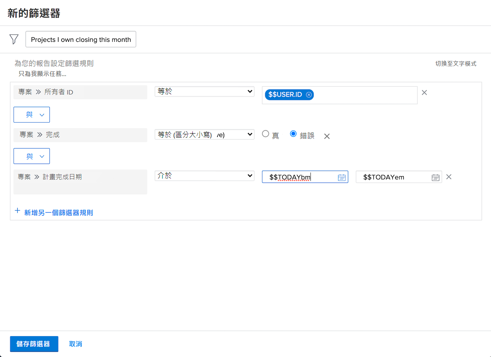

# 建立基本篩選活動

## 活動1 — 行銷投資組合中的所有專案

在此活動中，您將建立一個專案篩選器，名為「行銷組合中的所有專案」，位於 [!UICONTROL 舊版篩選器] 體驗。 這將會顯示名為「行銷Portfolio」的產品組合中的所有專案，無論其狀態為何。

以下包含逐步操作指示。

### 活動1的答案

1. 從[!UICONTROL 主選單]導覽至「[!UICONTROL 專案]」區域。接著會顯示專案清單。
1. 按一下 **[!UICONTROL 篩選]** 功能表並選取 [!UICONTROL 舊版篩選器].
1. 選取 **[!UICONTROL 新增篩選器]**.
1. 將您的篩選器命名為「行銷組合中的所有專案」。
1. 按一下「**[!UICONTROL 新增篩選規則]**」。
1. 在 [!UICONTROL 開始輸入欄位名稱] 欄位，輸入&quot;[!UICONTROL 投資組合名稱]「。 然後選取 [!UICONTROL 名稱] 在 [!UICONTROL Portfolio] 欄位來源。
1. 「[!UICONTROL 等於]」運算子維持原本設定。
1. Type &quot;[!UICONTROL 行銷]中的&quot; [!UICONTROL 開始輸入名稱] 欄位。
1. 選取 [!UICONTROL 行銷Portfolio] 假設您有一個您要篩選的名稱組合。 如果您不直接使用預先輸入功能來尋找您想要的投資組合。
1. 按一下 **[!UICONTROL 儲存篩選器]**.

## 活動2 — 我擁有的專案本月關閉

在本影片中，您將在以下位置建立一個名為「本月我擁有的專案正在關閉」的專案篩選器： [!UICONTROL 舊版篩選器] 體驗。 如果您密切注視許多專案，此篩選器可協助您放大即將關閉的專案。

以下包含逐步操作指示。

>[!VIDEO](https://video.tv.adobe.com/v/336807/?quality=12&learn=on)

### 活動2的答案

1. 從[!UICONTROL 主選單]導覽至「[!UICONTROL 專案]」區域。接著會顯示專案清單。
1. 按一下 **[!UICONTROL 篩選]** 功能表並選取 [!UICONTROL 舊版篩選器].
1. 選取 **[!UICONTROL 新增篩選器]**.
1. 將您的篩選器命名為「本月關閉的我所擁有的專案」。
1. 按一下「**[!UICONTROL 新增篩選規則]**」。
1. 在 [!UICONTROL 開始輸入欄位名稱] 欄位，輸入「所有者」。 然後選取「[!UICONTROL 專案]」欄位來源下方的「[!UICONTROL 所有者 ID]」。
1. 「[!UICONTROL 等於]」運算子維持原本設定。
1. 在「$$」中輸入 [!UICONTROL 開始輸入名稱] 欄位。
1. 選取「[!UICONTROL $$USER.ID]」這是已登入使用者的萬用字元。
1. 再按一下「[!UICONTROL 新增篩選規則]」。
1. 在 [!UICONTROL 開始輸入欄位名稱] 欄位，開始輸入「完成」。 然後在「專案」欄位來源之下選取「[!UICONTROL 已完成]」。
1. 「[!UICONTROL 等於]」運算子維持原本設定。
1. 選取「假」。
1. 再按一下「[!UICONTROL 新增篩選規則]」。
1. 在 [!UICONTROL 開始輸入欄位名稱] 欄位型別「計畫」，然後選取 [!UICONTROL 計畫完成日期] 在 [!UICONTROL 專案] 欄位來源。
1. 將「[!UICONTROL 等於]」運算子變更為「[!UICONTROL 本月]」。
1. 按一下 **[!UICONTROL 儲存篩選器]**.
