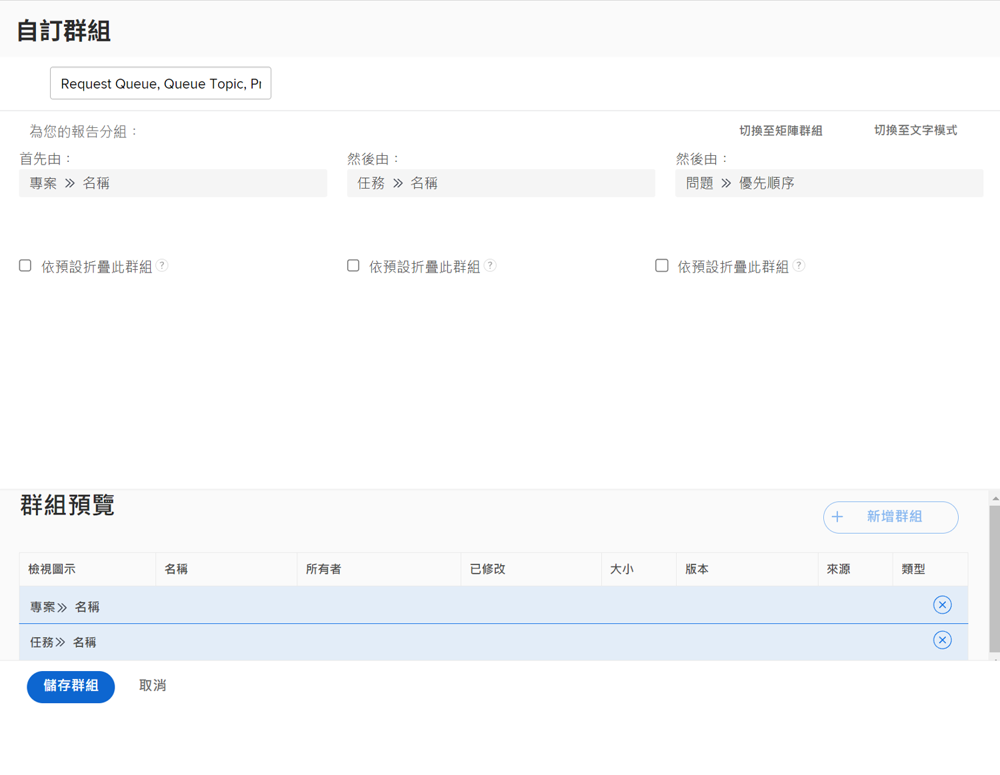

# 建立基本分組

觀看這段影片，您將會瞭解：

* 在 Workfront 中什麼是分組
* 如何建立分組
* 以及如何與其他 Workfront 使用者共用分組

>[!VIDEO](https://video.tv.adobe.com/v/335147/?quality=12&learn=on)

## 活動：建立基本分組

建立將在報告中使用的問題分組，以追蹤透過請求佇列傳入的請求。透過這樣的分組，可以更輕鬆看到類型相似的問題/請求依其優先順序分組。將分組命名為「請求佇列、佇列主題、優先順序」。

根據以下條件將問題報告進行分組：

1. 請求佇列的名稱 (這將是專案名稱)
1. 佇列主題
1. 請求的優先順序

## 解答

1. 在問題列表報告中，請至「**[!UICONTROL 分組]**」選單並選取「**[!UICONTROL 新增分組]**」。
1. 將您的分組命名為「請求佇列、佇列主題、優先順序」
1. 按一下「**[!UICONTROL 新增分組]**」。
1. 在「[!UICONTROL 首先依據]」欄位中輸入「專案名稱」，然後選取「專案」欄位來源之下的「**[!UICONTROL 名稱]**」。
1. 按一下「**[!UICONTROL 新增另一個分組]**」。
1. 在「[!UICONTROL 接著依據]」欄位中，輸入「佇列」然後選取「[!UICONTROL 佇列主題]」欄位來源之下的「**[!UICONTROL 名稱]**」。
1. 按一下「**[!UICONTROL 新增另一個分組]**」。
1. 在「[!UICONTROL 接著依據]」欄位中，輸入「優先順序」然後選取「[!UICONTROL 問題]」欄位來源之下的「**[!UICONTROL 優先順序]**」。
1. 按一下「**[!UICONTROL 儲存分組]**」
