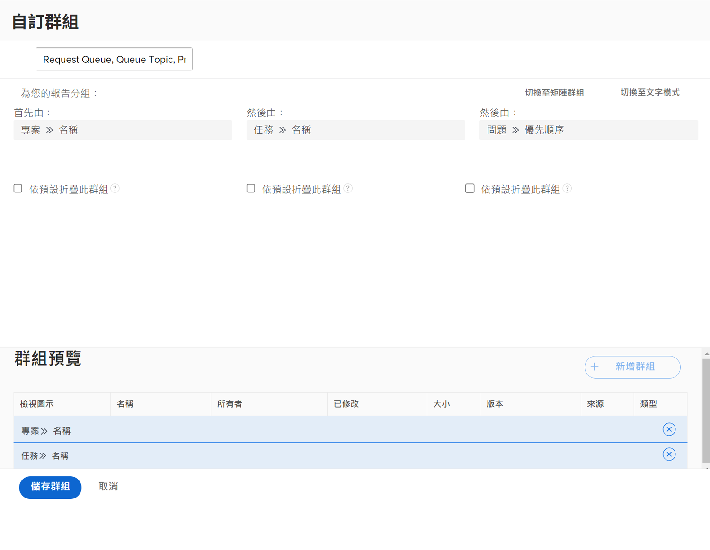

# 建立基本分組

此影片說明如何在Workfront中建立和管理群組，以有效組織專案清單。 分&#x200B;組是除了篩選器和檢視之外的三個主要報告元素之一，它們有助於根據共用資訊組織結果。 &#x200B;
本教學課程提供組織專案清單的實用步驟，以簡化日常工作和共同作業。 &#x200B;

>[!VIDEO](https://video.tv.adobe.com/v/3449826/?captions=chi_hant&quality=12&learn=on&enablevpops=0)

## 重點提要

* **群組的用途：**&#x200B;群組是Workfront中的關鍵報表元素，可根據共用資訊（例如完成日期、投資組合或計畫）來組織專案清單。 &#x200B;
* **建立群組：**&#x200B;您最多可以使用三個條件層級來建立自訂群組。 例如，專&#x200B;案可以先依投資組合分組，再依方案分組，以獲得更好的組織。 &#x200B;
* **編輯及儲存群組：**&#x200B;無法覆寫內建群組，但您可以將編輯儲存為新群組。 自&#x200B;訂群組應具有清楚的描述性名稱，以便輕鬆識別。 &#x200B;
* **共用群組：**&#x200B;群組可以與其他使用者共用，且具有預設「檢視」許可權，可允許他們使用和共用群組，但不能編輯它。 「&#x200B;管理」許可權可允許編輯和刪除。 &#x200B;
* **移除群組：**&#x200B;刪除您建立的群組也會從您共用該群組的使用者清單中將其移除。 共&#x200B;用群組會顯示在其他使用者的「與我共用」區段下。 &#x200B;

## 「建立基本分組」活動

### 活動 1：建立基本分組

建立將在報告中使用的問題分組，以追蹤透過請求佇列傳入的請求。 透過這樣的分組，可以更輕鬆看到類型相似的問題/請求依其優先順序分組。 將分組命名為「要求佇列、佇列主題、優先順序」。

根據以下條件將問題報告進行分組：

1. 請求佇列的名稱 (這將是專案名稱)
1. 佇列主題
1. 請求的優先順序

### 解答 1

1. 在問題列表報告中，請至「**[!UICONTROL 分組]**」選單並選取「**[!UICONTROL 新增分組]**」。
1. 將您的分組命名為「要求佇列、佇列主題、優先順序」。
1. 按一下「**[!UICONTROL 新增分組]**」。
1. 在[!UICONTROL Group by]欄位中。 輸入「專案名稱」，然後選取「專案」欄位來源下方的「**[!UICONTROL 名稱]**」。
1. 按一下&#x200B;**[!UICONTROL 新增其他群組]**，然後輸入「佇列」並在[!UICONTROL 佇列主題]欄位來源下選取&#x200B;**[!UICONTROL 名稱]**。
1. 按一下「**[!UICONTROL 新增其他群組]**」，然後輸入「優先順序」並在[!UICONTROL 問題]欄位來源下選取&#x200B;**[!UICONTROL 優先順序]**。
1. 按一下「**[!UICONTROL 儲存分組]**」
