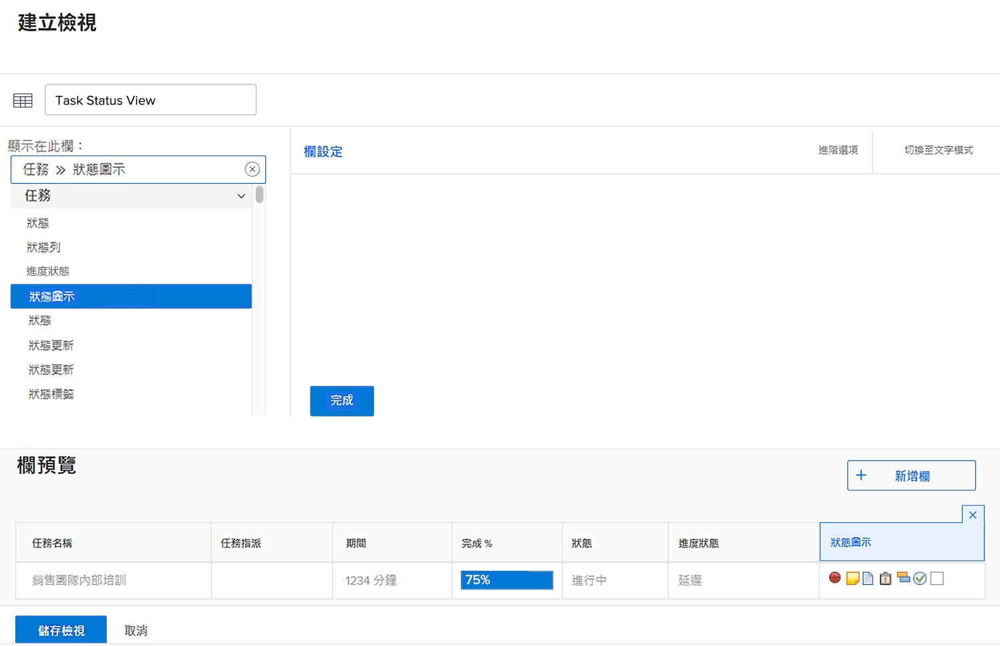
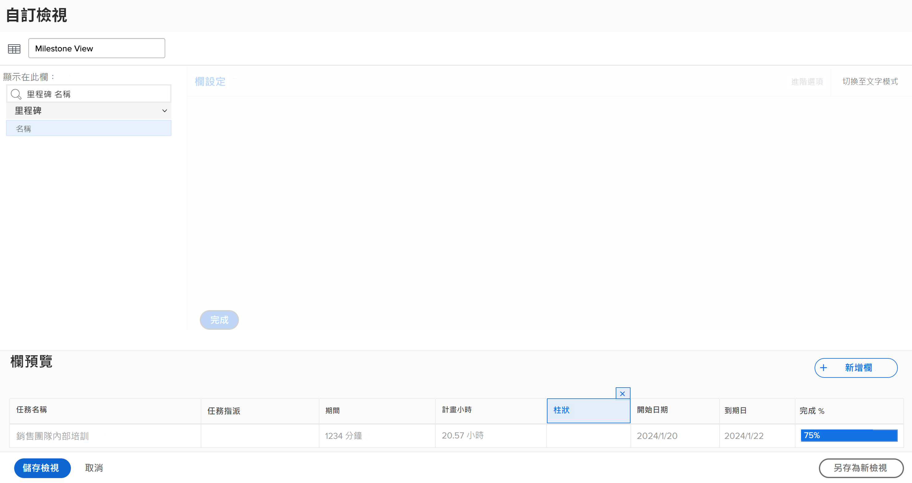
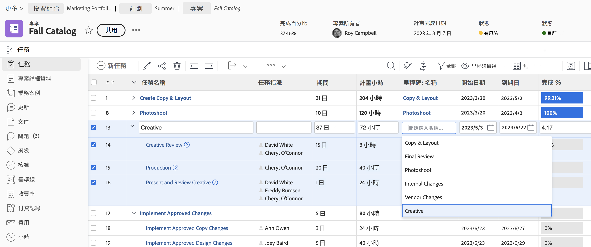
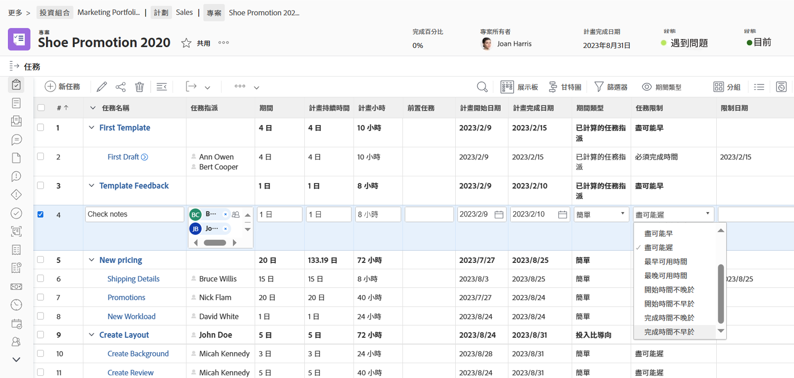
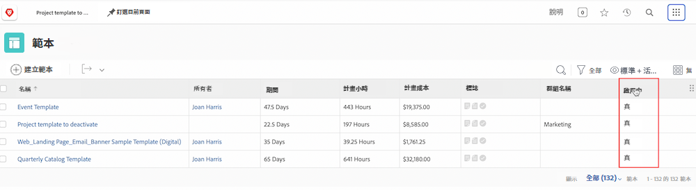

# 建立基本視圖

觀看這段影片，您將會瞭解：

* Workfront 中的視圖是什麼
* 如何建立和修改視圖
* 如何與其他 Workfront 使用者共用視圖

>[!VIDEO](https://video.tv.adobe.com/v/335148/?quality=12&learn=on)

## 活動 1：建立任務狀態視圖

作為專案經理人、團隊領導者或資源管理員，您想要追蹤任務工作的進展。透過這個視圖，您可以看到任務的數個狀態指標以清單或報告的形式全部排列顯示。

建立名為「任務狀態視圖」的任務視圖且包含下列欄：

* [!UICONTROL 任務名稱]
* [!UICONTROL 指派]
* [!UICONTROL 期間]
* [!UICONTROL 完成百分比]
* [!UICONTROL 狀態]
* [!UICONTROL 進度狀態]
* [!UICONTROL 狀態圖示]

## 活動 1 答案

1. 在任務清單報告中，前往「**[!UICONTROL 視圖]**」下拉式選單並選取「**[!UICONTROL 新增視圖]**」。
1. 將您的視圖命名為「任務狀態視圖」。
1. 移除這些欄：「[!UICONTROL 規劃時數]」、「[!UICONTROL 前置任務]」、「[!UICONTROL 開始日期]」和「[!UICONTROL 到期日]」。
1. 按一下「**[!UICONTROL 新增欄]**」。
1. 在「[!UICONTROL 在此欄中顯示]」欄位中，輸入「[!UICONTROL 狀態]」，然後在「任務」欄位來源之下選取「狀態」。
1. 再按一下「**[!UICONTROL 新增欄]**」。
1. 在「[!UICONTROL 在此欄中顯示]」欄位中，輸入「狀態」，然後在「[!UICONTROL 任務]」欄位來源之下選取「進度狀態」。
1. 再按一下「**[!UICONTROL 新增欄]**」。
1. 在「[!UICONTROL 在此欄中顯示]」欄位中，輸入「狀態」，然後在「任務」欄位來源之下選取「狀態圖示」。
1. 按一下「**[!UICONTROL 儲存]**」。

將游標懸停在「[!UICONTROL 狀態圖示]」欄的每個圖示上來看看他們代表的狀態。如果圖示呈現灰色，則表示該任務沒有備註、文件、核准流程等。如果圖示顯示顏色，則至少有一個項目與該任務關聯。您可以按一下備註或文件圖示前往該項目。

## 活動 2：建立里程碑視圖

如果您使用里程碑，此視圖是依名稱查看里程碑並使用行間編輯來新增或編輯里程碑的最簡單方法。

建立一個名為「里程碑視圖」的任務視圖且包含下列欄：

* [!UICONTROL 任務名稱]
* [!UICONTROL 指派]
* [!UICONTROL 期間]
* [!UICONTROL 計畫小時]
* [!UICONTROL 里程碑：名稱]
* [!UICONTROL 開始日期]
* [!UICONTROL 到期日]
* [!UICONTROL 完成百分比]

## 活動 2 答案

1. 在專案任務清單中，前往「**[!UICONTROL 視圖]**」下拉式選單並選取「**[!UICONTROL 新增視圖]**」。
1. 將您的視圖命名為「里程碑視圖」。
1. 按一下「[!UICONTROL 前置任務]」欄來選取前置任務。
1. 在「[!UICONTROL 在此欄中顯示]」欄位中，按一下「[!UICONTROL 任務 >> 前置任務]」欄位的 X 圖示，然後輸入「[!UICONTROL 里程碑名稱]」，再按一下清單中的「[!UICONTROL 名稱]」。
1. 按一下「**[!UICONTROL 儲存]**」。

## 活動 3：建立期間類型和任務限制視圖

您可以利用此視圖檢查和編輯專案中所有期間類型和任務限制。

建立名為「期間類型和任務限制視圖」的任務視圖並包含下列欄：

* [!UICONTROL 任務名稱]
* [!UICONTROL 指派]
* [!UICONTROL 期間]
* [!UICONTROL 規劃期間]
* [!UICONTROL 計畫小時]
* [!UICONTROL 前置任務]
* [!UICONTROL 開始日期]
* [!UICONTROL 到期日]
* [!UICONTROL 期間類型]
* [!UICONTROL 任務限制]
* [!UICONTROL 限制日期]

變更「[!UICONTROL 開始日期]」和「[!UICONTROL 到期日]」欄的「[!UICONTROL 欄位格式]」以便同時顯示日期和時間。

## 活動 3 答案

1. 在專案任務清單中，前往「**[!UICONTROL 視圖]**」下拉式選單並選取「**[!UICONTROL 新增視圖]**」。
1. 將您的視圖命名為「期間類型與任務限制視圖」。
1. 移除「[!UICONTROL 完成百分比]」欄。
1. 按一下「**[!UICONTROL 新增欄]**」。
1. 在「[!UICONTROL 在此欄中顯示]」欄位，輸入「[!UICONTROL 期間]」然後在「[!UICONTROL 任務]」欄位來源之下選取「[!UICONTROL 規劃期間]」。
1. 將這一欄移動到「[!UICONTROL 期間]」和「[!UICONTROL 規劃時數]」欄之間。
1. 再按一下「**[!UICONTROL 新增欄]**」。
1. 在「[!UICONTROL 在此欄中顯示]」欄位，輸入「[!UICONTROL 期間類型]」然後在「[!UICONTROL 任務]」欄位來源之下選取「[!UICONTROL 期間類型]」。
1. 再按一下「**[!UICONTROL 新增欄]**」。
1. 在「[!UICONTROL 在此欄中顯示]」欄位中，輸入「[!UICONTROL 限制]」然後在「任務」欄位來源之下選取「[!UICONTROL 任務限制]」。
1. 再按一下「**[!UICONTROL 新增欄]**」。
1. 在「[!UICONTROL 在此欄中顯示]」欄位中，輸入「[!UICONTROL 限制]」然後在「任務」欄位來源之下選取「[!UICONTROL 限制日期]」。
1. 選取「[!UICONTROL 開始日期]」欄，然後按一下「[!UICONTROL 進階選項]」。
1. 在「[!UICONTROL 欄位格式]」下拉式選單之下，選取「[!UICONTROL 10/17/60 3:00 AM]」。
1. 選取「[!UICONTROL 到期日]」欄，然後按一下「[!UICONTROL 進階選項]」。
1. 在「[!UICONTROL 欄位格式]」下拉式選單之下，選取「[!UICONTROL 10/17/60 3:00 AM&quot;]」。
1. 按一下「**[!UICONTROL 儲存]**」。

## 活動4：建立專案範本作用中狀態檢視

任何管理專案範本的人都會樂於在清單中看到每個範本的有效狀態（True或False）。 更好 — 欄位可內嵌編輯！

建立名為「標準+作用中狀態」的專案範本檢視，其欄位如下：

* [!UICONTROL 名稱]
* [!UICONTROL 所有者]
* [!UICONTROL 期間]
* [!UICONTROL 計畫時數]
* [!UICONTROL 計畫成本]
* [!UICONTROL 旗標]
* [!UICONTROL 群組名稱]
* [!UICONTROL 已啟用]

## 活動 4 答案

1. 在專案範本清單中，前往 **[!UICONTROL 檢視]** 下拉式功能表並選取 **[!UICONTROL 新檢視]**.
1. 將檢視命名為「標準+作用中狀態」。
1. 按一下「**[!UICONTROL 新增欄]**」。
1. 在 [!UICONTROL 顯示在此欄中] 欄位，輸入「是」，然後選取 [!UICONTROL 範本] 欄位來源。
1. 按一下 **[!UICONTROL 儲存檢視]**.
