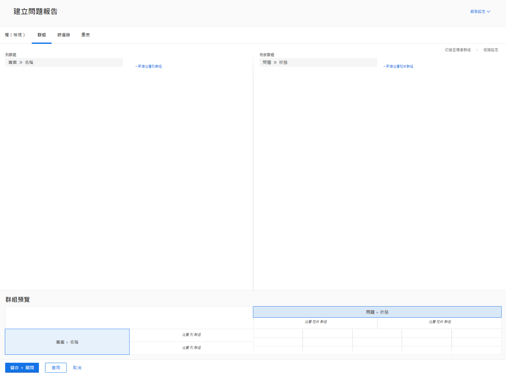
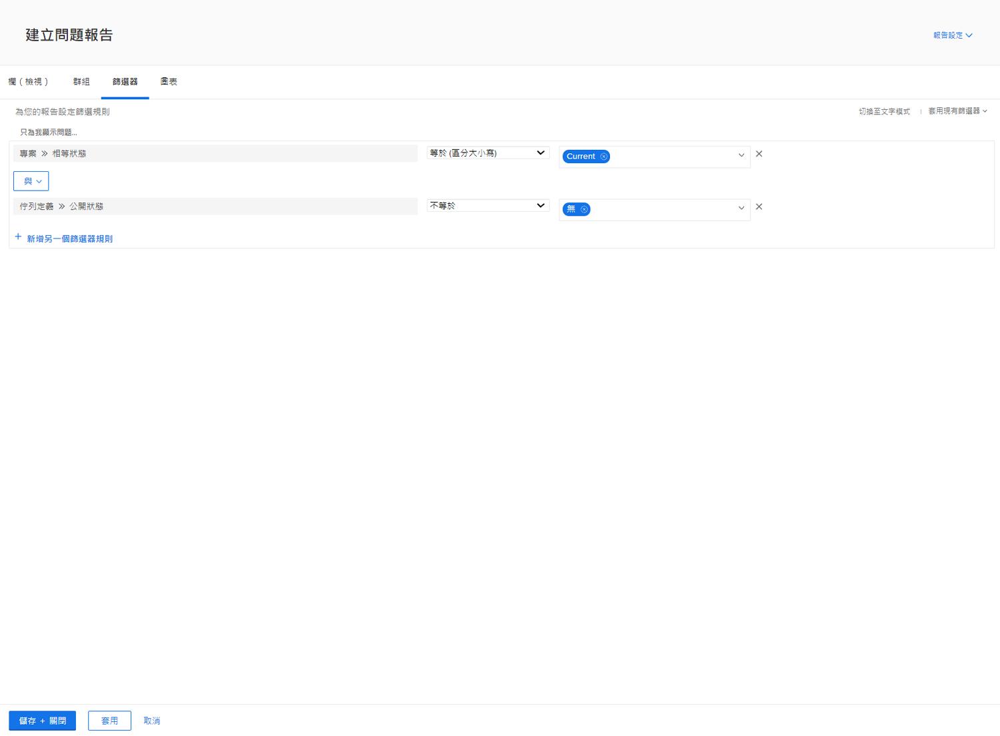

# 建立矩陣報告

觀看這段影片，您將會瞭解：

* 矩陣報告的適用時機
* 以及如何建立矩陣報告

>[!VIDEO](https://video.tv.adobe.com/v/3448194/?quality=12&learn=on&captions=chi_hant)

## 關鍵重點

* **矩陣報表結構：**&#x200B;矩陣報表會以列與欄的方式組織資料，並自動顯示列與欄總計。&#x200B;URL 這些維度非常適合用於追蹤工作時數、成本和收入等量度。&#x200B;URL
* **篩選器設定：**&#x200B;使用篩選器來專注於特定資料，例如特定主團隊的使用者上個季度所工作的時數。&#x200B;URL 「擁有者欄位來源」可協助識別相關團隊成員。&#x200B;URL
* **群組選項：**&#x200B;在我們的範例中，列是依「所有者名稱」（工作小時的人員）分組，而欄是依「小時輸入日期」（依月和周）分組。&#x200B;URL
* **摘要資料：**&#x200B;依預設會摘要時數、實際成本和收入等欄，以確保總和會顯示在矩陣中。 如有需要，可關閉這些預設值。&#x200B;URL
* **圖表整合：**&#x200B;矩陣報表可使用相同的群組資訊，以圖表作為替代資料視覺效果的補充。 您可以將矩陣標籤或圖表標籤設定為預設檢視。&#x200B;URL

## 「建立矩陣報告」活動

### 活動 1：建立矩陣報告

建立一份矩陣報告，顯示每個狀態的請求數量，並依請求佇列排序。您可以透過這份報告迅速掌握即將到來的工作量，以及您目前是否跟上進度。

您想要讓請求佇列依列分組顯示。而狀態依欄分組顯示。將報告命名為「依狀態和請求佇列排序的請求」。

### 解答 1

1. 在&#x200B;**[!UICONTROL 主選單]**&#x200B;中選取「**[!UICONTROL 報告]**」。
1. 按一下「**[!UICONTROL 新增報告]**」選項並選取「**[!UICONTROL 問題]**」。
1. 前往「**[!UICONTROL 分組]**」標籤並按一下「**[!UICONTROL 切換至矩陣分組]**」。
1. 對於「[!UICONTROL 列分組]」，請選取「**[!UICONTROL 專案]**」>「**[!UICONTROL 名稱]**」。
1. 對於「[!UICONTROL 欄分組]」，選取「**[!UICONTROL 問題]**」>「**[!UICONTROL 狀態]**」。

   

1. 前往「**[!UICONTROL 篩選器]**」標籤。
1. 為了確保您只看到使用中之請求佇列中的請求，請新增以下篩選規則：

   * 「[!UICONTROL 專案]」>「[!UICONTROL 狀態等同於]」>「[!UICONTROL 等於]」>「[!UICONTROL 目前]」
   * 「[!UICONTROL 佇列定義]」>「[!UICONTROL 是公開的]」>「[!UICONTROL 不等於]」>「[!UICONTROL 無]」(這是我們確認專案確實是請求佇列的方法，依照指派給其中一個公開選項的佇列定義。)

1. 按一下「**[!UICONTROL 儲存並關閉]**」。系統提示輸入報告名稱時，請輸入「依狀態和請求佇列排序的請求」。

   
