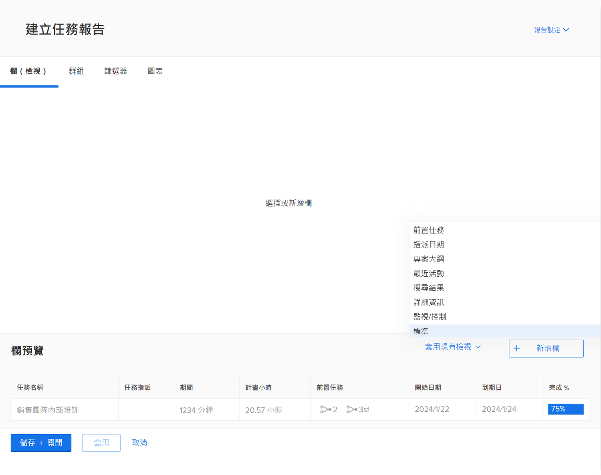
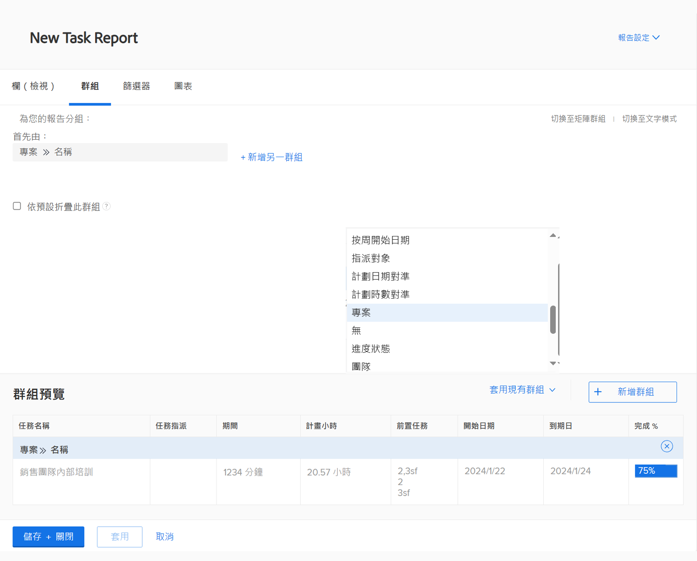
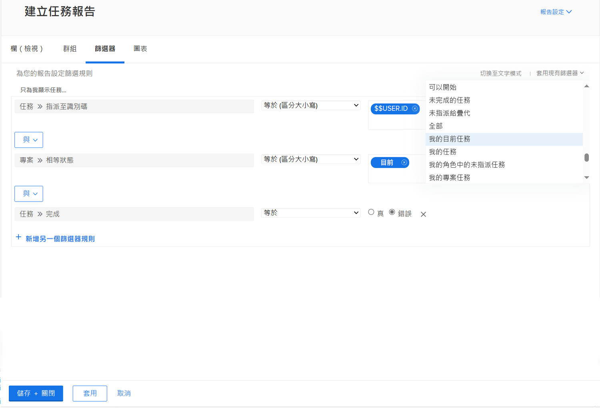
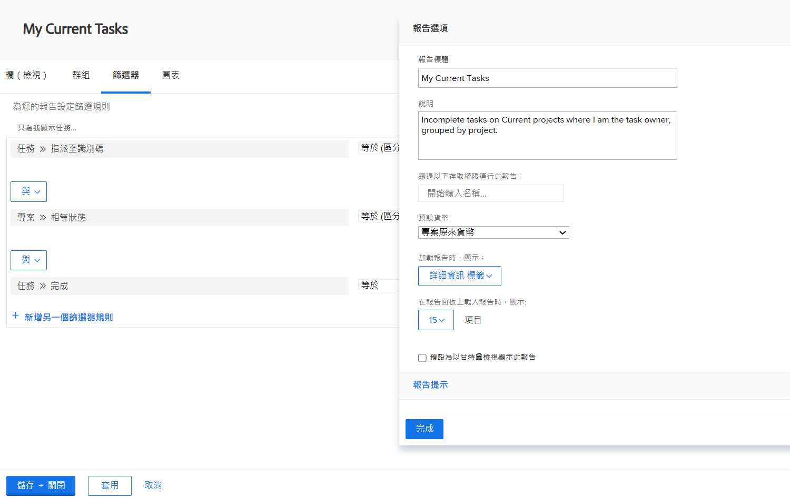

# 建立簡單報告

觀看這段影片，您將瞭解如何：

* 使用現有的篩選器、視圖和分組建立簡單報告

>[!VIDEO](https://video.tv.adobe.com/v/335153/?quality=12&learn=on)

## 「建立簡易報告」活動

### 活動 1：建立簡易任務報告

您想要在單一報告中追蹤所有進行中的任務。使用下列設定建立名為「我目前的任務」的任務報告：

* 欄 (視圖) = 標準
* 分組 = 專案
* 篩選器 = 我目前的任務
* 說明 = 我是任務所有者的目前專案上的未完成任務，依專案分組。

### 解答 1

1. 前往&#x200B;**[!UICONTROL 主選單]**&#x200B;並選取「**[!UICONTROL 報告]**」。
1. 按一下「**[!UICONTROL 新增報告]**」下拉式選單並選取「**[!UICONTROL 任務報告]**」。
1. 在「[!UICONTROL 欄 (視圖)]」中，按一下「**[!UICONTROL 套用現有視圖]**」選單並選取「**[!UICONTROL 標準]**」。

   

1. 在「**[!UICONTROL 分組]**」標籤中，按一下「**[!UICONTROL 套用現有分組]**」選單並選取「**[!UICONTROL 專案]**」。

   

1. 在「**[!UICONTROL 篩選器]**」標籤中，按一下「**[!UICONTROL 套用現有篩選器]**」選單並選取「我目前的任務」。

   

1. 開啟「**[!UICONTROL 報告設定]**」，並將報告命名為「我目前的任務」。
1. 在「說明」欄位中，請輸入「我是任務負責人的
目前專案的未完成任務，依專案分組」。

   

1. 儲存並關閉您的報告。
