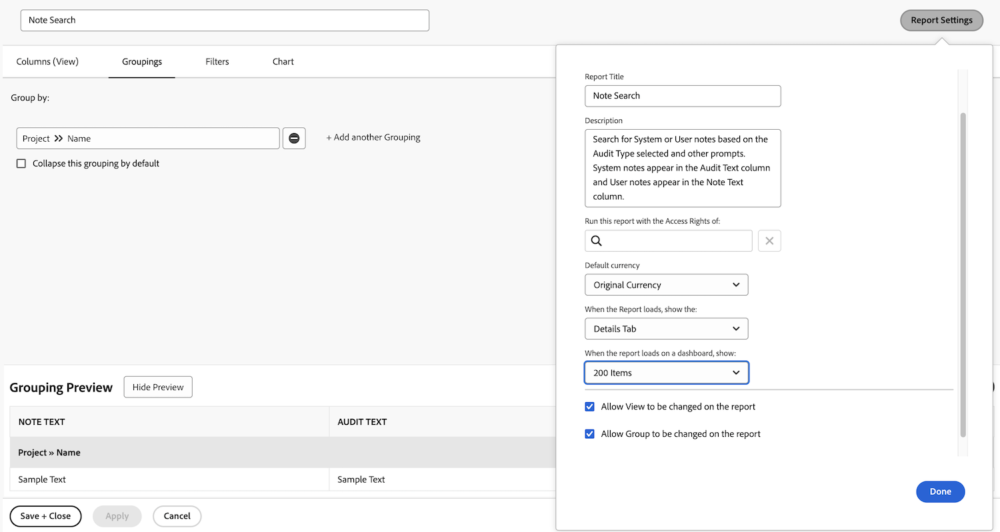

# 為延遲指派建立任務報告

影片逐步說明如何建立自訂報表，以追蹤指派給登入使用者的延遲任務。 首先，說明當現有的篩選器、檢視或內建報表不符合特定需求時，需要自訂報表。&#x200B;URL 該報表命名為「指派給我的最晚任務」，並新增說明以更明確說明。&#x200B;URL

產生的報表可幫助使用者專注於後期任務、提供相依性的深入分析，並簡化主機專案的導覽。&#x200B;URL

>[!VIDEO](https://video.tv.adobe.com/v/335154/?quality=12&learn=on&enablevpops=0)

## 關鍵重點

* **自訂報告建立：**&#x200B;當現有的篩選器和內建報告不符合您的需求時，您可以從頭開始建立自訂報告，以聚焦於特定資料，例如指派給您的延遲工作。&#x200B;URL
* **篩選器設定：**&#x200B;使用篩選器來定義報告條件，包括延遲任務、未完成任務、目前專案和指派給登入使用者的任務。&#x200B;URL
* 內容：**欄：**&#x200B;新增「可以開始」之類的欄以識別相依性問題，以及含有超連結的「專案名稱」，以輕鬆導覽至相關專案。&#x200B;URL
* **排序優先順序：**&#x200B;依「到期日」欄遞增順序排序工作，以在報告頂端優先處理最逾期的工作。&#x200B;URL
* **協助工具：**&#x200B;儲存報告、釘選報告或將其標示為最愛以快速存取，確保有效率地追蹤和管理延遲工作。

## 「建立任務報告」活動

>[!TIP]
>
>拿出您的各種器具，準備好使用我們 [&#x200B; Adobe Workfront 客戶報告逐步指南](/help/assets/workfront-customer-reporting-cookbook.pdf)內的秘方。您將在指南中找到 10 份報告的逐步說明，可供您立即在您的環境中快速應用。
>我們收集了客戶最喜歡的報告，並將這些內容整理成一套簡單易懂、易消化的秘方，您帶回後可在自己的 Workfront 環境中進行測試。
>這 10 份報告來自與您類似的客戶。我們的客戶分佈在不同的行業、部門、團隊、職位以及不同的公司，非常感謝這些最棒的客戶分享他們最喜歡的報告。有些報告很簡單 (但非常有用)，有些則比較複雜，但都可讓您的報告提升到另一個全新境界。

### 活動 1：建立附帶提示的備註報告

建立備註報告，方便您根據備註內容、作者、輸入日期、專案名稱或稽核類型來搜尋使用者備註 (即註解或更新) 或系統備註。將報告命名為「備註搜尋」。

使用「備註文字」提示時，這份報告將搜尋更新執行緒，以便迅速擷取符合提示中指定條件的任何內容。執行報告時不需要填寫每個提示，只需填寫您關心的即可。系統會自動忽略空白的提示。

該視圖應包含以下欄：

* 備註文字
* 稽核文字
* 輸入日期
* 所有者名稱
* 稽核類型
* 任務名稱
* 問題名稱

將篩選器標籤留白。

根據專案名稱分組。

包括以下提示：

* 稽核文字
* 備註文字
* 所有者名稱
* 輸入日期
* 專案名稱
* 稽核類型

### 解答 1

1. 在&#x200B;**[!UICONTROL 主選單]**&#x200B;中選取「**[!UICONTROL 報告]**」。
1. 按一下「**[!UICONTROL 新增報告]**」選單並選取「**[!UICONTROL 備註]**」。
1. 在「**[!UICONTROL 欄 (視圖)]**」設定您的欄，要包含以下項目：

   

   * 「[!UICONTROL 備註]」>「[!UICONTROL 備註文字]」
   * 「[!UICONTROL 備註]」>「[!UICONTROL 稽核文字]」
   * 「[!UICONTROL 備註]」>「[!UICONTROL 輸入日期]」
   * 「[!UICONTROL 所有者]」>「[!UICONTROL 名稱]」
   * 「[!UICONTROL 備註]」>「[!UICONTROL 稽核類型]」
   * 「[!UICONTROL 任務]」>「[!UICONTROL 名稱]」
   * 「[!UICONTROL 問題]」>「[!UICONTROL 名稱]」

1. 選取「**[!UICONTROL 輸入日期]**」欄並變更為「**[!UICONTROL 降序排序]**」。
1. 在「**[!UICONTROL 分組]**」標籤中，設定報告依照「[!UICONTROL 專案]」>「[!UICONTROL 名稱]」分組。

   

1. 讓「[!UICONTROL 篩選器]」留白。
1. 開啟「**[!UICONTROL 報告設定]**」並將報告命名為「備註搜尋」。
1. 在「[!UICONTROL 說明]」欄位中，請輸入例如「根據所選稽核類型和其他提示來搜尋系統或使用者備註。系統備註出現在「稽核文字」欄而使用者備註出現在「備註文字」欄」。

   

1. 選取「**[!UICONTROL 詳細資料標籤]**」，以便在報告載入時顯示此標籤。
1. 當儀表板上也顯示報告時，設定報告顯示 200 個項目。
1. 按一下「**[!UICONTROL 報告提示]**」並新增：

   

   * 「[!UICONTROL 備註]」>「[!UICONTROL 稽核文字]」
   * 「[!UICONTROL 備註]」>「[!UICONTROL 備註文字]」
   * 「[!UICONTROL 所有者]」>「[!UICONTROL 名稱]」
   * 「[!UICONTROL 備註]」>「[!UICONTROL 輸入日期]」
   * 「[!UICONTROL 專案]」>「[!UICONTROL 名稱]」
   * 「[!UICONTROL 備註]」>「[!UICONTROL 稽核類型]」

1. 勾選「**[!UICONTROL 在儀表板中顯示提示]**」方塊。
1. 儲存並關閉您的報告。

### 活動 2：建立管理團隊意見回饋報告

這是一份問題報告，主要是顯示為系統管理員所建立意見回饋請求佇列的所有問題。您可以在「[建立系統管理員意見回饋請求佇列](https://experienceleague.adobe.com/docs/workfront-learn/tutorials-workfront/manage-work/request-queues/create-a-system-admin-feedback-request-queue.html)」教學課程中查看如何建立此請求佇列。

此報告也使用自訂表單。若要了解如何建立自訂表單，請參閱「[建立和共用自訂表單](https://experienceleague.adobe.com/docs/workfront-learn/tutorials-workfront/custom-data/custom-forms/custom-forms-creating-and-sharing-a-custom-form.html)」教學課程。

此自訂表單應使用物件型別「專案和問題」，並應按如下方式建立：

名稱：管理流程意見回饋

1. 程式型別（單選下拉式欄位）
   * 存取層級
   * 核准流程 (僅限全域)
   * 電子郵件通知
   * 版本配置範本
   * 里程碑路徑
   * 專案範本
   * 提醒通知
   * 請求佇列
1. 流程名稱 (單行文字欄位)
1. 程式等級（單選下拉式欄位）
   * 1 - 完全沒用
   * 2 - 不是很有用
   * 3 - 很好，但還可以更好
   * 4 - 非常好
1. 有問題或是好消息 (段落文字欄位)

建立名為「**管理團隊意見回饋報告**」的問題報告 。

此視圖應具有以下列欄：

* 問題：名稱
* 主要聯絡人：姓名
* 問題：流程類型
* 問題：流程名稱
* 問題：流程等級
* 問題：有問題或是好消息
* 問題：輸入日期
* 問題：年齡
* 問題：指派
* 問題：狀態

按流程類型分組。

篩選意見回饋問題所在的請求佇列專案 ID。

### 解答 2

1. 在&#x200B;**[!UICONTROL 主選單]**&#x200B;中選取「**[!UICONTROL 報告]**」。
1. 按一下「**[!UICONTROL 新增報告]**」選單並選取「**[!UICONTROL 問題]**」。
1. 在「**[!UICONTROL 欄 (視圖)]**」設定您的欄，要包含以下項目：

   

   * 「[!UICONTROL 問題]」>「[!UICONTROL 名稱]」
   * [!UICONTROL 主要聯絡人] > [!UICONTROL 姓名]
      * 注意：這會以「擁有者:Name」作為欄標籤顯示。 您可以將此變更為「報告人」，方法是按一下「進階選項」，然後在「**自訂欄標籤**」欄位中輸入「報告人」。
   * [!UICONTROL 問題] > [!UICONTROL 流程類型]
   * [!UICONTROL 問題] > [!UICONTROL 流程名稱]
   * [!UICONTROL 問題] > [!UICONTROL 流程等級]
   * [!UICONTROL 問題] > [!UICONTROL 有問題或是好消息]
   * [!UICONTROL 問題] > [!UICONTROL 輸入日期]
   * [!UICONTROL 問題] > [!UICONTROL 年齡]
   * [!UICONTROL 問題] > [!UICONTROL 指派]
   * [!UICONTROL 問題] > [!UICONTROL 狀態]

1. 選取「**[!UICONTROL 輸入日期]**」欄並變更為「**[!UICONTROL 降序排序]**」。
1. 在「**[!UICONTROL 分組]**」標籤中，設定報告依照「**[!UICONTROL 問題]」>「[!UICONTROL 流程類型]**」分組。

   

1. 在「**[!UICONTROL 篩選器]**」標籤中，為「**[!UICONTROL 問題] > [!UICONTROL 專案 ID]**」新增篩選器，以達到意見回饋問題所在的請求佇列專案。

   

1. 儲存並關閉您的報告。
