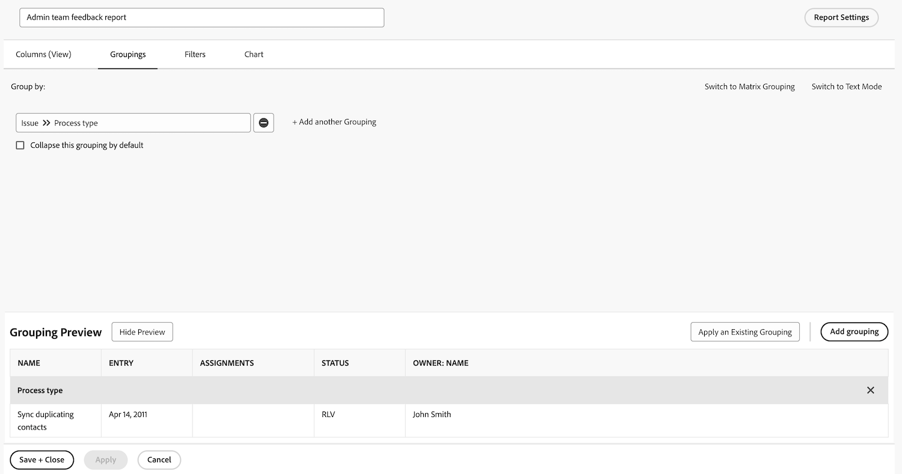

# 建立任務報告

觀看這段影片，您將會瞭解：

* 如何使用複雜的篩選器建立任務報告
* 如何尋找您建立的報告

>[!VIDEO](https://video.tv.adobe.com/v/335154/?quality=12&learn=on)

>[!TIP]
>
>將鏟子和碗混合起來，準備試試我們的「配方」 [Adobe Workfront客戶報告逐步指南](/help/assets/workfront-customer-reporting-cookbook.pdf). 在裡面，您可以找到10份報告的逐步指示，讓您在今天的環境中快速啟動。
> 
>我們收集了客戶最喜歡的報告，並將它們放進可點心、容易消化的逐步指南中，供您在自己的Workfront廚房中取回並進行測試。
> 
>這10個報表來自與您相同的客戶。 我們遍佈各行各業、各部門、各團隊、各職位，感謝各位出色的客戶分享他們最愛的報告。 有些報表相當簡單（但功用絕佳），有些則較複雜，無法將您的報表提升到全新的境界。

## 活動1：建立具有提示的筆記報告

建立備註報告，方便您根據備註內容、作者、輸入日期、專案名稱或稽核類型來搜尋使用者備註 (即註解或更新) 或系統備註。將報表命名為「附註搜尋」。

使用「備註文字」提示時，這份報告將搜尋更新執行緒，以便迅速擷取符合提示中指定條件的任何內容。執行報告時，您不需要填寫每個提示，只需填寫您關心的提示。 系統會自動忽略空白的提示。

該視圖應包含以下欄：

* 備註文字
* 稽核文字
* 輸入日期
* 所有者名稱
* 稽核類型
* 任務名稱
* 問題名稱

將篩選器標籤留白。

根據專案名稱分組。

包括以下提示：

* 稽核文字
* 備註文字
* 所有者名稱
* 輸入日期
* 專案名稱
* 稽核類型

## 活動 1 答案

1. 在&#x200B;**[!UICONTROL 主選單]**&#x200B;中選取「**[!UICONTROL 報告]**」。
1. 按一下「**[!UICONTROL 新增報告]**」選單並選取「**[!UICONTROL 備註]**」。
1. 在「**[!UICONTROL 欄 (視圖)]**」設定您的欄，要包含以下項目：

   

   * 「[!UICONTROL 備註]」>「[!UICONTROL 備註文字]」
   * 「[!UICONTROL 備註]」>「[!UICONTROL 稽核文字]」
   * 「[!UICONTROL 備註]」>「[!UICONTROL 輸入日期]」
   * 「[!UICONTROL 所有者]」>「[!UICONTROL 名稱]」
   * 「[!UICONTROL 備註]」>「[!UICONTROL 稽核類型]」
   * 「[!UICONTROL 任務]」>「[!UICONTROL 名稱]」
   * 「[!UICONTROL 問題]」>「[!UICONTROL 名稱]」

1. 選取「**[!UICONTROL 輸入日期]**」欄並變更為「**[!UICONTROL 降序排序]**」。
1. 在「**[!UICONTROL 分組]**」標籤中，設定報告依照「[!UICONTROL 專案]」>「[!UICONTROL 名稱]」分組。

   

1. 讓「[!UICONTROL 篩選器]」留白。
1. 開啟 **[!UICONTROL 報表設定]** 並將報表命名為「附註搜尋」。
1. 在 [!UICONTROL 說明] 欄位，輸入類似於「根據所選稽核型別搜尋系統或使用者附註」和其他提示的內容。 系統附註會顯示在「稽核文字」欄中，而使用者附註會顯示在「附註文字」欄中。」

   

1. 選取「**[!UICONTROL 詳細資料標籤]**」，以便在報告載入時顯示此標籤。
1. 當儀表板上也顯示報告時，設定報告顯示 200 個項目。
1. 按一下「**[!UICONTROL 報告提示]**」並新增：

   

   * 「[!UICONTROL 備註]」>「[!UICONTROL 稽核文字]」
   * 「[!UICONTROL 備註]」>「[!UICONTROL 備註文字]」
   * 「[!UICONTROL 所有者]」>「[!UICONTROL 名稱]」
   * 「[!UICONTROL 備註]」>「[!UICONTROL 輸入日期]」
   * 「[!UICONTROL 專案]」>「[!UICONTROL 名稱]」
   * 「[!UICONTROL 備註]」>「[!UICONTROL 稽核類型]」

1. 勾選「**[!UICONTROL 在儀表板中顯示提示]**」方塊。
1. 儲存並關閉您的報告。

## 活動2：建立管理員團隊意見反應報表

這是問題報告，會顯示為系統管理員建立的意見要求佇列中的所有問題。 您可在以下位置瞭解如何建立此請求佇列： [建立系統管理員回饋要求佇列](https://experienceleague.adobe.com/docs/workfront-learn/tutorials-workfront/manage-work/request-queues/create-a-system-admin-feedback-request-queue.html) 教學課程。

此報表也使用自訂表單。 若要瞭解如何建立自訂表格，請參閱 [建立和共用自訂表格](https://experienceleague.adobe.com/docs/workfront-learn/tutorials-workfront/custom-data/custom-forms/custom-forms-creating-and-sharing-a-custom-form.html) 教學課程。

此自訂表單的建立方式如下：

名稱：管理員程式意見回饋

1. 程式型別（下拉式欄位）
   * 存取層級
   * 核准流程（僅限全域）
   * 電子郵件通知
   * 版面配置範本
   * 里程碑路徑
   * 專案範本
   * 提醒通知
   * 請求佇列
1. 程式名稱（單行文字欄位）
1. 程式等級（下拉式欄位）
   * 1 — 完全沒用
   * 2 — 不太實用
   * 3 — 良好，但可能更好
   * 4 — 極佳
1. 問題或好消息（段落文字欄位）

建立問題報告，並命名為 **管理員團隊意見反應報表**.

檢視應具有下列欄：

* 問題：名稱
* 主要連絡人：姓名
* 問題：程式型別
* 問題：程式名稱
* 問題：處理等級
* 問題：問題或好消息
* 問題：輸入日期
* 問題：年齡
* 問題：指派
* 問題：狀態

處理程式型別的群組。

篩選意見問題所在的請求佇列專案ID。

## 活動 2 答案

1. 在&#x200B;**[!UICONTROL 主選單]**&#x200B;中選取「**[!UICONTROL 報告]**」。
1. 按一下 **[!UICONTROL 新報告]** 功能表並選取 **[!UICONTROL 問題]**.
1. 在「**[!UICONTROL 欄 (視圖)]**」設定您的欄，要包含以下項目：

   

   * 「[!UICONTROL 問題]」>「[!UICONTROL 名稱]」
   * [!UICONTROL 主要連絡人] > [!UICONTROL 名稱]
      * 注意：這會以「擁有者：名稱」作為欄標籤顯示。 您可以按一下「進階選項」，然後在 **自訂欄標籤** 欄位。
   * [!UICONTROL 問題] > [!UICONTROL 程式型別]
   * [!UICONTROL 問題] > [!UICONTROL 處理程式名稱]
   * [!UICONTROL 問題] > [!UICONTROL 程式等級]
   * [!UICONTROL 問題] > [!UICONTROL 問題或好消息]
   * [!UICONTROL 問題] > [!UICONTROL 輸入日期]
   * [!UICONTROL 問題] > [!UICONTROL 年齡]
   * [!UICONTROL 問題] > [!UICONTROL 指定任務]
   * [!UICONTROL 問題] > [!UICONTROL 狀態]

1. 選取「**[!UICONTROL 輸入日期]**」欄並變更為「**[!UICONTROL 降序排序]**」。
1. 在 **[!UICONTROL 群組]** 索引標籤中，設定報告分組依據 **[!UICONTROL 問題] > [!UICONTROL 程式型別]**.

   

1. 在 **[!UICONTROL 篩選器]** 索引標籤中，新增篩選器 **[!UICONTROL 問題] > [!UICONTROL 專案ID]** 代表意見問題所在的請求佇列專案。

   

1. 儲存並關閉您的報告。
