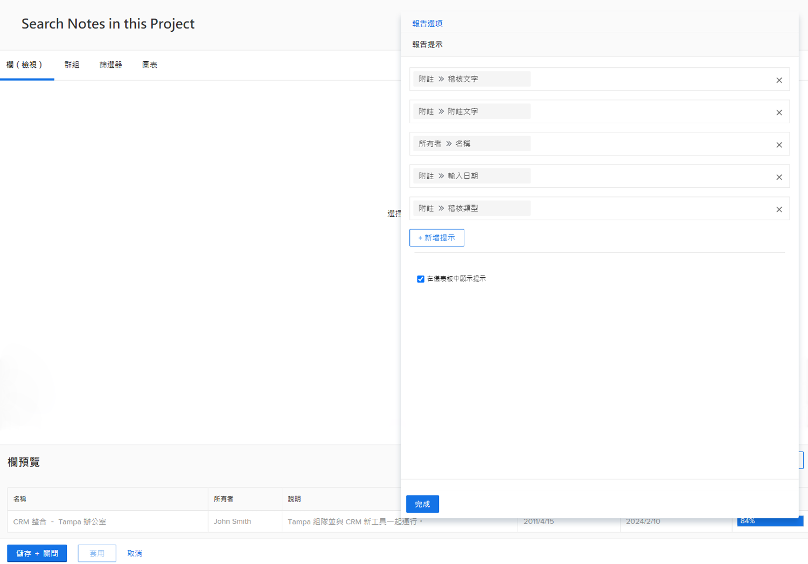
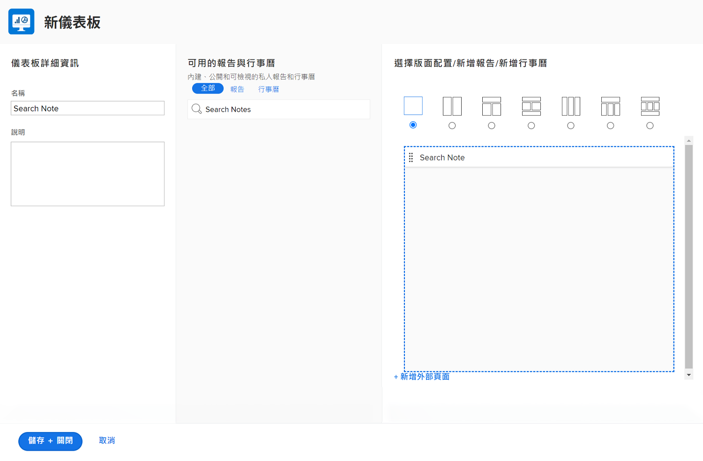
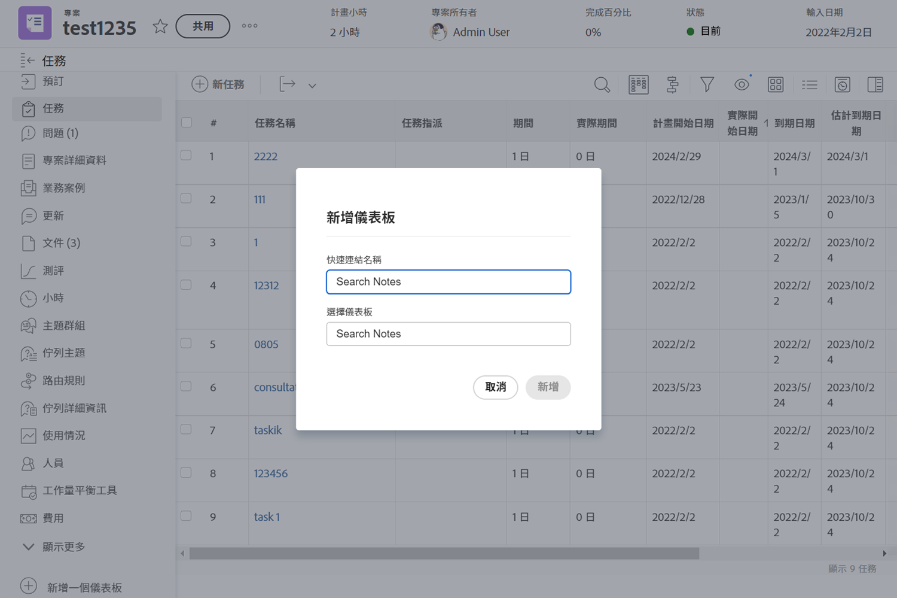

# 建立儀表板

觀看這段影片，您將會瞭解：

* Workfront 中的儀表板是什麼
* 如何建立儀表板
* 如何尋找和使用儀表板
* 如何與其他 Workfront 使用者共用儀表板
* 如何列印儀表板

>[!VIDEO](https://video.tv.adobe.com/v/335157/?quality=12&learn=on)

## 活動：建立儀表板

建立僅包含一份報告的[!UICONTROL 儀表板] — 「搜尋本專案中的備註」。這樣可以快速找到專案上的任何更新，即使要搜尋的更新多達數千。它會搜尋更新資料串，以利快速擷取符合您在提示中指定之條件的任何更新。

複製您在「建立備註報告」活動中建立的「搜尋備註」報告來建立這份報告 (若您未進行該活動，請使用另一份報告)。

* 移除副本的「專案名稱」提示，並把報告重新命名為「搜尋本專案中的備註」。
* 把[!UICONTROL 儀表板]命名為「搜尋備註」。
* 前往任何專案登陸頁面並建立[!UICONTROL 儀表板]的自訂區段。
* 請注意，當您在自訂區段中搜尋備註時，它只會顯示您目前參與的專案所包含的備註。

## 解答

1. 執行您在「建立備註報告」活動中建立的報告。
1. 按一下「**[!UICONTROL 報告動作]**」並選取「**[!UICONTROL 複製]**」。[!DNL Workfront] 建立一個名為「備註搜尋 (副本)」的新報告。
1. 前往「**[!UICONTROL 報告動作]**」並選取「**[!UICONTROL 編輯]**」。按一下「**[!UICONTROL 報告設定]**」並將名稱變更為「搜尋本專案中的備註」。
1. 按一下「[!UICONTROL 報告提示]」並刪除清單中的「[!UICONTROL 專案]」>「[!UICONTROL 名稱]」提示。

   

1. 勾選「**[!UICONTROL 在儀表板中顯示提示]**」方塊。
1. 按一下「**[!UICONTROL 完成]**」，然後「**[!UICONTROL 儲存並關閉]**」。您現在看到的是報告的「[!UICONTROL 提示]」畫面。

   接下來，您將使用快捷鍵建立新儀表板並把這份報告加入儀表板中。

1. 按一下「**[!UICONTROL 報告動作]**」並選取「**[!UICONTROL 新增到儀表板]**」>「**[!UICONTROL 新增儀表板]**」。
1. 把報告「搜尋本專案中的備註」拖曳到「**[!UICONTROL 版面]**」面板。
1. 請注意，報告的名稱將成為儀表板的名稱。把名稱編輯成「搜尋備註」。

   

1. 按一下「**[!UICONTROL 儲存並關閉]**」。

   現在把儀表板新增到專案頁面。

   

1. 前往任何專案。從左側面板選單，按一下「**[!UICONTROL 新增自訂區段]**」圖示。
1. 在「**[!UICONTROL 新增儀表板]**」欄位中，輸入「搜尋備註」並從清單中選取[!UICONTROL 儀表板]。
1. 在「**[!UICONTROL 自訂區段標題]**」欄位，輸入「搜尋備註」。
1. 按一下「**[!UICONTROL 新增新區段]**」。
1. 從左側面板選單中，找到「搜尋備註」。按一下區段名稱左邊的圓點，並把它拖曳到「更新」下方。
