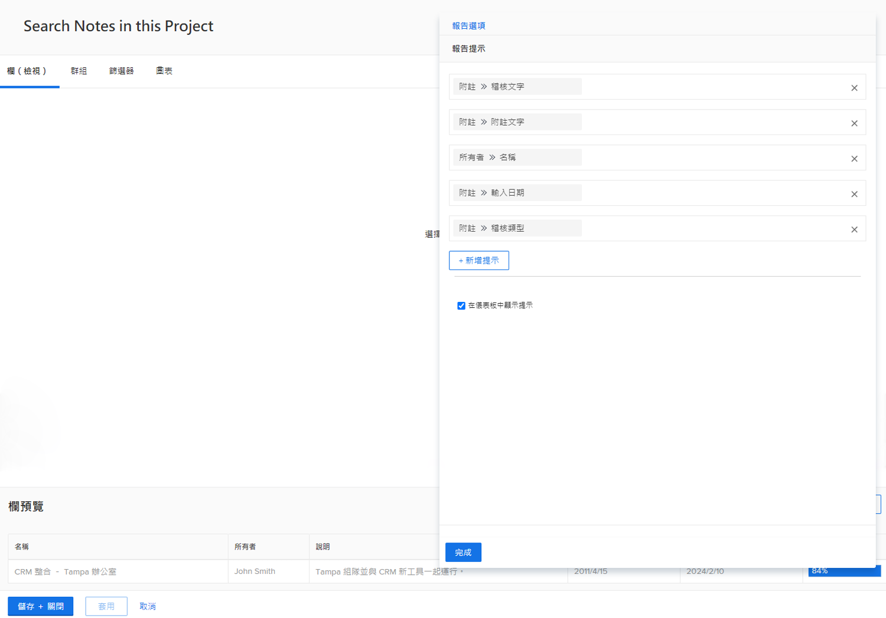
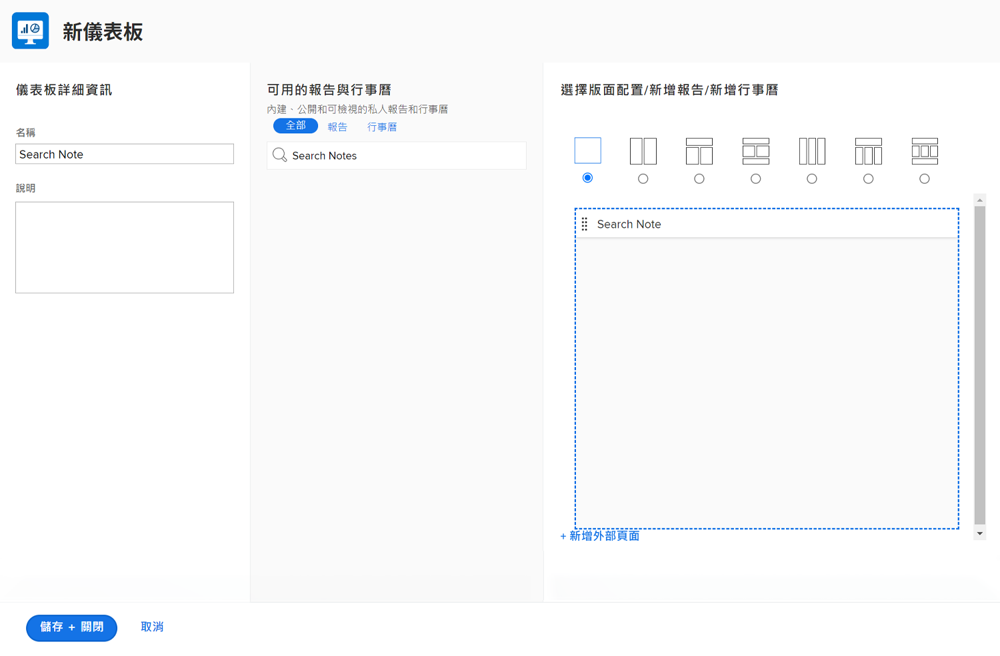
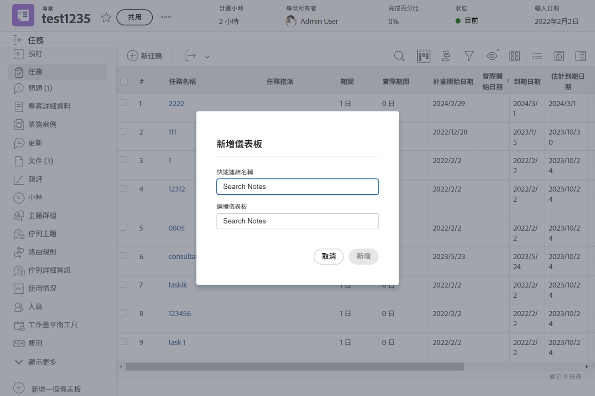

# 在Workfront中建立儀表板

影片提供全面指南，讓您瞭解並使用Workfront中的控制面板。
它說&#x200B;明，儀表板是報表的集合，可讓使用者在一個位置整理和顯示相關資料。

>[!VIDEO](https://video.tv.adobe.com/v/335157/?quality=12&learn=on&enablevpops=0)

## 關鍵重點

* **Workfront中的儀表板：**&#x200B;儀表板是報表的集合，可讓使用者在一個集中檢視中組織和顯示相關資料，例如專案、任務和問題。&#x200B;URL
* **建立儀表板：**&#x200B;您可以透過選取版面配置、新增報告、自訂行事曆或外部頁面，以及安排儀表板以最佳化顯示，來自訂儀表板。使用&#x200B;者也可以自訂哪些欄要顯示在控制面板內的並排報表中。&#x200B;URL
* **存取儀表板：**&#x200B;儀表板可在儀表板區域的「我的儀表板」、「共用儀表板」或「所有儀表板」下找到。常&#x200B;用儀表板可以釘選或新增到我的最愛中以快速存取。&#x200B;URL
* **共用控制面板：**&#x200B;控制面板可以透過「控制面板動作」功能表與其他Workfront使用者共用，包括控制面板內的所有報表。&#x200B;URL
* **列印儀表板：**&#x200B;儀表板可以直接從[儀表板動作]功能表列印，因此可以輕鬆共用資料的實體復本。&#x200B;URL

## 「建立儀表板」活動

### 活動 1：建立儀表板

建立僅包含一份報告的[!UICONTROL 儀表板]—「此專案的搜尋備註」。 這樣可以快速找到專案上的任何更新，即使要搜尋的更新多達數千。 它會搜尋更新資料串，以利快速擷取符合您在提示中指定之條件的任何更新。

建立此報表的方式為複製您在「建立備註報表」活動中建立的「搜尋備註報表」。 尚未建立嗎？ 按一下這裡以在[建立任務報告](https://experienceleague.adobe.com/en/docs/workfront-learn/tutorials-workfront/reporting/basic-reporting/create-a-task-report#activity-1-create-a-note-report-with-prompts)教學課程中檢視活動。

* 移除副本的「專案名稱」提示，並將報告重新命名為「此專案的搜尋備註」。
* 將[!UICONTROL 儀表板]命名為「搜尋備註」。
* 前往任何專案登陸頁面並建立[!UICONTROL 儀表板]的自訂區段。
* 請注意，當您在自訂區段搜尋備註時，只會顯示您目前參與的專案所包含的備註。

### 解答 1

1. 執行您在「建立備註報表」活動中建立的報表。 尚未建立嗎？ 按一下這裡以在[建立任務報告](https://experienceleague.adobe.com/en/docs/workfront-learn/tutorials-workfront/reporting/basic-reporting/create-a-task-report#activity-1-create-a-note-report-with-prompts)教學課程中檢視活動。
1. 按一下「**[!UICONTROL 報告動作]**」並選取「**[!UICONTROL 複製]**」。 [!DNL Workfront] 建立一個名為「備註搜尋 (副本)」的新報告。
1. 前往「**[!UICONTROL 報告動作]**」並選取「**[!UICONTROL 編輯]**」。 按一下「**[!UICONTROL 報告設定]**」，並將名稱變更為「此專案的搜尋備註」。
1. 按一下「[!UICONTROL 報告提示]」並刪除清單中的「[!UICONTROL 專案]」>「[!UICONTROL 名稱]」提示。

   

1. 勾選「**[!UICONTROL 在儀表板中顯示提示]**」方塊。
1. 按一下「**[!UICONTROL 完成]**」，然後「**[!UICONTROL 儲存並關閉]**」。 您現在看到的是報告的「[!UICONTROL 提示]」畫面。

   接下來，您將使用快速鍵建立新儀表板，並將這份報告新增至儀表板。

1. 按一下&#x200B;**[!UICONTROL 報告動作]**&#x200B;並選取&#x200B;**[!UICONTROL 新增到傳統儀表板]** > **[!UICONTROL 新儀表板]**。
1. 將「此專案的搜尋備註」報告拖曳至「**[!UICONTROL 版面]**」面板。
1. 請注意，此報告的名稱將成為儀表板的名稱。 將名稱編輯為「搜尋備註」。

   

1. 按一下「**[!UICONTROL 儲存並關閉]**」。

   現在把儀表板新增到專案頁面。

   

1. 前往任何專案。 從左側面板功能表，按一下&#x200B;**[!UICONTROL 新增儀表板]**&#x200B;按鈕。
1. 在「**[!UICONTROL 選擇儀表板]**」欄位中，輸入「搜尋備註」並從清單中選取[!UICONTROL 儀表板]。
1. 在&#x200B;**[!UICONTROL 快速連結名稱]**&#x200B;欄位中，輸入「搜尋備註」。
1. 按一下&#x200B;**[!UICONTROL 新增]**。
1. 從左側面板選單，尋找底部附近的搜尋附註。 按一下名稱左側的點，並將其拖曳至「更新」的正下方。

### 活動2：我的團隊的未完成任務

建立[!UICONTROL 儀表板]，其中包含3個「開啟任務」報告，每個報告都由指派給任務的不同團隊篩選。

如果您有現有的「開啟任務」報告（由團隊篩選），請使用該報告，或為此儀表板建立新的報告。 為其他兩個團隊複製並編輯報告兩次，然後將它們放在名為「**」我的團隊的未完成任務「**」的單一儀表板上。

### 解答 2

#### 第1部分 — 建立依您其中一支團隊篩選的「未完成任務」報告

1. 在&#x200B;**[!UICONTROL 主選單]**&#x200B;中選取「**[!UICONTROL 報告]**」。
1. 按一下&#x200B;**[!UICONTROL 新報告]**&#x200B;功能表並選取&#x200B;**[!UICONTROL 工作]**。
1. 將報表命名為「指派給Creative團隊的未完成任務」（或您的任何其他團隊）。
1. 在「**[!UICONTROL 欄 (視圖)]**」設定您的欄，要包含以下項目：

   

   * 「[!UICONTROL 專案]」>「[!UICONTROL 名稱]」
   * 「[!UICONTROL 任務]」>「[!UICONTROL 名稱]」
   * [!UICONTROL 任務] > [!UICONTROL 指派]
   * [!UICONTROL 任務] > [!UICONTROL 工期]
   * [!UICONTROL 任務] > [!UICONTROL 計畫時數]
   * [!UICONTROL 任務] > [!UICONTROL 計劃開始日期]
   * [!UICONTROL 任務] > [!UICONTROL 計畫完成日期]
   * [!UICONTROL 任務] > [!UICONTROL 完成百分比]

1. 選取&#x200B;**[!UICONTROL 規劃完成日期]**&#x200B;欄，並將排序變更為&#x200B;**遞增**。

1. 在&#x200B;**[!UICONTROL 篩選器]**&#x200B;索引標籤中，新增要包含的篩選器規則：

   

   * [!UICONTROL 專案] > [!UICONTROL 狀態等於] > [!UICONTROL 等於] > 「目前」
   * [!UICONTROL 任務] > [!UICONTROL 團隊識別碼] > [!UICONTROL 相等] > &quot;Creative&quot;
   * [!UICONTROL 任務] > [!UICONTROL 完成百分比] > [!UICONTROL 小於] > &quot;100&quot;

1. 按一下&#x200B;**[!UICONTROL 儲存+關閉]**&#x200B;按鈕以儲存並關閉您的報告。

#### 第2部分 — 複製您剛建立的報表，並為第二個團隊建立新報表

1. 檢視您剛建立的報告，按一下&#x200B;**[!UICONTROL 報告動作] > [!UICONTROL 複製]**。
1. 新報告將會出現，並在標題中附加名稱&#x200B;**&quot;（副本）&quot;**。
1. 按一下&#x200B;**[!UICONTROL 報告動作] > [!UICONTROL 編輯]**。 然後變更篩選器和報告標題以將焦點放在Orion團隊（或您的任何其他團隊）。
1. 按一下[!UICONTROL 篩選器]標籤，然後變更篩選器規則
   **[!UICONTROL 任務] > [!UICONTROL 團隊識別碼] > [!UICONTROL 相等] > &quot;Creative&quot;**至
   **[!UICONTROL 任務] > [!UICONTROL 團隊識別碼] > [!UICONTROL 等於] > &quot;Orion&quot;**
1. 在「報表標題」欄位中，將&#x200B;**[!UICONTROL &quot;Creative&quot;]**&#x200B;一詞變更為&#x200B;**[!UICONTROL &quot;Orion&quot;]**，並刪除&#x200B;**&quot;（複製）&quot;**。
1. 按一下&#x200B;**[!UICONTROL 儲存+關閉]**&#x200B;按鈕以儲存並關閉您的報告。

#### 第3部分 — 再次複製報告，並為您的第三個團隊建立新報告

1. 檢視您剛建立的報告，再按一下&#x200B;**[!UICONTROL 報告動作] > [!UICONTROL 複製]**。 這次將標題和篩選器中的團隊名稱變更為「數位行銷」（或您的任何其他團隊）。

#### 第4部分 — 建立控制面板，顯示每個團隊的未完成任務

1. 從主功能表，按一下&#x200B;**[!UICONTROL 儀表板]**。
1. 然後按一下&#x200B;**[!UICONTROL 新儀表板]**。

   

1. 將儀表板命名為&#x200B;**「我的團隊的未完成任務」**。
1. 開始在&#x200B;**[!UICONTROL 依名稱搜尋]**&#x200B;欄位中輸入報表名稱。
1. 由於您的報表名稱一開始都是使用相同的字詞，因此您可能會看到它們都像這樣產生：

   

1. 將每個檔案拖曳至版面配置區域，然後按一下「儲存+關閉」。

   

1. 以下是最後一個儀表板：

   
