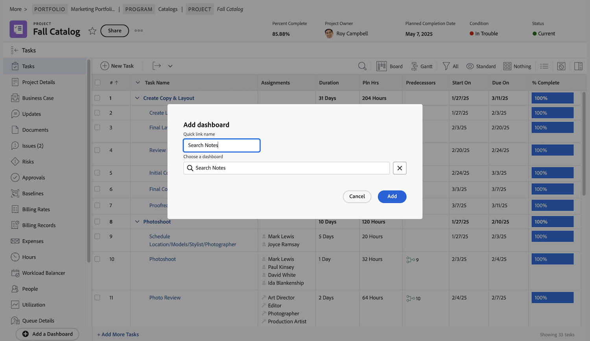

# 建立儀表板

影片涵蓋下列重點：

* **儀表板簡介：**&#x200B;說明Workfront中的儀表板是什麼，以及它作為相關報表集合的目的。&#x200B;URL
* **建立儀表板：**&#x200B;如何導覽至「儀表板」區域、選取「新儀表板」、命名儀表板，並選擇版面配置，以建立新儀表板。&#x200B;URL
* **新增報告：**&#x200B;示範如何將各種報告新增到儀表板，例如專案報告、任務報告和問題報告，並在選擇的版面中排列它們。&#x200B;URL
* **自訂檢視：**&#x200B;顯示如何編輯報告並選取要顯示的特定欄，以自訂哪些欄顯示在儀表板檢視中。&#x200B;URL
* **新增其他元素：**&#x200B;說明如何將自訂行事曆和外部頁面（例如，線上檔案）新增到儀表板。&#x200B;URL
* **儲存並釘選：**&#x200B;儲存儀表板並釘選儀表板以方便存取。&#x200B;URL
* **檢視和編輯：**&#x200B;提供檢視和編輯儀表板的秘訣，包括調整欄可見度以提升顯示效果。&#x200B;URL
* **尋找和共用儀表板：**&#x200B;說明如何透過主功能表尋找儀表板、新增至我的最愛，以及與其他使用者共用。&#x200B;URL
* **列印儀表板：**&#x200B;說明列印儀表板的程式。&#x200B;URL

>[!VIDEO](https://video.tv.adobe.com/v/335157/?quality=12&learn=on)

## 「建立儀表板」活動

### 活動 1：建立儀表板

建立僅包含一份報告的[!UICONTROL 儀表板]—「此專案的搜尋備註」。這樣可以快速找到專案上的任何更新，即使要搜尋的更新多達數千。它會搜尋更新資料串，以利快速擷取符合您在提示中指定之條件的任何更新。

複製您在「建立備註報告」活動中建立的「搜尋備註」報告的副本來建立這份報告 (若您未進行該活動，請使用另一份報告)。

* 移除副本的「專案名稱」提示，並將報告重新命名為「此專案的搜尋備註」。
* 將[!UICONTROL 儀表板]命名為「搜尋備註」。
* 前往任何專案登陸頁面並建立[!UICONTROL 儀表板]的自訂區段。
* 請注意，當您在自訂區段搜尋備註時，只會顯示您目前參與的專案所包含的備註。

### 解答 1

1. 執行您在「建立備註報告」活動中建立的報告。
1. 按一下「**[!UICONTROL 報告動作]**」並選取「**[!UICONTROL 複製]**」。[!DNL Workfront] 建立一個名為「備註搜尋 (副本)」的新報告。
1. 前往「**[!UICONTROL 報告動作]**」並選取「**[!UICONTROL 編輯]**」。按一下「**[!UICONTROL 報告設定]**」，並將名稱變更為「此專案的搜尋備註」。
1. 按一下「[!UICONTROL 報告提示]」並刪除清單中的「[!UICONTROL 專案]」>「[!UICONTROL 名稱]」提示。

   

1. 勾選「**[!UICONTROL 在儀表板中顯示提示]**」方塊。
1. 按一下「**[!UICONTROL 完成]**」，然後「**[!UICONTROL 儲存並關閉]**」。您現在看到的是報告的「[!UICONTROL 提示]」畫面。

   接下來，您將使用快速鍵建立新儀表板，並將這份報告新增至儀表板。

1. 按一下「**[!UICONTROL 報告動作]**」，並選取「**[!UICONTROL 新增至儀表板]**」>「**[!UICONTROL 新儀表板]**」。
1. 將「此專案的搜尋備註」報告拖曳至「**[!UICONTROL 版面]**」面板。
1. 請注意，此報告的名稱將成為儀表板的名稱。將名稱編輯為「搜尋備註」。

   

1. 按一下「**[!UICONTROL 儲存並關閉]**」。

   現在把儀表板新增到專案頁面。

   

1. 前往任何專案。從左側面板選單，按一下「**[!UICONTROL 新增自訂區段]**」圖示。
1. 在「**[!UICONTROL 新增儀表板]**」欄位中輸入「搜尋備註」，並從清單中選取「[!UICONTROL 儀表板]」。
1. 在「**[!UICONTROL 自訂區段標題]**」欄位，輸入「搜尋備註」。
1. 按一下「**[!UICONTROL 新增新區段]**」。
1. 從左側面板選單中，找到「搜尋備註」。按一下區段名稱左邊的圓點，並把它拖曳到「更新」下方。
