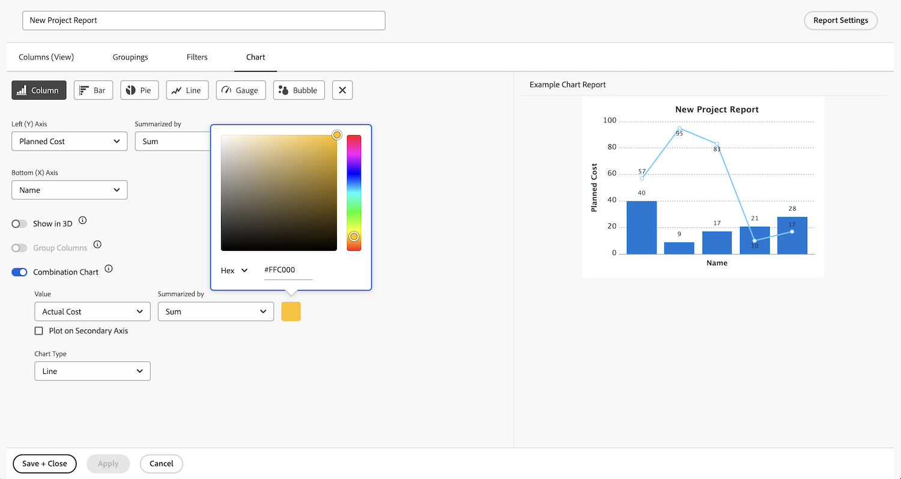

# 使用圖表建立報表

在此影片中，您將學習：

* 圖表如何改善資料的視覺效果
* 如何使用Workfront的圖表工具

>[!VIDEO](https://video.tv.adobe.com/v/335155/?quality=12)

## 活動：新增圖表至報表

季度末即將結束，您想要了解完成的項目是如何最近停滯在預算之中。 建立顯示計畫成本與項目實際成本的報表。 您只想查看上個季度完成的專案。 使用自訂顏色新增組合欄圖。

## 回答

1. 選擇 **[!UICONTROL 報表]** 從 **[!UICONTROL 主菜單]**.
1. 按一下 **[!UICONTROL 新增報表]** 選取 **[!UICONTROL 專案]**.
1. 在 **[!UICONTROL 欄（檢視）]** 按一下 **[!UICONTROL 添加列]**.
1. 選擇 [!UICONTROL 專案] > [!UICONTROL 計畫成本] 匯總本欄內容 **[!UICONTROL 總和]**.
1. 按一下 **[!UICONTROL 添加列]** 。
1. 選擇 [!UICONTROL 專案] > [!UICONTROL 實際成本] 匯總本欄內容 **[!UICONTROL 總和]**.

   

1. 在 **[!UICONTROL 分組]** 索引標籤，將報表設定為群組依據 [!UICONTROL 專案] > [!UICONTROL 名稱].

   

1. 在 **[!UICONTROL 篩選器]** 索引標籤，新增兩個篩選規則：

   * [!UICONTROL 專案] > [!UICONTROL 狀態等於] > [!UICONTROL 完成]
   * [!UICONTROL 專案] >[!UICONTROL  實際完成日期] > [!UICONTROL 上一季]

   

1. 在 **[!UICONTROL 圖表]** 標籤，選擇 **[!UICONTROL 欄]** （圖表類型）。
1. 若 [!UICONTROL 左(Y)軸]，選擇 [!UICONTROL 專案] > [!UICONTROL 計畫成本].
1. 若 [!UICONTROL 底部(X)軸]，選擇 [!UICONTROL 專案] > [!UICONTROL 名稱].
1. 按一下 **[!UICONTROL 組合圖]** 按鈕並選取 [!UICONTROL 專案] > [!UICONTROL 實際成本] 在 **[!UICONTROL 值]** 欄位。
1. 按一下顏色方塊旁的箭頭，以變更 [!UICONTROL 實際成本] 顏色。 選取其中一種出現的顏色，或按一下右下角的方塊以開啟調色盤。
1. 按一下 **[!UICONTROL 儲存+關閉]**. 提示輸入報表名稱時，請將其命名為「按項目上季度完成的計畫成本與實際成本」。

   
