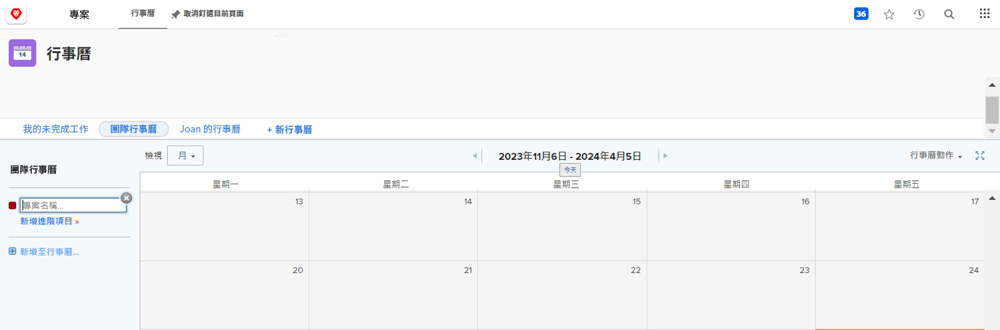
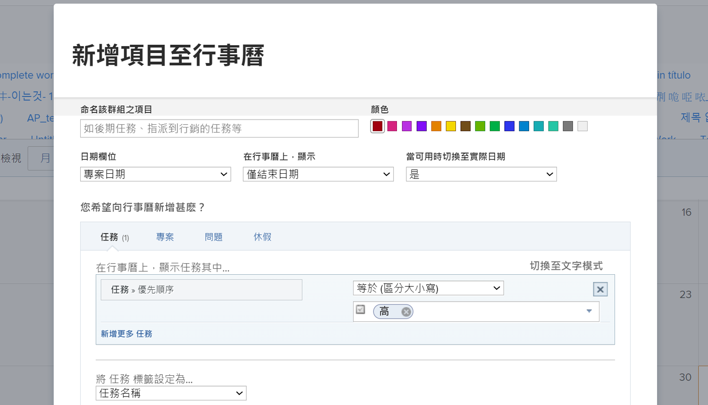
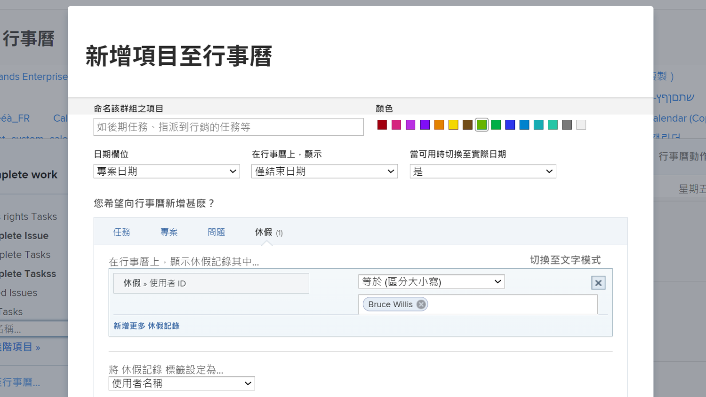

# 建立自訂行事曆

在本節中，您將瞭解如何：

* 建立新行事曆
* 建立行事曆分組
* 將工作專案新增至行事曆群組
* 建立休假行事曆

以下說明如何建立自己的自訂行事曆。

## 首先，新增行事曆

1. 從 **[!UICONTROL 主要功能表]**，選取 **[!UICONTROL 行事曆]** 區域。
1. 按一下 **[!UICONTROL 新行事曆]** 選項。
1. 輸入行事曆的名稱，然後按 **[!UICONTROL 傳回]**.

## 第二，新增行事曆分組

1. 若要顯示與特定專案相關的專案，請在 [!UICONTROL 分組] 欄位（這會顯示與該專案相關的所有任務）。
1. 或按一下 **[!UICONTROL 新增進階專案]** 將來自各種專案的工作專案包含在系統中的選項。

## 第三，將工作專案新增到行事曆分組

1. 為群組命名，以反映要顯示的內容。
1. 選取群組的顏色指定。
1. 選取要使用的日期型別 — [!UICONTROL 預計日期]， [!UICONTROL 計畫日期]，或 [!UICONTROL 自訂]. ([!UICONTROL 自訂] 日期是日期欄位，包含在 [!UICONTROL 自訂表單].)
1. 選取要在行事曆上顯示的日期 — [!UICONTROL 僅結束日期]， [!UICONTROL 僅開始日期]，或 [!UICONTROL 持續時間（開始至結束）].
1. 如果您想要顯示 [!UICONTROL 實際日期] 當該資訊可用時，從功能表選取「是」。 如果您一律想要選取的日期型別，請選取「否」 ([!UICONTROL 預計]， [!UICONTROL 已計畫]，或 [!UICONTROL 自訂])以顯示。
1. 選取您要在行事曆上看到的專案資訊型別 — [!UICONTROL 任務]， [!UICONTROL 專案]， [!UICONTROL 問題]，或 [!UICONTROL 休假].
1. 設定篩選條件以顯示所需的資訊。
1. 按一下&#x200B;**[!UICONTROL 儲存]**。

>[!NOTE]
>
>使用「新增至行事曆」選項，可將其他群組新增至現有行事曆。

## 建立顯示個人休假的行事曆

[!DNL Workfront] 提供您透過使用者設定檔中的個人休假功能指定休假的方法。 這會提醒專案經理您沒有空，並允許計畫完成日期視需要自動或手動調整。

在「行事曆」區域中，您可以建立行事曆檢視，以顯示這些休假專案。

若要建立特定人員的行事曆，請執行下列動作：

1. 按一下 **[!UICONTROL 新增至行事曆]** 在左側面板中。
1. 按一下 **[!UICONTROL 新增進階專案]**.
1. 為群組命名，以反映要顯示的內容。
1. 選取群組的顏色指定。
1. 設定 [!UICONTROL 日期欄位] 至 [!UICONTROL 計畫日期].
1. 選取要在行事曆上顯示的日期 — [!UICONTROL 持續時間].
1. 忽略在實際日期不可用時資訊的顯示方式。 此規定不適用。
1. 選取 [!UICONTROL 休假] 以瞭解您要檢視的資訊型別。
1. 針對篩選，將使用者ID設定為團隊成員的名稱。
1. 按一下&#x200B;**[!UICONTROL 儲存]**。

