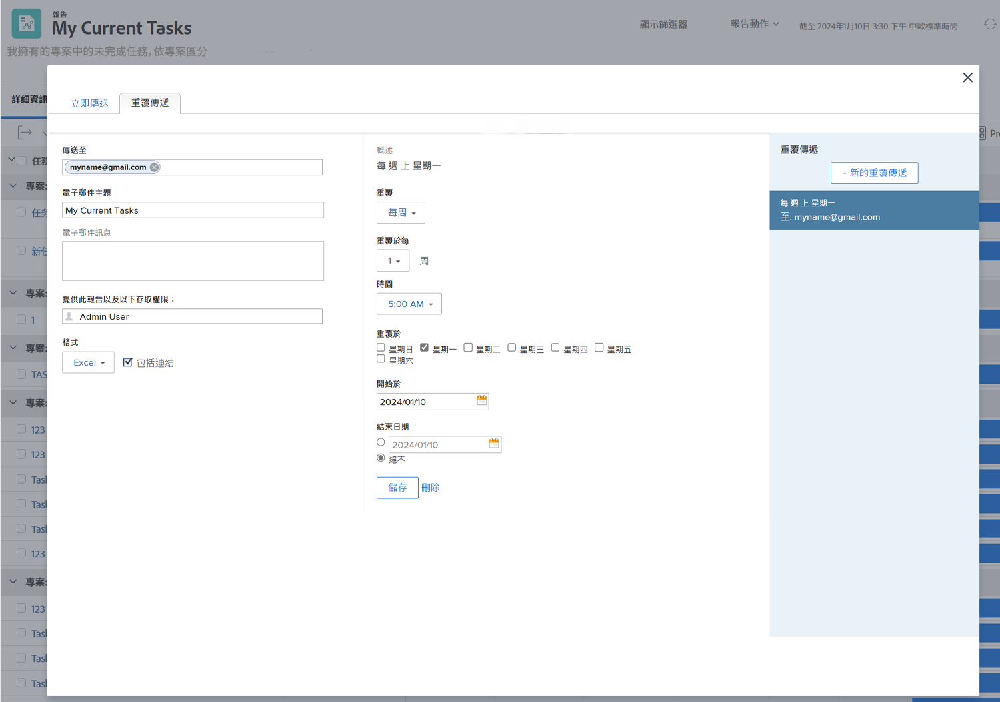

# 傳送和共用報表

在此影片中，您將學習：

* 如何傳送報表給使用者、團隊或任何電子郵件地址
* 如何與任何人共用報表
* 收件者可查看及處理Workfront報表的項目

>[!VIDEO](https://video.tv.adobe.com/v/335158/?quality=12)

## 活動：傳送報表

每週一凌晨5:00以Excel試算表形式自行傳送報表。 這是自動收集每週報告的絕佳方式，您稍後可使用這些報告來查看趨勢。

## 回答

1. 查看已建立的任何報表，然後選擇 **[!UICONTROL 傳送報表]** 從 **[!UICONTROL 報表動作]** 功能表。
1. 按一下 **[!UICONTROL 重複傳送]** 標籤。
1. 將您的電子郵件地址放入 **[!UICONTROL 傳送至]** 欄位。
1. 提供電子郵件主旨。
1. 將格式變更為Excel。
1. 設定 **[!UICONTROL 重複]** to [!UICONTROL 每週].
1. 設定 [!UICONTROL 時間] 5點。
1. 設定 [!UICONTROL 重複於] 到星期一。
1. 按一下&#x200B;**[!UICONTROL 儲存]**。

>[!NOTE]
>
>請注意您在 [!UICONTROL 重複傳送] 面板。 您可以為報表設定多個傳送，且所有傳送都會顯示在此處。

**DELETE傳遞**

選取您剛建立的傳送，然後按一下「刪除」(位於 **[!UICONTROL 儲存]** 按鈕)。
