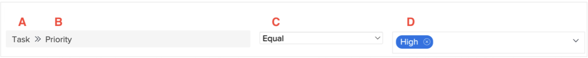

# 瞭解報告元件

影片說明Workfront中報表元件的概念，這些元件對於建立篩選器、檢視和分組至關重要。 主要元件包括：

* **物件型別：**&#x200B;指定正在處理的Workfront物件，例如專案、任務或小時專案。&#x200B;URL 濾鏡、檢視和群組是物件型別專屬的。&#x200B;URL
* **欄位Source和欄位名稱：**&#x200B;欄位來源是Workfront中附加資訊的專案，而欄位名稱是特定資訊（例如，專案的「說明」）。&#x200B;URL
* **值欄位：**&#x200B;代表優先順序欄位的欄位內容，例如「低」、「正常」、「高」或「緊急」。&#x200B;URL
* **篩選限定詞：**&#x200B;定義要在報告中包含或排除的值，例如顯示優先順序為「高」的工作&#x200B;。

>[!VIDEO](https://video.tv.adobe.com/v/335146/?quality=12&learn=on)

## 關鍵重點

* **報表元件：** Workfront的報表元件包括物件型別、欄位來源、欄位名稱、篩選限定詞和值欄位，這些對於建立篩選器、檢視和群組至關重要。&#x200B;URL
* **物件型別特殊性：**&#x200B;篩選器、檢視和群組繫結至特定物件型別，例如專案、任務或小時專案，確保報表符合相關資料。&#x200B;URL
* **篩選器規則：**&#x200B;篩選器使用欄位來源、欄位名稱、限定詞和值來定義條件。&#x200B;URL 例如，「我的專案」篩選器只會顯示目前有登入使用者屬於專案團隊的專案。&#x200B;URL
* **檢視和群組：**&#x200B;檢視會在欄中顯示欄位來源和欄位名稱組合（例如「擁有者名稱」），而群組會根據特定條件（例如「公司名稱」）來組織資料&#x200B;。
* **萬用字元使用方式：**&#x200B;篩選器中的萬用字元允許動態比對，例如識別專案團隊中的登入使用者，加強報告中的個人化。&#x200B;URL

## 報告元件快速參考

**A- 欄位來源**

欄位來源選項取決於選取的物件類型。通常，欄位來源是 Workfront 中某項資訊 (即欄位名稱) 所屬的項目。有時候欄位來源與物件類型相同。
欄位來源決定可以使用的欄位名稱。

例如：「[!UICONTROL  專案]」、「[!UICONTROL 任務]」、「[!UICONTROL 問題]」、「[!UICONTROL 指派至]」

**B - 欄位名稱**

欄位名稱是您選取作為欄位來源的地方所提供的可用資訊

可能是您填寫的 Workfront 欄位、自訂表單的欄位，或是 Workfront 自動擷取的資訊。

欄位名稱驅動值欄位選項。

例如：「[!UICONTROL 進度狀態]」、「[!UICONTROL 說明]」、「[!UICONTROL 規劃完成日期]」、自訂表單欄位

**C - 篩選器限定詞**

篩選器限定詞可以縮小所選欄位來源與欄位名稱之下可檢視的可能結果之範圍。

限制詞指定欄位來源和欄位名稱與值欄位的關聯方式。

例如：等於、包含、空、小於

**D - 值**

值是在欄位名稱指定的欄位中輸入的資訊。

值的選項由欄位來源和欄位名稱決定。

使用者和日期適用的萬用字元，可以用於值和自由形式的文字。

例如：新、目前、$$TODAYbw、說明

>[!TIP]
>
>如需瞭解 Workfront 中特定欄位名稱，請查看「[Adobe Workfront 術語的字彙表](https://experienceleague.adobe.com/docs/workfront/using/basics/workfront-terminology-glossary.html?lang=zh-Hant)」。

