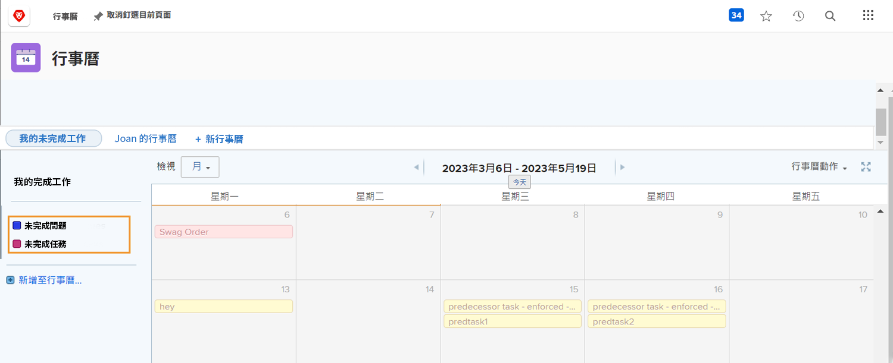
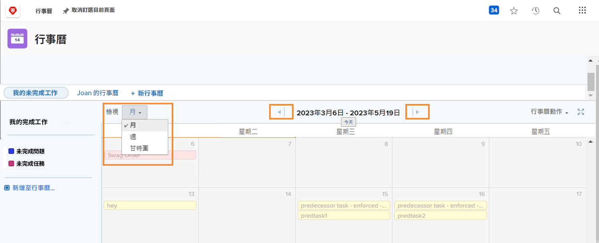
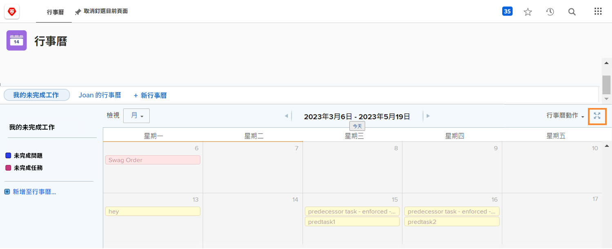
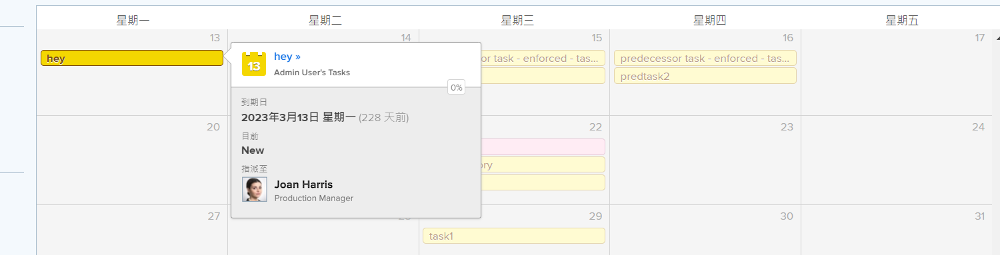
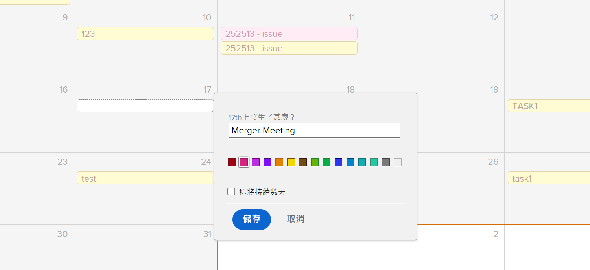

# 了解日曆介面

在本節中，您將學習：

* 日曆分組
* 日曆檢視
* 日曆動作功能表
* 以及如何建立隨選日曆項目

在建立您自己的自訂日曆之前，我們先導覽自訂日曆中可用的基本功能。

## 日曆分組

可以將單個日曆組織成不同的工作項分組。 每個分組都可開啟或關閉，讓使用者隨時都能專注於最重要的工作項目。

## 日曆檢視

日曆可以以月、周或 [!UICONTROL 甘特圖] 格式。 使用側邊的捲軸或頂端的箭頭來移動日曆。 此 [!UICONTROL 甘特圖] 檢視可讓您從不同的角度查看您的工作。 尋找最適合您的檢視。

![中的日曆螢幕影像 [!UICONTROL 甘特圖] 檢視](assets/calendar-1-1bb.png)

## [!UICONTROL 日曆動作] 功能表

跟其他工作項目一樣，日曆有 [!UICONTROL 動作] 菜單，允許您在日曆上查看週末；刪除或複製日曆；與個別Workfront使用者、全系統或外部使用者共用行事歷；並將日曆新增至 [!UICONTROL 我的最愛] 功能表。

![的影像 [!UICONTROL 日曆動作] 螢幕](assets/calendar-1-1c.png)

## 全螢幕模式

按一下全螢幕圖示，以全螢幕模式檢視行事歷。 再按一下以返回原始大小。

## 摘要資訊

在日曆上選擇一個項，以顯示該項的匯總詳細資訊，包括名稱、原始項目、狀態、分配、進度狀態和到期日。

## 臨機事件

按兩下以在日曆上建立臨機事件，以代表您的排程或其他工作項目。

>[!NOTE]
>
>建立隨選事件不會在Workfront中建立任務。

